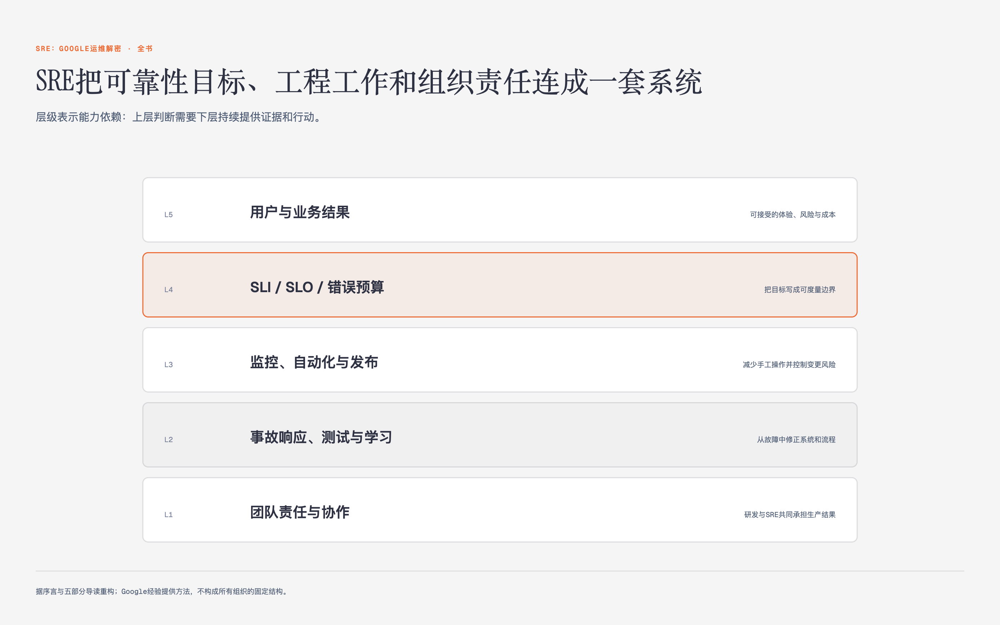

# 《SRE：Google运维解密》SRE：Google运维解密 · 译者序、前言与序言 · 原书回顾与主题讲解

本单元要回答：怎样理解并使用“SRE：Google运维解密 · 译者序、前言与序言”，以及它在什么条件下不适用。

图0-1｜SRE把可靠性目标、工程工作和组织责任连成一套系统

## 一、原书回顾：作者怎样展开

### 译者序

译者孙宇聪回顾在Google SRE的八年经历，指出SRE团队通过务实态度和工匠精神，利用传统软件工程方法解决大规模运维难题。他强调书中无“魔法系统”，而是对问题本质的讨论，旨在将体系化的运维理念分享给国内读者，并感谢同事与家人的支持。

### 前言

Mark Burgess指出Google的发展史是对传统运维理念的革命，SRE将运维定义为人与计算机共同参与的工程。本书记录了工程师团队在解决利益冲突中的思考过程，强调真实的设计过程比最终架构更有价值。作者呼吁读者以谦逊态度旁观，从他人的成功与失败中汲取经验，指引未来。

### 序言

序言定义SRE为关注可靠性的工程师，通过Margaret Hamilton在阿波罗计划中因忽视软件状态检查导致危机的故事，强调灾难预案的重要性。书中将SRE工作分为理念、实践与管理三部分，推荐从第2、3章开始阅读，并介绍了字体约定及代码使用许可，旨在共享经验并促进跨行业交流。

## 二、主题讲解：SRE运维理念与工程思维

### SRE的工程化定义

SRE（站点可靠性工程师）并非传统运维的简单延伸，而是将软件工程方法应用于运维领域的职业。其核心在于使用编程和自动化工具来管理大规模分布式系统，而非依赖人工操作。SRE工程师需深度参与开发，负责系统架构设计与资源优化，确保系统在扩展时仍能保持高可靠性。这种工程化思维要求运维人员具备编程能力，通过代码解决重复性问题，从而将精力从琐事中解放出来，专注于系统稳定性的提升。

### 可靠性与错误预算

可靠性是SRE关注的核心，指系统在指定环境下成功执行功能的概率。SRE并不追求100%的完美可用性，因为成本远超价值。相反，他们引入“错误预算”概念，允许系统在达到一定容错率后，将精力转向新功能开发。这种平衡机制避免了过度追求稳定而阻碍创新，确保业务迭代速度与用户体验之间的最佳平衡。可靠性管理是一种动态过程，需根据业务需求不断调整容错阈值。

### 从历史案例看运维价值

阿波罗计划中Margaret Hamilton的故事说明，即使团队掌握了系统原理，人为错误仍不可避免。SRE因此把软件状态检查和灾难预案放进系统设计，不只依赖人员训练，也不等事故发生后再补救。现代SRE团队沿用这种思路，把可靠性当作产品设计的一部分，让运维更早参与工程决策。

## 检验理解

**情形**：假设你负责一个初创公司的核心API服务，目前可用性为99.9%，但业务增长迅速，团队面临巨大的新功能开发压力。

**问题**：请结合SRE的“错误预算”理念，分析此时是否应继续投入资源将可用性提升至99.99%？并说明你的决策依据及可能采取的工程化措施。

### 核对思路（先作答再看）

不应盲目提升至99.99%。依据是SRE强调可靠性与创新的平衡，当系统“足够可靠”时，应转向新功能开发。决策依据是错误预算已消耗殆尽或性价比极低。工程化措施包括：自动化监控以快速发现故障、引入容错机制而非单纯增加冗余、优化发布流程以减少变更风险，而非单纯追求零故障。

## 来源、范围与阅读连接

- 原书定位：PDF 2-29、54-55、137-141、404-405、475。
- 源文件 SHA-256：`75611d407c657cfcbe2079507dc6957df46836ad8cdf6bea30912fdeab4f3a96`。
- “原书回顾”只归纳本单元作者的展开；“主题讲解”和理解检查属于书镜重构。
- 版本边界：书中工具、Google组织结构和规模数字来自2016年中文版及更早实践，不作为当前产品或组织现状。
- 边界：SRE实践基于Google大规模分布式系统经验，中小型企业需根据实际规模调整，不可直接套用。
- 边界：书中案例多为Google内部实践，其他团队需结合自身体制与文化进行类比，而非机械复制。
- 边界：可靠性定义侧重于Web服务，不直接适用于核电、医疗等极高安全要求领域。
- 阅读连接：下一单元是“第1章 介绍”，继续回答：传统运维模式下的Dev/Ops冲突与SRE的引入。
