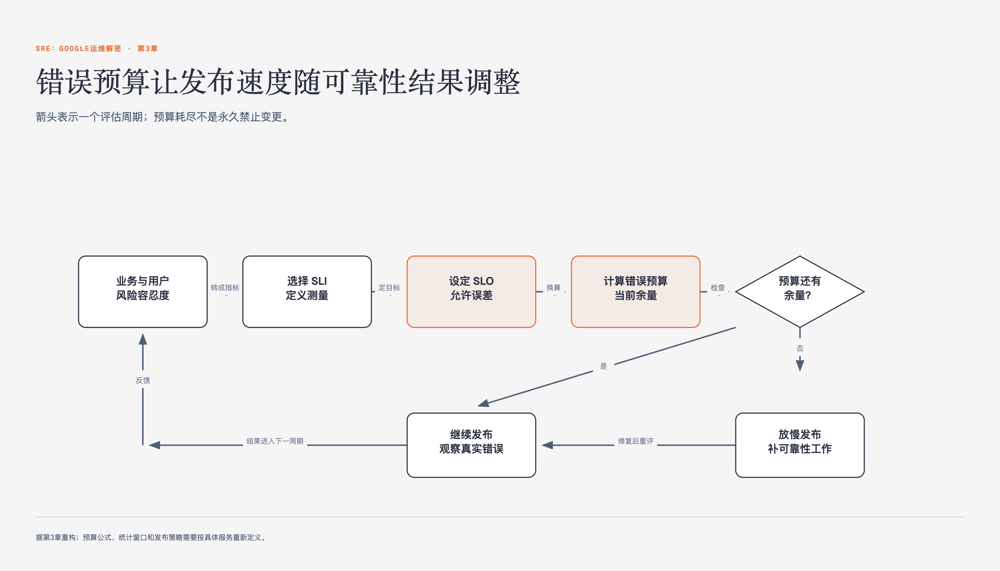

# 《SRE：Google运维解密》第3章 拥抱风险 · 原书回顾与主题讲解

本单元要回答：怎样理解并使用“拥抱风险”，以及它在什么条件下不适用。

图3-1｜错误预算怎样在可靠性与发布速度之间形成反馈

## 一、原书回顾：作者怎样展开

### 管理风险

本章开篇指出极致的可靠性往往伴随高昂成本且用户难以感知，SRE的核心在于平衡创新与运营风险。作者通过成本收益分析，强调应将运维风险与业务风险对应，避免过度追求可靠性而牺牲新功能开发。这一观点为后续量化风险指标奠定了基调，引出如何具体度量服务风险的话题。

### 冗余物理服务器/计算资源的成本

该部分指出通过投入冗余设备可实现离线维护及数据持久性保证。作者认为提升可靠性的成本非线性增加，极端可靠性带来成本大幅上升，限制新功能开发并增加成本，而用户难以感知高可靠性与极端可靠性的差异，因此需平衡创新与运营风险。

### 机会成本

作者指出当组织分配工程资源构建减险系统而非用户直接可用功能时需承担机会成本。因工程师无法从事设计新功能工作，导致新功能数量减少。这体现了在构建减险系统时，资源被占用从而牺牲了直接面向用户的功能开发，是可靠性提升带来的隐性代价。

### 度量服务的风险

作者提出通过单一客观指标量化风险，首选计划外停机时间。书中对比了基于时间的可用性公式与基于请求成功率的合计可用性，指出后者更适合全球分布式服务。这一度量方法的转变，自然过渡到如何根据服务特性设定具体的风险容忍度目标。

### 服务的风险容忍度

本节探讨如何辨别服务风险容忍度，强调需将商业目标转化为工程目标。作者区分了消费者服务与基础设施服务在风险定义上的差异，指出前者有明确产品负责人，后者则缺乏清晰的所有权结构。这种分类为后续分别讨论两类服务的具体风险考量因素提供了框架。

### 辨别消费者服务的风险容忍度

针对消费者服务，作者列出可用性目标、故障类型、成本及其他指标四个考量维度。通过Google Apps for Work和YouTube的案例，说明不同市场定位和生命周期阶段决定了不同的可用性目标。这种基于业务影响的评估方法，进一步细化到对故障类型的具体分析。

### 可用性目标

本节讨论可用性目标的设定依据，包括用户期望、收入关联性及竞争对手水平。以Google Apps for Work为例，说明企业级服务需兼顾外部目标与内部协议。这一部分强调了业务定位对技术目标的决定性作用，为后续分析故障类型对业务的影响做铺垫。

### 故障的类型

作者指出不同类型的故障对业务影响迥异，通过联系人管理应用的案例，对比了体验故障与数据泄露风险。对于Ads前端服务，作者提出计划内停机可被接受。这种对故障性质的区分，引出了成本因素在可用性目标决策中的关键作用。

### 成本（原书第1处）

本节通过广告服务的收入与可靠性权衡，展示了成本在设定可用性目标中的重要性。作者提出将误差率控制在ISP背景误差率以下的策略，以降低用户感知的故障影响。这一成本效益分析逻辑，自然延伸至其他服务指标如延迟对风险容忍度的影响。

### 成本（原书第2处）

本节强调通过分割基础设施服务来优化成本，以Bigtable为例说明高可靠集群与高吞吐量集群的成本差异。作者指出，明确划分服务水平可将部分成本转移给用户，促使其做出合理选择。这一策略在前端基础设施中同样适用，引出具体案例。

### 其他服务指标

除了可用性，延迟等指标也影响风险容忍度。作者以AdWords和AdSense为例，说明不同服务对延迟的敏感度不同，从而允许在资源分配上做出权衡。这种基于指标差异的权衡策略，进一步扩展到基础设施服务特有的风险容忍度讨论。

### 基础设施服务的风险容忍度

基础设施服务因客户多样而需求复杂，作者以Bigtable为例，说明低延迟与高吞吐量需求的冲突。通过分割基础设施为不同集群，作者展示了如何在满足竞争性约束的同时控制成本。这种分割策略的核心在于明确划分服务水平，从而引出错误预算的应用。

### 可用性目标水平

本节分析Bigtable不同用户群体对可用性目标的差异化需求，指出单一高可靠性目标往往成本过高。通过分析用户队列期望，作者提出通过分割服务来满足多样化需求。这一成本效益分析逻辑，进一步延伸到前端基础设施的风险容忍度评估。

### 故障类型

针对基础设施，作者指出低延迟用户与离线分析用户对成功和失败的定义相反。通过Bigtable案例，说明如何通过调整冗余度和资源配置来平衡不同用户需求。这种对故障类型的细致区分，为前端基础设施的具体风险案例提供了理论支撑。

### 例子：前端基础设施

以前端基础设施为例，作者说明反向代理和负载均衡系统因直接处理用户连接而需超高可靠性。由于无法掩盖后端不可用，任何请求丢失都意味着服务完全失败。这一极端案例验证了前文风险容忍度评估原则的普适性，并过渡到错误预算的应用。

### 使用错误预算的目的

本节引入错误预算以解决SRE与产品研发团队间的紧张关系。通过指出双方绩效指标的差异，作者强调需要客观指标来指导谈判。错误预算作为共同接受的可靠性指标，旨在排除政治因素，为后续构建过程提供客观依据。

### 软件对故障的容忍度

作者探讨软件对故障的容忍度，指出过度追求稳定可能导致产品无人问津，而过度脆弱则导致尴尬故障。这一平衡点的寻找，需要结合测试和发布频率的综合考量，从而引出错误预算在调节发布速度中的具体作用。

### 测试

本节讨论测试在风险平衡中的作用，指出不足测试可能导致严重故障，而过度测试可能错失市场先机。这一矛盾凸显了寻找最佳平衡点的必要性，为错误预算作为调节发布速度和测试投入的工具提供了背景支持。

### 发布频率

作者指出每次发布都有风险，需权衡减少风险的时间投入。通过引入错误预算，团队可以基于数据而非谈判能力做出决策。这一客观指标的确立，为后续错误预算的具体构建过程奠定了方法论基础。

### 金丝雀测试（Canary）的持续时间和大小

本节以金丝雀测试为例，说明如何通过小范围测试来评估新代码的风险。作者指出，测试的持续时间和范围需根据服务特性调整，以避免因测试不足或过度而影响发布节奏。这一具体实践是错误预算调节发布速度的重要手段。

### 错误预算的构建过程

作者详细描述了错误预算的构建过程：产品管理层定义SLO，监控系统测算实际在线时间，差值即为剩余预算。只要预算未耗尽，即可发布新版本。这一流程将风险量化，为团队提供了明确的决策依据，并引出错误预算带来的好处。

### 好处

本节总结错误预算的主要好处，即激励团队在创新与可靠性间找到平衡。通过调节发布速度，错误预算促使团队自我监管，并在SLO违规时暂停发布。这一机制有效减少了关于事故的争论，强调了共同责任，为章节总结做铺垫。

### 关键点

本章最后总结，管理可靠性即管理风险，100%可靠性既不可行也不经济。错误预算通过调整激励，使SRE与研发团队在风险承担上达成一致。这一观点强调了将服务风险与业务风险匹配的重要性，完成了对拥抱风险主题的反馈链。

## 二、主题讲解：理解服务风险与错误预算

### 风险与可靠性的权衡

在构建服务时，追求极致的可靠性往往伴随着不成比例的成本上升，且用户难以感知细微差异。SRE的核心任务并非单纯最大化在线时间，而是平衡快速创新与高效运营之间的风险。这意味着我们需要将运维风险与业务风险明确对应，避免为了超出用户需求的可靠性而牺牲新功能的开发速度。理解这一权衡是制定合理服务目标的前提，它要求我们认识到可靠性提升的非线性成本特征，从而在资源分配上做出更明智的决策。

### 度量服务风险的方法

为了量化风险，Google采用基于请求成功率的可用性指标，而非单纯的时间可用性。这种方法通过计算滚动窗口内的成功请求比例，更准确地反映了分布式服务的实际表现。对于非服务型系统，如批处理进程，则通过定义成功与非成功的工作单元来估算可用性。这种度量方式使得风险指标具有客观性和一致性，便于团队追踪系统表现的变化，并为设定具体的风险容忍度目标提供数据支持。

### 错误预算的构建与应用

错误预算是基于服务水平目标（SLO）定义的季度不可靠性额度，用于调节发布速度与系统可靠性之间的平衡。当实际在线时间高于SLO时，剩余预算允许团队发布新版本；一旦预算耗尽，发布暂停，团队需专注于提升系统弹性。这一机制将政治谈判转化为数据驱动的决策，促使产品研发与SRE团队共同承担风险责任，并在创新与稳定之间找到可持续的平衡点。

### 基础设施服务的风险策略

基础设施服务因客户需求的多样性而面临复杂的风险容忍度挑战。通过分割基础设施为不同服务水平，如低延迟集群和高吞吐量集群，可以在满足竞争性约束的同时优化成本。这种策略将部分成本转移给用户，促使其根据需求选择合适的基础设施。明确划分服务水平不仅提高了资源利用效率，还使得不同用户群体能够根据自身风险偏好进行权衡，从而实现了整体系统的最优配置。

## 检验理解

**情形**：假设你负责一个面向内部开发者的API服务，其SLO设定为99.9%的可用性。当前季度已消耗80%的错误预算，但产品团队希望发布一个可能引入轻微延迟但能显著提升开发效率的新功能。

**问题**：基于错误预算机制，你应该如何决策？请说明你的推理步骤，并解释如果忽略错误预算限制直接发布，长期可能对团队协作产生的影响。

### 核对思路（先作答再看）

首先，检查剩余20%的错误预算是否足以覆盖新功能可能引入的风险。如果新功能风险可控且在预算内，可发布；若风险超出预算，应暂停发布或要求产品团队增加测试以缩小风险范围。忽略错误预算直接发布可能导致SLO违规，耗尽剩余预算，迫使后续发布暂停，甚至引发SRE与产品团队的信任危机。长期来看，这会破坏基于数据的协作机制，使风险管理退回到主观谈判，降低团队效率。

## 来源、范围与阅读连接

- 原书定位：PDF 56-68。
- 源文件 SHA-256：`75611d407c657cfcbe2079507dc6957df46836ad8cdf6bea30912fdeab4f3a96`。
- “原书回顾”只归纳本单元作者的展开；“主题讲解”和理解检查属于书镜重构。
- 版本边界：书中工具、Google组织结构和规模数字来自2016年中文版及更早实践，不作为当前产品或组织现状。
- 边界：错误预算的具体数值（如99.999%）仅适用于书中案例，实际应用中需根据业务需求定制。
- 边界：书中提到的成本效益分析（如900美元阈值）基于特定广告业务场景，不具普遍适用性。
- 边界：错误预算机制假设SLO准确反映业务风险，若SLO设定不当，可能导致错误的决策。
- 阅读连接：下一单元是“第4章 服务质量目标”，继续回答：如何构建可运维的服务质量目标体系。
