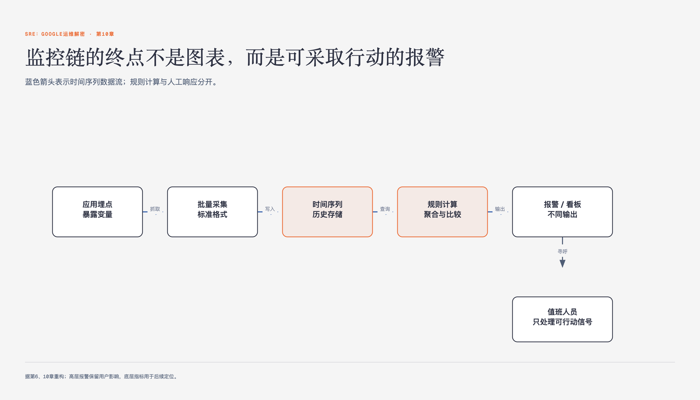

# 《SRE：Google运维解密》第10章 基于时间序列数据进行有效报警 · 原书回顾与主题讲解

本单元要回答：如何构建一个能支撑大规模服务、低维护成本且能自动过滤噪声的有效报警系统？

图10-1｜从应用指标到可操作报警的监控链

## 一、原书回顾：作者怎样展开

### ——SRE 谚语

本章开篇引用SRE谚语，强调监控是生产环境金字塔的基石，旨在通过数据让报警沉默。作者指出监控不仅用于应急响应，更需确保服务质量与产品目标一致。这一引言确立了全章基调：监控的核心价值在于通过理性判断保障服务可靠性，而非单纯的技术堆砌。

### Borgmon的起源

作者回顾Google监控系统从探针脚本向时间序列模型的演进，引出Borgmon的诞生。针对大型系统组件繁杂、单机报警无意义的问题，Borgmon采用自动汇总和高级别服务质量报警策略。它摒弃了复杂的子进程调用，转而依靠标准数据分析模型，实现了低成本、大规模的批量数据收集，奠定了白盒监控的基础。

### 应用软件的监控埋点

为解决大规模数据收集难题，Borgmon设计了标准化的监控指标格式。通过HTTP接口/varz以文本形式暴露变量，或增加Map格式支持标签，使得新增监控点仅需一行代码。这种低门槛接口降低了SRE与研发部门的协作成本，虽在可维护性上有所妥协，但通过自动校验工具弥补了定义与使用分离带来的风险。

### 如何将内部变量暴露给监控系统

Google二进制文件默认包含HTTP服务，主流语言提供API自动注册变量。这种机制允许开发者直接修改变量值，无需复杂配置。相比SNMP协议，HTTP协议虽看似违背简单传输理念，但实践证明其能很好地应对网络故障。结合自动生成的合成指标，如目标解析状态和健康检查响应，增强了报警规则的鲁棒性。

### 监控指标的收集

Borgmon通过配置目标列表动态抓取/varz URI，并将数据解码存储于内存。为避免上游同时抓取下游导致的负载峰值，Borgmon将收集工作均匀分散在周期内。同时，记录目标解析、响应及健康检查等合成指标，用于检测任务不可用状态。这种设计确保了在复杂网络环境下，监控数据收集的稳定性与可追溯性。

### 时间序列数据的存储

Borgmon将数据以(timestamp, value)格式存入内存链表，并按标签命名。内存存满后通过垃圾回收清除过期数据，保留约12小时的历史数据用于图表渲染。相比外部TSDB，内存查询更快但容量有限。这种设计平衡了查询速度与存储成本，确保在有限内存下能高效处理百万级时间序列，为上层计算提供实时数据支撑。

### 标签与向量

时间序列数据以向量形式存储，标签集合唯一标识一个时间序列。标签来源包括目标名称、提供数据、配置文件及规则。通过指定标签集合，可查询符合多维条件的多个时间序列，形成向量。这种机制支持灵活的数据聚合与过滤，使得监控数据能够按服务、区域等维度进行结构化组织，便于后续的高级计算与分析。

### Borg规则计算

Borgmon本质是可编程计算器，规则由代数表达式组成，输入时间序列并输出新序列。规则可在时间维度和空间维度上同时应用，支持汇总计算如计算整体QPS。通过计数器与测量器的区分，确保数据准确性。规则计算集中化减少了重复代码，提高了表达力，并通过内部监控指标帮助分析性能瓶颈，确保系统高效运行。

### 报警

报警规则计算结果为真或假，真则触发报警。为防止报警频繁波动，规则设定最小持续时间，如错误率超过阈值且持续两分钟才触发。报警信息包含任务名称、报警名称及触发值，通过Alertmanager服务转发。Alertmanager负责抑制重复报警、合并排重及根据标签展开信息，确保报警精准送达On-call工程师或工单系统，避免噪音干扰。

### 监控系统的分片机制

为应对单点故障和性能瓶颈，Borgmon采用流式传输协议在实例间传输数据。部署模型包括全局Borgmon和数据中心Borgmon，后者可进一步划分为收集层和汇总层。上游Borgmon过滤下游信息，减少全局层的存储压力。这种层级汇总体系允许按需下行查询，既保障了系统的高可用性，又优化了资源利用率，适应大规模分布式环境。

### 黑盒监控

白盒监控虽能深入内部状态，但无法反映最终用户视角。Google SRE团队利用探针程序进行黑盒监控，模拟用户请求并校验返回结果。探针可直接发送报警或暴露结果给Borgmon，用于收集响应速度直方图等指标。通过探测前端和后端，可区分局部问题与全局故障，消除无效报警，确保监控覆盖用户可见的性能体验。

### 配置文件的维护

Borgmon配置文件分离规则定义与收集目标，支持语言级模板减少重复。通过单元测试和回归测试确保规则正确性，生产环境通过持续集成体系分发配置。模板库涵盖HTTP服务器、内存分配器等通用类库，以及按命运共享理念构建的层级汇总模型。标签机制用于标记数据维度、来源及分组，使得监控配置灵活且易于维护，适应复杂的服务部署结构。

### 十年之后

Borgmon革命性地改变了测试与报警模型，实现了海量数据收集与中央化规则计算。松耦合模式使监控系统独立于报警规则，易于维护。随着Google成长，监控系统持续改进，开源项目如Prometheus也借鉴了这一理念。核心在于确保监控维护成本与服务规模非线性增长，SRE通过扩展性设计保障每一环节都能适应更大规模，确保持续可靠的运维能力。

## 二、主题讲解：时间序列监控的核心机制与报警实践

### 时间序列数据的结构化存储与查询

Borgmon将监控数据以时间序列（Time-Series）形式存储，每个序列由唯一标签集合标识。标签包括变量名、任务类型、服务组、区域等，形成多维矩阵。查询时，通过指定标签集合可获取符合条件的多个序列，形成向量。这种结构支持灵活的数据聚合，如按区域汇总错误率。标签不仅标记数据来源，还用于分组和汇总，使得监控数据能够按服务部署模型进行结构化组织，便于后续的高级计算与分析。

### 基于规则的聚合计算与报警逻辑

Borgmon规则本质是代数表达式，输入时间序列并输出新序列。规则可在时间维度和空间维度上同时应用，支持汇总计算如计算整体QPS。通过计数器与测量器的区分，确保数据准确性。报警规则计算结果为真或假，真则触发报警。为防止报警频繁波动，规则设定最小持续时间，如错误率超过阈值且持续两分钟才触发。报警信息包含任务名称、报警名称及触发值，通过Alertmanager服务转发，确保报警精准送达。

### 白盒与黑盒监控的互补实践

白盒监控深入系统内部状态，能高效定位错误根源，但无法反映最终用户视角。Google SRE团队利用探针程序进行黑盒监控，模拟用户请求并校验返回结果。探针可直接发送报警或暴露结果给Borgmon，用于收集响应速度直方图等指标。通过探测前端和后端，可区分局部问题与全局故障，消除无效报警。这种互补实践确保了监控覆盖用户可见的性能体验，同时保持内部状态的透明度。

## 检验理解

**情形**：你正在为一个全球分布的Web服务设计监控报警系统。该服务由多个数据中心的实例组成，每个实例有多个任务。你发现某数据中心的HTTP 500错误率突然升高，但整体服务的错误率仍在阈值以下。

**问题**：1. 请说明白盒监控和黑盒监控在这一场景下分别能提供什么信息？2. 如果仅依赖白盒监控的报警规则，可能会忽略什么问题？3. 如何结合黑盒监控结果调整报警策略，以确保既能快速定位局部故障，又不会因整体服务正常而忽略潜在风险？

### 核对思路（先作答再看）

1. 白盒监控能提供内部状态信息，如队列长度、内存使用率等，帮助定位具体组件故障。黑盒监控通过探针测试用户可见的HTTP状态，反映最终用户体验。2. 仅依赖白盒监控可能忽略用户不可见的内部状态变化，或因局部故障未影响整体服务而忽略报警。3. 结合黑盒监控结果，可设置分层报警策略：当局部错误率升高时，即使整体服务正常，也触发局部警告；当整体错误率升高时，触发全局报警。同时，利用黑盒监控结果验证白盒监控数据的准确性，减少误报。

## 来源、范围与阅读连接

- 原书定位：PDF 142-154。
- 源文件 SHA-256：`75611d407c657cfcbe2079507dc6957df46836ad8cdf6bea30912fdeab4f3a96`。
- “原书回顾”只归纳本单元作者的展开；“主题讲解”和理解检查属于书镜重构。
- 版本边界：书中工具、Google组织结构和规模数字来自2016年中文版及更早实践，不作为当前产品或组织现状。
- 边界：本章内容基于Google内部Borgmon系统的实践经验，不自动适用于所有团队。
- 边界：技术细节如内存占用、查询速度等数据仅适用于Google规模环境。
- 边界：报警规则的具体实现细节可能因开源版本差异而有所不同。
- 阅读连接：下一单元是“第11章 on-call轮值”，继续回答：怎样理解并使用“on-call轮值”，以及它在什么条件下不适用。
