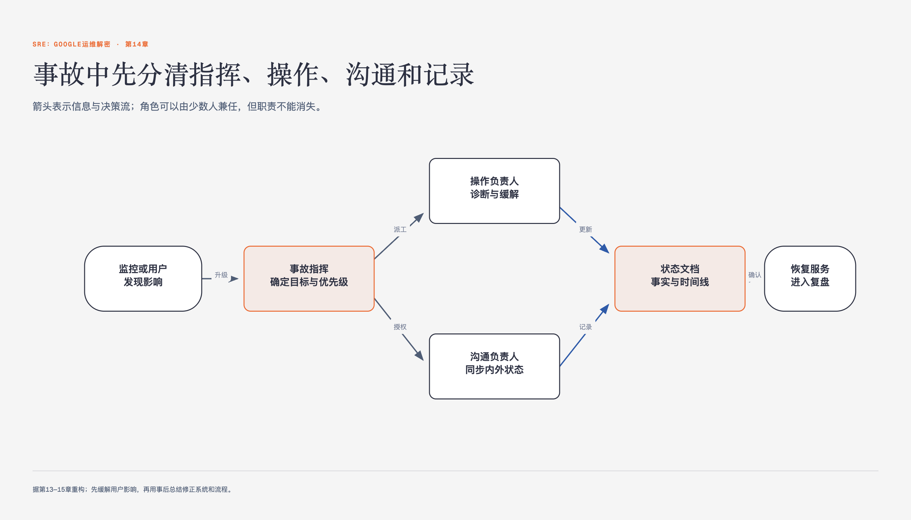

# 《SRE：Google运维解密》第14章 紧急事故管理 · 原书回顾与主题讲解

本单元要回答：怎样理解并使用“紧急事故管理”，以及它在什么条件下不适用。

图14-1｜紧急事故响应中的角色与信息流

## 一、原书回顾：作者怎样展开

### 无流程管理的紧急事故

本章以Mary作为On-call工程师的视角，描述了一次因缺乏流程管理而失控的事故。周五下午，服务在多个数据中心同时瘫痪，Mary独自回滚版本无效，随后同事Josephine和Sabrina介入，高管Malcolm也随意修改配置，导致情况恶化。作者通过这一混乱场景，展示了在高压下个人英雄主义式的单打独斗如何加剧系统崩溃，为后续引入标准化流程管理做铺垫。

### 对这次无流程管理的事故的剖析

作者指出事故失控并非因为工程师不努力，而是源于三个常见问题。首先是过于关注技术细节，导致Mary无暇思考缓解策略；其次是沟通不畅，团队成员互不知晓彼此操作，业务部门愤怒却无人回应；最后是不请自来，Malcolm在未通知负责人的情况下修改配置，反而加剧了故障。这些分析揭示了缺乏协调机制的危害。

### 过于关注技术问题

作者以Mary为例，指出因按技术能力招聘，导致其在灾难中忙于执行技术操作，无暇思考其他缓解手段。这解释了为何事故恶化，说明缺乏全局视角会使技术努力失效。

### 沟通不畅

基于Mary忙于技术操作的原因，作者指出其无法有效沟通，致使他人不知其动向，业务部门愤怒且其他工程师未被充分利用。这揭示了技术忙碌如何导致协作断裂和信息孤岛。

### 不请自来

作者描述Malcolm出于善意修改系统却未通知Mary，导致服务崩溃。这作为反面案例，说明未经协调的干预会破坏故障排除秩序，强调明确负责人权限对避免混乱的关键作用。

### 紧急事故的流程管理要素

为解决上述问题，Google采用基于Incident Command System的流程管理，核心在于嵌套式职责分离。通过明确分工，让每个人专注于自身任务，减少相互干扰。该体系将职责划分为事故总控、事务处理、发言人、规划负责人及控制中心等角色，确保在紧急情况下信息清晰、行动有序，从而提升整体响应效率。

### 嵌套式职责分离

作者提出通过明晰职责（如事故总控、发言人等）使人员独立自主。通过介绍Google的IRC工具和实时文档，说明清晰分工能减少疑虑，提升协作效率，是应对前文混乱的核心机制。

### 事故总控（incident command）

事故总控负责掌握全局信息，组建团队并按优先级分配任务。其核心职责包括协调工作、代申请访问权限及收集联系信息，确保事务处理团队能高效解决问题。未分配的职责仍由总控负责，这一角色是事故处理的中枢，旨在通过清晰的指挥链消除混乱，使其他成员能更自主地工作。

### 事务处理团队（operational work）

事务处理团队在事故总控的指挥下，负责具体执行解决系统问题的操作。他们是事故中唯一被允许对系统进行修改的团队。这一角色与总控紧密沟通，确保所有技术操作符合整体策略。通过限制修改权限，避免了多人同时操作导致的不可控风险，保障了修复过程的安全性和有效性。

### 发言人（communication）

发言人是事故处理团队的公众代表，负责向团队及关心方发送周期性通知，通常通过邮件进行。其职责还包括维护事故文档，确保信息的准确性和及时性。通过统一对外口径，发言人减轻了其他工程师的沟通负担，使技术团队能专注于问题解决，同时让利益相关者及时了解进展，缓解焦虑。

### 规划负责人（planning）

规划负责人为事务处理团队提供支持，处理持续性工作如填写Bug报告、安排餐饮及职责交接记录。他们负责记录处理过程中的特殊操作，以便事后复原。这一角色确保了技术操作的记录完整性和后勤支持，使团队能专注于核心故障排除，同时为事故后的复盘和系统复原提供准确依据。

### 控制中心

控制中心是受影响部门与事故总控联系的枢纽，常设立为“作战室”以便集中办公。Google发现IRC系统对紧急处理极有帮助，因其可靠且能提供完整记录。通过IRC机器人记录通信和报警，团队能高效协调并保留细节，便于事后分析。控制中心作为物理或虚拟枢纽，强化了信息流动的稳定性。

### 实时事故状态文档

事故总控需维护实时事故文档，通常采用Wiki形式，支持多人同时编辑。Google推荐使用Google Docs或Sites，避免使用正在修复的服务本身。文档应使用模板，将最新信息置顶以提高可用性，并在事后总结中发挥作用。这一文档是事故处理的核心信息源，确保所有参与者基于最新状态做出决策。

### 明确公开的职责交接

在超出工作时间后，事故总控职责需明确、公开地交接。交接时应通过电话或视频会议同步情况，新负责人确认接手后，原负责人方可离开。交接结果需向所有处理人员宣布，明确当前负责人。这一机制确保了责任的连续性和透明度，避免了因人员轮换导致的信息断层或指挥混乱。

### 一次流程管理良好的事故

作者重述了同一事故在良好流程管理下的处理过程。Mary发现故障后，立即邀请Sabrina担任事故总控。Sabrina记录状态、发送通知、评估影响，并协调Josephine和Robin介入。通过IRC和邮件保持沟通，Sabrina在下班前组织电话会议并顺利完成职责交接。最终问题被解决，体现了流程管理在协调资源和缓解压力方面的有效性。

### 什么时候对外宣布事故

作者强调应尽早宣布事故，而非等到问题持续数小时。Google设定了宣布事故的标准：需引入第二团队、影响最终用户或集中分析一小时未解决。通过定期使用流程管理处理常规变更和进行灾难演习，工程师能保持技能熟练度。这种预防性实践有助于在真正紧急情况下迅速启动有效的响应机制。

### 小结

本章总结指出，通过事前准备事故流程管理策略、确保平稳实施及经常测试，能降低平均恢复时间（MTTR）并减轻人员压力。任何关注服务可靠性的组织都能从类似策略中受益。这一小结重申了流程管理在提升应急响应能力和降低运营风险方面的核心价值，为后续最佳实践提供理论基础。

### 事故流程管理最佳实践

最后列出七项最佳实践：划分优先级以控制影响和恢复服务；事前准备流程；信任团队成员自主行动；反思情绪状态；定期审视替代方案；通过练习形成习惯；以及换位思考熟悉其他角色。这些实践旨在通过制度化训练和心态调整，提升团队在紧急情况下的整体协作效率和心理韧性。

## 二、主题讲解：紧急事故管理的核心机制

### 事故中的角色分工与职责隔离

在紧急事故中，混乱往往源于职责不清。Google的Incident Command System通过嵌套式职责分离来解决这一问题。事故总控负责全局指挥和资源分配，事务处理团队专注技术修复，发言人统一对外沟通，规划负责人处理后勤与记录。这种分工并非为了增加层级，而是为了让每个人在明确边界内自主工作，减少相互干扰。例如，总控不直接修改代码，而是协调资源；发言人不处理技术细节，只传递信息。这种隔离确保了信息流的清晰和操作的安全性，避免了“多头指挥”导致的系统崩溃。

### 实时状态文档与沟通机制

有效的事故管理依赖于实时、准确的信息共享。实时事故状态文档是核心工具，通常采用支持多人编辑的Wiki形式，如Google Docs。文档需使用模板，将最新信息置顶，确保所有参与者基于同一事实决策。同时，IRC等可靠通信工具被广泛用于记录通信和报警，提供事后复盘依据。控制中心作为物理或虚拟枢纽，连接总控与受影响部门。这种机制不仅加速了信息流动，还通过记录功能降低了人为错误风险，使团队能在高压下保持有序协作。

### 流程管理的触发条件与持续练习

流程管理并非仅在重大事故时启用，而应成为日常运维的一部分。Google设定了明确的宣布事故标准：如需引入第二团队、影响最终用户或一小时未解决。通过定期处理常规变更和进行灾难演习，工程师能保持流程熟练度。这种预防性实践避免了技能萎缩，确保在真正紧急情况下能迅速启动响应。此外，明确公开的职责交接机制确保了责任的连续性，避免了因人员轮换导致的信息断层。

## 检验理解

**情形**：假设你是一名On-call工程师，发现服务响应时间突然增加50%，但用户尚未完全无法访问。此时，你是否应该立即宣布事故并启动流程管理？请结合本章提到的宣布标准（如影响用户、解决时长等）进行判断。如果决定启动，你应首先分配哪个角色？如果决定不启动，你如何确保后续问题升级时能迅速切换？请说明你的推理依据，并思考如何平衡流程开销与响应速度。

**问题**：在上述情境中，如果服务响应时间增加50%但用户仍可访问，根据Google的宣布标准，你是否会立即启动事故流程？请说明理由。若启动，首先应分配哪个角色？若不启动，如何确保后续升级时的快速响应？

### 核对思路（先作答再看）

根据Google标准，若影响最终用户或一小时未解决，应宣布事故。响应时间增加50%可能影响用户体验，若持续一小时未解决，应启动流程。若启动，首先应分配事故总控，负责全局指挥和资源分配。若不启动，需持续监控并设定明确阈值，确保在问题升级时能迅速切换至流程管理，避免延误。平衡流程开销与响应速度需通过定期演习和明确标准来实现。

## 来源、范围与阅读连接

- 原书定位：PDF 184-190。
- 源文件 SHA-256：`75611d407c657cfcbe2079507dc6957df46836ad8cdf6bea30912fdeab4f3a96`。
- “原书回顾”只归纳本单元作者的展开；“主题讲解”和理解检查属于书镜重构。
- 版本边界：书中工具、Google组织结构和规模数字来自2016年中文版及更早实践，不作为当前产品或组织现状。
- 边界：本章内容基于Google的特定实践，其他组织可能因规模、文化或技术栈不同而有所差异。
- 边界：事故流程管理的有效性依赖于团队的训练和纪律，实际应用中可能存在执行偏差。
- 边界：实时状态文档和IRC等工具的使用需结合组织的具体技术环境进行调整。
- 边界：职责交接和流程启动的标准需根据组织的具体业务影响定义进行定制。
- 阅读连接：下一单元是“第15章 事后总结：从失败中学习”，继续回答：如何从事故中有效学习以避免重复失败？
