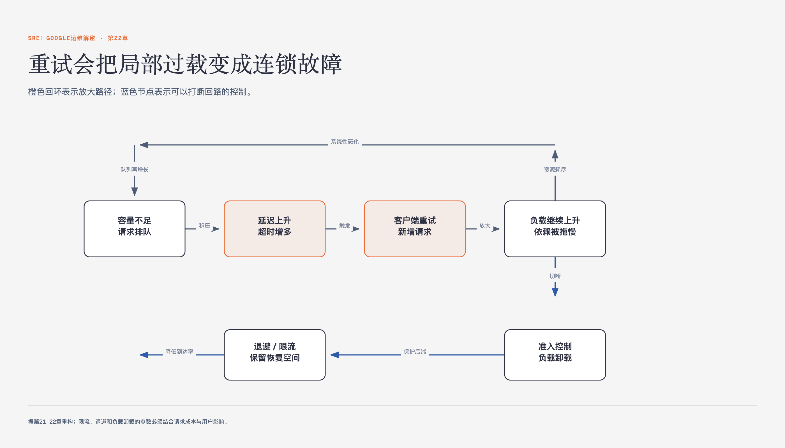

# 《SRE：Google运维解密》第22章 处理连锁故障 · 原书回顾与主题讲解

本单元要回答：怎样理解并使用“处理连锁故障”，以及它在什么条件下不适用。

图22-1｜连锁故障如何从局部过载放大成系统失稳

## 一、原书回顾：作者怎样展开

### 连锁故障产生的原因和如何从设计上避免

本节定义连锁故障为正反馈循环导致的规模扩大，以莎士比亚搜索服务为例说明局部故障如何引发全局崩溃。作者指出服务器过载是常见触发原因，并引出资源耗尽这一核心概念，为后续详细分析各类资源耗尽场景做铺垫。

### 资源耗尽

本节阐述资源耗尽导致高延迟和错误率，进而引发负载均衡转发和连锁故障。作者指出不同资源耗尽影响各异，首先聚焦CPU资源不足，说明其会导致请求变慢及一系列副作用，自然过渡到对CPU具体副作用的逐一剖析。

### CPU

本节详细列举CPU资源不足的副作用，包括in-flight请求上升、队列过长、线程卡住、死锁、RPC超时及缓存效率下降。作者通过列举这些相互关联的现象，说明CPU过载如何引发连锁反应，为后续讨论内存等资源耗尽做对比铺垫。

### 正在处理的（in-flight）请求数量上升

作者指出CPU资源不足导致处理变慢，使同一时间服务器需处理更多请求。这会影响内存、线程及文件描述符等资源，可能引发队列排队，是服务器过载引发连锁故障的直接表现和后续资源耗尽的诱因。

### 队列过长

当资源不足以稳定处理请求时，服务器队列会逐渐填满。这导致延迟上升并消耗更多内存。作者强调队列过长是资源耗尽的典型后果，并指出应对策略需参考本章后续的“队列管理”小节，以平衡负载与处理能力。

### 线程卡住

若线程因等待锁而无法处理请求，服务器可能无法及时响应健康检查。在Borg系统中，这会被视为服务器失败并触发杀掉进程的操作。作者以此说明线程阻塞如何间接导致服务被误判为故障，加剧系统不稳定。

### CPU死锁或者请求卡住

作者描述服务器内置看门狗机制可能检测到工作停滞，导致软件因CPU不足而崩溃。若看门狗由远端触发，排队请求无法及时处理，会触发看门狗杀掉进程。这展示了资源竞争如何触发自动化保护机制，导致服务中断。

### RPC超时

服务器过载时RPC回复变慢，超过客户端超时时间。这导致服务器处理被浪费，客户端重试造成更严重过载。作者指出这是连锁故障中常见的正反馈循环，重试放大了负载，使系统更难恢复稳定状态。

### CPU缓存效率下降

作者指出CPU使用增多会使任务分散到多个核心，导致本地缓存失效，降低处理效率。这是资源耗尽时的副作用之一，说明CPU过载不仅影响吞吐量，还通过缓存命中率下降进一步恶化性能，形成恶性循环。

### 内存

本节分析内存耗尽的影响，包括任务崩溃、Java GC速率加快导致CPU上升（GC死亡螺旋）及缓存命中率下降。作者指出内存压力会减少缓存空间，导致更多RPC请求后端，进而引发后端过载，展示了资源间的相互依赖关系。

### 任务崩溃

内存耗尽可能导致任务因超过资源限制被容器管理器驱逐，或触发程序逻辑崩溃。作者将此列为内存耗尽的直接后果，说明资源不足不仅影响性能，还会直接导致服务实例不可用，进而将负载转移至其他节点。

### Java 垃圾回收（GC）速率加快，从而导致CPU使用率上升

作者描述“GC死亡螺旋”场景：CPU减少致处理变慢，内存上升触发更多GC，进一步减少CPU。这是极糟糕的连锁反应，说明Java应用中内存与CPU资源的相互依赖如何导致系统迅速崩溃，难以通过简单手段恢复。

### 缓存命中率下降

可用内存减少导致应用层缓存命中率降低，向后端发送更多RPC，可能致后端过载。作者指出这是内存压力引发的次级现象，说明缓存失效如何将负载转移至后端，加剧整个系统的资源紧张和故障风险。

### 线程

本节简述线程不足导致的错误和健康检查失败，以及线程增加带来的内存占用和PID耗尽风险。作者指出文件描述符不足会影响网络连接和健康检查，进而引出资源间相互依赖的复杂场景，说明定位根本问题往往十分困难。

### 文件描述符

文件描述符不足可能导致无法建立网络连接，进而引发健康检查失败。作者将其列为资源耗尽的一种具体表现，说明底层资源限制如何影响网络通信和服务状态检测，最终可能导致服务被标记为不健康并触发故障转移。

### 资源之间的相互依赖

本节通过Java前端GC导致CPU不足、进而引发内存上升、缓存命中率下降、最终导致后端过载的复杂案例，说明资源耗尽的连锁效应。作者强调在前后端分离运维时，判断后端崩溃源于前端缓存命中率下降极为困难，引出服务不可用的严重后果。

### 服务不可用

本节描述资源耗尽导致服务器崩溃，引发负载转移和滚雪球效应，甚至导致服务无法通过简单降载恢复。作者指出负载均衡策略可能加剧此问题，引出防止软件服务器过载的策略，强调通过压力测试确定服务器极限的重要性。

### 防止软件服务器过载

本节提出防止过载的策略，包括压力测试、提供降级结果、主动拒绝请求及上层系统拒绝请求。作者指出速率限制可能无法阻止连锁故障，引出容量规划的重要性，说明好的容量规划能降低连锁反应可能性，但无法完全避免。

### 提供降级结果

作者建议向用户返回低质量但易计算的结果，以减轻服务器负担。策略取决于服务自身，旨在过载时减少计算量。这是防止过载崩溃的主动策略之一，通过牺牲部分服务质量来换取系统的整体可用性和稳定性。

### 在过载情况下主动拒绝请求

作者强调软件服务器应保护自己不进入过载崩溃状态，尽早标记失败请求。这是防止过载的关键策略，通过主动拒绝新请求来避免资源耗尽。该策略需在过载模式早期实施，以防止系统进入不可逆的故障循环。

### 上层系统应该主动拒绝请求

作者指出简单速率限制可能无法阻止连锁故障，建议在反向代理、负载均衡器或任务自身实现。通过限制特定特性请求或丢弃非关键请求，可缓解过载。这强调了多层防御的重要性，避免单一节点过载引发全局故障。

### 进行容量规划

本节强调容量规划需配合性能测试，以确定服务失败的负载程度。作者指出容量规划仅能减少触发可能性，无法避免计划内外不可用或突发流量导致的连锁反应，引出队列管理在应对突发流量中的作用，说明队列长度对延迟的影响。

### 队列管理

本节分析队列管理对延迟和内存的影响，指出稳定服务应减小队列长度，尽早拒绝请求。作者以Gmail为例说明无队列服务器的优势，引出流量抛弃和优雅降级策略，说明在临近过载时主动抛弃负载以避免内存超限和延迟升高。

### 流量抛弃和优雅降级

本节介绍流量抛弃通过拒绝请求避免过载，优雅降级通过降低回复质量减少计算量。作者指出实施时需考虑指标选择、动作执行及层级，并强调降级系统应简单、避免复杂逻辑导致反馈循环，引出重试机制可能加剧过载的风险。

### 重试

本节通过Go语言gRPC重试代码示例，说明重试如何放大后端过载，导致请求量指数级增长直至后端崩溃。作者指出即使降低前端负载，重试仍可能维持过载状态，引出重试机制中需考虑随机化、限制次数及全局预算等关键原则。

### 请求延迟和截止时间

本节讨论RPC截止时间对限制后端资源消耗的作用，指出设置截止时间可避免处理已取消请求。作者强调截止时间传递的重要性，说明若不传递，底层服务器可能继续处理已超时的请求，导致资源浪费和连锁故障加剧。

### 选择截止时间

作者认为设置截止时间明智，可避免短暂问题持续消耗资源。截止时间需平衡，过长导致资源浪费，过短致重型请求失败。这是防止资源被无效请求占用的关键设计，确保系统在高负载下仍能维持基本服务能力。

### 超过截止时间

作者指出服务器常消耗大量资源处理已超时的请求，这是无用功。建议在RPC各阶段前检查截止时间，避免继续处理已取消的请求。这有助于减少资源浪费，防止过载情况下因无效处理加剧系统负担和故障风险。

### 截止时间传递

作者提倡采用截止时间传递机制，使整个RPC树共享绝对截止时间。若不传递，底层服务器可能继续处理已超时的请求，造成资源浪费。传递机制确保上游超时能迅速终止下游处理，防止连锁故障中的资源泄露和放大。

### 请求延迟的双峰分布（Bimodal）

本节通过前端线程耗尽案例，说明少量不可完成请求如何导致大部分请求失败。作者指出检测双峰分布困难，建议启用快速失败选项，避免设置过长的截止时间，并考虑限制特定客户端请求数量，以解决线程耗尽问题。

### 慢启动和冷缓存

本节分析进程启动后处理速度慢的原因，包括初始化、JIT编译及冷缓存。作者指出冷缓存导致高延迟，可能引发过载，引出上线新集群、维护后恢复及重启等导致冷缓存的场景，说明需通过过量配备和缓慢增加负载来避免问题。

### 必需的初始化过程

作者指出进程启动后需与后端建立连接，导致处理变慢。这是冷启动时的常见现象，说明初始化过程会增加延迟。在连锁故障中，冷启动可能加剧负载压力，需通过预热或慢启动策略来缓解初始化带来的性能波动。

### 运行时性能优化，尤其是Java

作者提到JIT编译、热点优化及类延迟加载导致启动后处理变慢。这是Java运行时特性，说明性能优化需要时间。在故障恢复或扩容时，这些优化未完成可能导致服务暂时无法承受负载，需考虑预热机制以避免性能瓶颈。

### 上线一个新的集群

作者指出新集群缓存为空，导致效率低下。这是冷缓存问题的触发场景之一，说明新节点上线可能因缓存未热而处理缓慢。在连锁故障中，新集群可能无法立即承担负载，需通过缓慢增加流量来避免过载风险。

### 在某个集群维护之后恢复服务状态

作者指出维护后恢复服务时，缓存数据可能过期，导致效率低。这是冷缓存问题的另一触发场景，说明维护后的恢复过程可能伴随性能下降。需确保缓存预热或数据一致性，以避免恢复期间因处理缓慢引发过载或故障。

### 重启

作者指出重启后缓存需时间填充，可能导致处理变慢。这是冷缓存问题的常见触发因素，说明重启操作可能暂时降低服务能力。在连锁故障中，重启若未配合预热策略，可能加剧负载压力，导致服务再次崩溃或进入故障循环。

### 保持调用栈永远向下

本节通过莎士比亚搜索服务例子，说明同层通信可能导致分布式死锁和延迟上升。作者指出应避免层内交互，由客户端重试，引出连锁故障的触发条件，如进程崩溃、更新及自然增长，说明这些情况可能触发多米诺骨牌效应。

### 连锁故障的触发条件

本节列举进程崩溃、更新、自然增长及资源限制等触发条件，说明小规模事件可能引发大规模故障。作者指出依赖备用资源危险，引出连锁故障的测试策略，强调通过压力测试观察服务行为，确定临界点和故障模式。

### 进程崩溃

作者指出进程崩溃减少服务容量，微小事件如几个任务崩溃可能触发连锁故障。这是服务不稳定的直接表现，说明容量减少如何导致负载转移，进而引发其他节点过载。作者强调需监控并快速恢复，以防止故障扩散。

### 自然增长

作者指出连锁故障常因使用量天然上升且无容量调整导致。这是非特定改变引发的故障场景，说明流量增长若未伴随容量规划，可能触发过载。作者强调需通过容量规划和压力测试，提前识别并应对自然增长带来的负载压力。

### 计划中或计划外的不可用

作者指出集群维护或事故导致容量不可用，可能引发连锁故障。这是服务可用性降低的直接原因，说明依赖不可用如何导致上游负载转移。作者强调需评估依赖关系，通过冗余设计和故障转移机制，减少不可用对系统的影响。

### 请求特征的变化

作者指出负载均衡改动或用户行为变化导致请求特征改变，可能引发过载。这是服务负载变化的诱因，说明请求成本变化如何影响后端处理。作者强调需监控请求特征，通过容量规划和负载管理，适应变化并防止过载。

### 资源限制

作者指出集群允许超卖资源，CPU备用资源可能随时消失，导致任务资源不足。这是资源限制引发的故障场景，说明依赖备用资源的风险。作者强调需确保服务在预留资源限制内运行，通过压力测试验证资源边界，防止超卖导致的故障。

### 连锁故障的测试

本节讨论通过压力测试检测连锁故障，建议测试组件崩溃及恢复行为。作者指出应测试不同负载场景及客户端行为，强调测试非关键性后端以确保其不可用不影响关键组件，引出解决连锁故障的立即步骤，如增加资源和重启。

### 测试最常用的客户端

作者建议理解最大客户如何使用服务，如重试策略和流量变化。这是测试策略的一部分，说明了解客户端行为有助于识别潜在风险。作者强调需针对大客户进行模拟演习，观察其应对后端问题的方式，以优化服务设计和故障处理。

### 解决连锁故障的立即步骤

本节提出增加资源、停止健康检查、重启及丢弃流量等立即步骤。作者指出增加资源可能无法解决死亡螺旋，重启需谨慎，丢弃流量是重型操作，需先修复根源。引出莎士比亚搜索服务案例，说明实际故障处理过程。

### 增加资源

作者指出增加任务数量是容量不足时的快速解决方案，但若进入死亡螺旋可能无效。这是应对连锁故障的立即步骤，说明资源增加需结合问题来源修复。作者强调需先解决触发原因，再逐步恢复负载，避免单纯增加资源无法解决问题。

### 进入降级模式

作者建议通过提供降级回复或丢弃不重要流量来减少工作量。这是进入降级模式的策略，说明需了解哪些流量可降级。作者强调该策略需在服务内部实现，通过区分请求类型，降低负载并维持基本服务，防止系统完全崩溃。

### 莎士比亚搜索服务的连锁故障

本节以莎士比亚搜索服务为例，说明流量激增和大型更新导致过载，通过优雅降级和增加容量恢复服务。作者指出事后总结的重要性，说明SRE通过调整负载均衡和自动伸缩机制避免问题重现，引出小结对连锁故障的总结。

### 小结

本节总结连锁故障中牺牲部分用户可见错误优于继续服务所有请求，强调理解临界点和系统行为模式的重要性。作者指出优化稳定状态的改变可能增加事故几率，提醒小心评估改变，避免灾难接踵而至，完成本章内容。

## 二、主题讲解：理解连锁故障的机制与应对

### 连锁故障的正反馈机制

连锁故障的核心机制是正反馈循环，即局部故障引发更大范围的故障。以服务器过载为例，当集群B故障时，请求全部转向集群A，导致集群A过载。过载导致请求处理变慢，in-flight请求数量上升，进一步消耗资源。这种资源消耗导致更多请求排队或超时，客户端重试又增加负载，形成恶性循环。理解这一机制的关键在于识别资源耗尽如何导致服务性能下降，进而触发更多请求，最终导致系统崩溃。

### 资源耗尽的连锁效应

资源耗尽是连锁故障的直接原因。CPU不足导致请求变慢，内存不足导致GC加速和缓存命中率下降，线程不足导致健康检查失败。这些资源相互依赖，如CPU不足导致请求处理慢，内存使用上升，缓存命中率下降，导致更多RPC请求后端，最终导致后端过载。理解这一效应需关注资源间的相互依赖，识别根本问题而非表面现象。例如，Java前端GC问题导致CPU不足，进而引发内存和缓存问题，最终导致后端过载。

### 防止过载的策略

防止过载需采取多种策略，包括压力测试、流量抛弃、优雅降级和容量规划。压力测试确定服务器极限和失败模式，流量抛弃在临近过载时主动拒绝请求，优雅降级通过降低回复质量减少计算量。容量规划确保服务有足够的处理能力，但无法完全避免突发流量导致的故障。理解这些策略需关注其适用场景和限制，如流量抛弃需选择合适的指标，优雅降级需简单易懂，避免复杂逻辑导致反馈循环。

### 应对连锁故障的立即步骤

应对连锁故障需采取立即步骤，如增加资源、停止健康检查、重启和丢弃流量。增加资源可能无法解决死亡螺旋，重启需谨慎，丢弃流量是重型操作，需先修复根源。理解这些步骤需关注其操作顺序和效果，如先增加资源，再停止健康检查，最后重启服务。同时，需通过事后总结识别触发条件，调整负载均衡和自动伸缩机制，避免问题重现。

## 检验理解

**情形**：假设一个搜索服务的前端服务器在处理请求时，发现后端存储层响应缓慢。前端服务器设置了10秒的RPC截止时间，但后端处理单个请求需要8秒。此时，前端服务器有100个线程，每秒接收10个请求。如果后端存储层突然故障，导致所有请求超时，前端服务器将如何处理这些请求？

**问题**：在这种场景下，前端服务器是否会因为处理超时请求而耗尽线程资源，进而导致连锁故障？请说明理由。

### 核对思路（先作答再看）

是的，前端服务器可能会因为处理超时请求而耗尽线程资源。如果后端存储层故障，所有请求都将超时，前端服务器将等待10秒才能释放线程。如果每秒接收10个请求，前端服务器将在10秒内积累100个线程，导致线程耗尽。这将导致新请求无法处理，进而导致连锁故障。为了避免这种情况，前端服务器应设置较短的截止时间，或在检测到后端故障时快速失败，释放线程资源。

## 来源、范围与阅读连接

- 原书定位：PDF 275-292。
- 源文件 SHA-256：`75611d407c657cfcbe2079507dc6957df46836ad8cdf6bea30912fdeab4f3a96`。
- “原书回顾”只归纳本单元作者的展开；“主题讲解”和理解检查属于书镜重构。
- 版本边界：书中工具、Google组织结构和规模数字来自2016年中文版及更早实践，不作为当前产品或组织现状。
- 边界：Google规模和组织实践属于书中经验，不自动写成所有团队的通则。
- 阅读连接：下一单元是“第23章 管理关键状态：利用分布式共识来提高可靠性”，继续回答：管理关键状态：利用分布式共识来提高可靠性。
