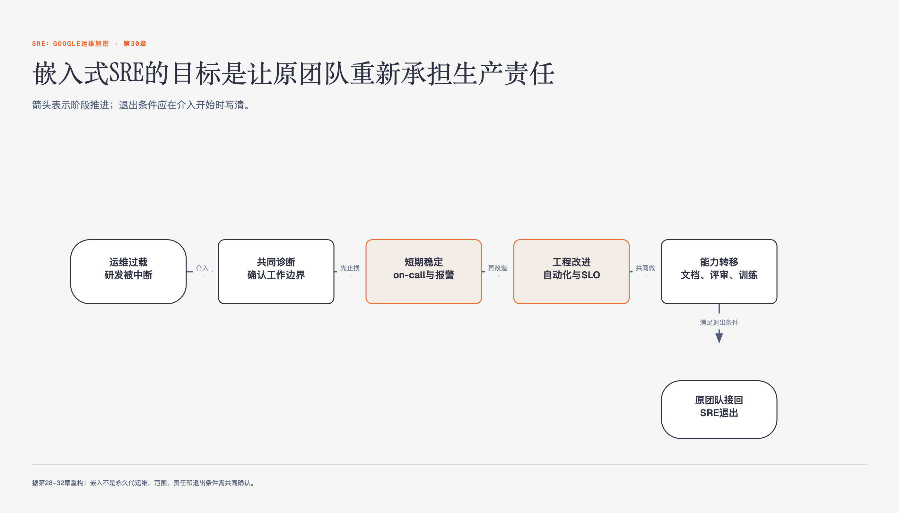

# 《SRE：Google运维解密》第30章 通过嵌入SRE的方式帮助团队从运维过载中恢复 · 原书回顾与主题讲解

本单元要回答：嵌入式SRE如何帮助团队从运维过载中恢复？

图30-1｜嵌入式SRE怎样帮助团队从运维过载恢复

## 一、原书回顾：作者怎样展开

### 第一阶段：了解服务，了解上下文

本章开篇指出，长期处于Ops模式会导致团队疲劳且服务可靠性下降。嵌入式SRE的核心任务不是清理工单，而是改善团队工作方式。通过观察日常流程，SRE能发现成员视角盲区，引导团队建立减少工单的健康习惯，而非单纯增加人手。

### Ops模式与非线性扩展

Ops模式通过增加管理员应对规模扩大，而SRE通过消除瓶颈实现非线性扩展。SRE需判断服务规模：若商业价值高但规模小，应聚焦改进工作方式；若处于增长初期，则需为爆发式增长做准备。可扩展性判断直接影响后续策略制定。

### 确定最大的压力来源

团队陷入Ops模式常因过度关注快速解决紧急事件而非减少其数量。SRE需根据历史中断对团队压力的程度对问题进行排序。需注意，由于视角局限，团队可能忽视某些实际负担沉重的小问题，SRE需客观识别这些被低估的压力源。

### 找到导火索

确定最大问题后，需关注即将发生的紧急情况。导火索包括：知识代沟导致的依赖、SRE直接开发功能被忽视、对“未来解决方案”的过度依赖、被视而不见的警报、缺乏SLI/SLO/SLA且有投诉的服务、仅靠增加服务器解决容量问题的服务、仅回滚不究根源的事后总结，以及SRE对关键组件缺乏理解的状况。

### 知识代沟

指出大型团队过度专业化导致成员缺乏广泛知识，在on-call时因不懂关键系统而需他人帮助，同时其他成员也缺乏该专家的知识，形成恶性循环。作者以此说明专业化带来的沟通壁垒是运维压力的来源之一。

### SRE直接参与开发的功能变得越来越重要

指出SRE直接参与开发的功能常被忽视，因其规模小且曾有SRE支持。作者强调这些功能虽不起眼，但缺乏同等关注会导致可靠性隐患，提醒团队需给予其与新功能同等重视，以预防潜在故障。

### 对“未来的一件大事”的过度依赖

描述团队成员常忽略当前问题，坚信即将上线的新方案能解决一切，从而认为临时措施无意义。作者借此揭示这种心态导致问题被长期搁置，阻碍了即时改进，是造成运维负担的重要心理因素。

### 开发团队和SRE都视而不见的警报

指出某些警报常被定性为暂时性而被忽视，实则分散团队精力。作者建议要么彻底调查此类警报，要么修改规则使其不再出现，强调消除干扰源对提升运维效率至关重要，避免无效警报消耗团队注意力。

### 第二阶段：分享背景知识

了解痛点后，需通过建立最佳实践改善状况。重点在于书写好的事后总结作为示范。不健康的团队视事后总结为惩罚，SRE应避免评论过往错误，而是亲自负责下一次事故的事后总结，展示如何通过永久性修复根源问题来减少长期影响，打破“坏苹果”理论误区。

### 书写一个好的事后总结作为示范

事后总结体现团队集体推理能力。SRE应亲自撰写示范文档，解释如何从根源受益，而非指责个人。面对“为什么是我”的防御心理，需指出复杂系统中错误不可避免，引导成员记录决策时的信息，发现系统误导之处，从而建立对事不对人的文化。

### 将紧急事件按类型排序

将紧急事件分为两类：不应存在的琐事和日常工作中产生压力的事件。SRE需将列表交给团队，清晰解释哪些应自动化，哪些是必须承担的运维工作。通过分类，帮助团队区分可消除的负担与必须管理的复杂性，为后续自动化奠定基础。

### 第三阶段：主导改变

团队健康是持续过程，需建立良好SRE心理模型。SRE应关注创建正确的初始条件，传授简单原则。避免个人英雄主义，通过帮助团队成员完成有价值工作，解释其如何永久解决问题，并亲自评审代码和文档，逐步引导团队接受改变。

### 从基础开始

若团队无法区分SRE与Ops模型，需从基础原则开始。首要目标是制定服务等级目标（SLO），它为事故后果提供量化依据，也是流程改变重要性的基础。若无SLO，其他建议无效。需召集技术负责人和管理层讨论确定SLO，达成共识。

### 获取团队成员的帮助

SRE需克制直接修复问题的冲动，避免宣扬“改变是别人的事”。应找到可由成员完成的价值工作，解释其如何永久解决问题，并亲自作为评审者。重复此过程两三次，将其他问题写入文档鼓励成员提供意见，促进信息共享和文档编写。

### 解释你的逻辑推理过程

随着团队接受改变，SRE需解释日常决策背后的逻辑。即使无人要求，也应主动解释，引用基础理念以建立心理模型。提供充分解释的例子，如基于错误预算或SLO要求说明反对发布的原因，避免模糊理由，防止团队形成懒惰风气。

### 提出引导性问题

SRE应提出引导性问题而非指责性问题，鼓励团队思考基本理念。例如询问警报对SLO的影响或上线过程复杂的原因，而非质问停滞发布。通过引导性提问，帮助团队理解SRE哲学，使其在SRE离开后仍能预知决策评论，建立独立判断能力。

### 小结

SRE应提供宗旨：量化指出改变原因，提供具体改变例子，解释SRE常识背后的逻辑，提供解决新情况的核心理念。最后书写报告，重申观点与逻辑，列出待办事项确保实践。报告应组织成检查报告，解释成功决策。后续需持续关注团队容量规划、事件处理和部署过程。

## 二、主题讲解：嵌入式SRE的三阶段干预法

### 第一阶段：诊断与上下文理解

嵌入式SRE的首要任务是深入理解服务上下文，而非直接处理工单。Ops模式通过增加人力应对规模增长，而SRE旨在通过消除瓶颈实现非线性扩展。SRE需评估服务规模：若服务小但价值高，应聚焦改进工作方式；若处于增长期，则需为爆发做准备。同时，需识别最大压力来源，包括知识代沟、被忽视的警报、缺乏SLI/SLO/SLA的服务以及仅靠增加服务器解决容量问题的做法。通过排序历史中断对团队的压力，SRE能发现被团队低估的问题，从而精准定位改进切入点。

### 第二阶段：建立最佳实践与知识共享

在识别痛点后，SRE需通过建立最佳实践来改善团队动态。核心示范是书写高质量的事后总结。SRE应避免评论过往错误，而是亲自撰写下一次事故的事后总结，展示如何通过永久性修复根源问题来减少长期影响。这有助于打破“坏苹果”理论误区，建立对事不对人的文化。此外，SRE需将紧急事件分类为不应存在的琐事和日常压力事件，明确哪些应自动化，哪些是必须承担的运维工作，从而为团队提供清晰的行动指南和知识共享框架。

### 第三阶段：主导改变与逻辑解释

SRE需通过主导改变来建立健康的SRE心理模型。首先，从基础开始，制定服务等级目标（SLO），为事故后果提供量化依据，这是流程改变的基础。其次，获取团队成员帮助，通过让他们完成有价值工作并亲自评审，逐步引导接受改变。SRE需解释决策背后的逻辑推理过程，如基于错误预算或SLO要求说明反对发布的原因，避免模糊理由。最后，提出引导性问题而非指责性问题，鼓励团队思考基本理念，使其在SRE离开后仍能预知决策评论，建立独立判断能力。

## 检验理解

**情形**：某团队服务QPS从100增长至10000，SRE发现团队通过增加服务器应对，且事后总结仅记录“回滚变更”。

**问题**：作为嵌入式SRE，你应如何运用“解释逻辑推理过程”和“提出引导性问题”来干预？请结合SLO制定和根源问题分析，说明你的具体干预步骤，并解释为何这比直接扩容更有效。

### 核对思路（先作答再看）

1. 干预步骤：首先，制定SLO，量化事故后果，作为流程改变基础。其次，解释逻辑：指出扩容是Ops模式，SRE应通过消除瓶颈实现非线性扩展。引导性问题：询问“扩容是否解决了根本瓶颈？”“事后总结为何仅记录回滚？”。2. 有效性：直接扩容是临时措施，未解决根源问题，导致Ops模式持续。通过SLO和逻辑解释，团队能理解长期收益，建立SRE心理模型，实现自我调节，减少长期工单压力。

## 来源、范围与阅读连接

- 原书定位：PDF 432-440。
- 源文件 SHA-256：`75611d407c657cfcbe2079507dc6957df46836ad8cdf6bea30912fdeab4f3a96`。
- “原书回顾”只归纳本单元作者的展开；“主题讲解”和理解检查属于书镜重构。
- 版本边界：书中工具、Google组织结构和规模数字来自2016年中文版及更早实践，不作为当前产品或组织现状。
- 边界：本章方法基于Google SRE经验，不自动适用于所有团队。
- 边界：SLO制定需技术负责人和管理层共识，非SRE单方面决定。
- 边界：引导性问题需基于团队具体情境，避免通用化。
- 边界：事后总结示范需结合具体事故，避免抽象理论。
- 阅读连接：下一单元是“第31章 SRE与其他团队的沟通与协作”，继续回答：SRE团队在跨部门协作中面临沟通壁垒与职责模糊，如何建立高效协作机制并解决具体迁移案例中的冲突？
