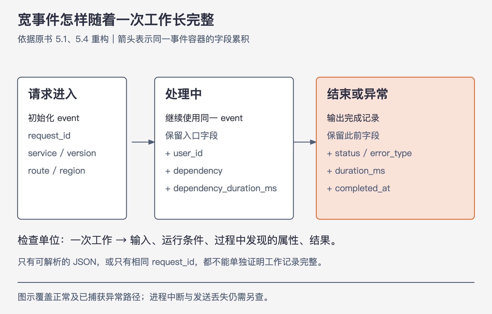

# 《可观测性工程》第5章｜结构化事件——可观测性的构建块 · 书镜 V8.2 优化版

本章要回答：一次请求的上下文怎样形成完整的结构化事件，为什么仅有JSON日志还不够？

五行日志分别写着连接进入、认证成功、开始处理、返回200、关闭连接。把每一行改成JSON后，机器容易读了，但调查人员仍要回答：这五行是否属于同一次工作，过程中查到了哪些信息，最终结果是什么？本章从这个差别解释“结构化事件”。

前四章提出了调查未知问题的需要。现在要让数据本身能支撑调查：一个请求发生时，先保留足够的上下文，之后才有机会提出当初没预料到的问题。没有采集的字段，不能靠临时查询补出来。

## 一、原书回顾：从零散消息到一个工作单元

### 5.1 通过结构化事件进行调试

作者把事件定义为特定请求与服务交互时的信息记录。请求到达时初始化一个Map，把当时已知的环境与请求属性放进去；执行过程中继续增加ID、参数、变量、调用和耗时；结束或出错时记录这个Map。键值有明确名称和类型，才能方便地搜索和比较。

事件不只包含请求参数。容器、服务版本等运行条件，同样可能解释为什么一些请求异常、另一些正常。调试时先比较事件，再沿相关维度过滤和分组，逐步缩小需要解释的群体。能分组只意味着有了调查线索，仍要验证候选原因。（PDF 46—47）

### 5.2 指标作为构建块的局限性

这里的指标指预聚合的标量测量，不泛指所有遥测。作者比较“过去5秒的平均页面加载时间”和“每秒请求数”：它们能显示某个时间窗的系统状态，却没有告诉你某位用户的一次请求怎样执行。

若同样5秒内的1000个事件各自保留加载时间，你仍能算出总体平均，也能按1秒重新聚合，或按用户、主机等字段分组。反过来，只剩一个均值时，不能还原1000条记录与各字段的对应关系。不断增加互相割裂的指标，也难以在并发请求间准确拼出这种联系。第16章再展开存储机制；这里的重点是数据在进入查询前是否已经丢失了所需粒度。（PDF 47—48）

### 5.3 传统日志作为构建块的局限性

作者分两步改进日志：先让消息可解析，再让一次工作能被整体理解。两步不能合并成“用了JSON便完成可观测性”。

### 5.3.1 非结构化日志

原书以一次连接为例：6:01:00接受连接，随后用户foo认证、访问 `/super/slow/server`，返回200，6:01:19关闭连接。阅读这几行，可以跟上叙事；当它们穿插在数百万行其他请求中，格式差异、缺少关联字段和人工搜索便成为障碍。

日志搜索仍能帮助验证已有怀疑，但难以稳定地把任意群体拿出来比较。解析器可以尝试提取字段，效果依赖日志格式和解析规则，并不能保证把所有原本散落的上下文准确补齐。（PDF 48）

### 5.3.2 结构化日志

原书先把每行写成 `time=... msg=... user=...` 这样的键值对。此时机器能识别字段，但“处理一个连接”仍分散在五条消息中。作者再把服务名、路径、用户、状态、持续时间与trace标识组织为一条完成事件，展示其JSON表示。

“工作单元”由调查对象决定：可以是下载一个文件、解析一个文件，也可以是处理一个HTTP请求；一个HTTP请求内部仍可能有多个需要单独记录的工作单元。关键是能看见这一单元的输入、执行中发现的属性、服务条件与结果。若继续分成多条日志，就需稳定关联及明确的完成语义，否则不能把其中任意一行当成完整事件。（PDF 49）

### 5.4 在调试中有用的事件属性

作者按生命周期累积字段：入口记录参数、环境和运行信息，执行中补充用户、购物车、下游调用，结束时补充耗时、状态和错误。“任意宽”表示事件格式应允许增加调查需要的字段，而不是把工具预先支持的少数维度当作上限。

高基数指一个字段有许多不同取值，例如用户ID；高维度指可同时使用许多字段。书中把加拿大、iOS版本、法语包、安装时间、固件和存储分片组合起来，说明调查可能要沿多个条件找出极小的请求群体。

**补充辨析：**原书把这些严格限定条件概括为高基数维度，但没有提供各字段取值分布。单个国家字段未必高基数，多个条件组合却可以很具体；本版将单字段取值数量与多字段组合分开解释。

作者说成熟探针的事件可有300—400个维度，这是其描述的实践规模，不是每条事件必须凑够的指标。必要的是字段能承载调查，且其意义、类型和关联保持可用；不是数量越多越好。（PDF 50）

### 5.5 结论

本章的构建块是任意宽的结构化事件：它保留一个工作单元的上下文，能被机器解析，也能在事后按多种维度重新比较。指标仍可呈现聚合状态；日志若按工作单元重新组织，也能成为这些事件的载体。下一章用上下文与父子关系把事件拼成trace。（PDF 50—51）

## 二、主题讲解：让一条事件随着工作逐步长完整



图5-A｜依据原书5.1、5.4重构。箭头表示同一个事件容器随执行推进而增补字段，最终输出一次完成记录；不是把三条不相关日志直接当成一条事件。

### 先选工作边界，再选字段

以下为讲解用的假设HTTP请求。工作边界是“服务处理一次请求并返回结果”；用户ID用不具认证能力的示例关联值，未记录密码或会话令牌。

```text
event = {work: "serve_http", request_id, service, version, route, region}
start = monotonicNow()
try:
    user = authenticate(request)
    event.user_id = user.observationId
    event.dependency = "image-store"
    dependencyStart = monotonicNow()
    try:
        result = callDependency()
    finally:
        event.dependency_duration_ms = elapsedSince(dependencyStart)
    event.status = 200
catch error:
    event.status = 500
    event.error_type = classify(error)
    raise error
finally:
    event.duration_ms = elapsedSince(start)
    event.completed_at = wallClockNow()
    emit(event)
```

这是说明字段累积和结束记录的伪代码。`finally`覆盖正常返回及这里捕获的异常路径，不保证进程被强制终止时仍能发送；“没有完成事件”也可能是观测链路缺失，需要另查。时间戳用于定位发生时间，单调计时用于计算本地耗时。

一次成功运行后的完整示例可以是：

```json
{
  "work": "serve_http",
  "request_id": "req-demo-07",
  "service": "photo-api",
  "version": "v2",
  "route": "/photos",
  "user_id": "user-demo-21",
  "region": "west",
  "dependency": "image-store",
  "dependency_duration_ms": 87,
  "duration_ms": 123,
  "status": 200,
  "completed_at": "2026-09-09T10:00:00Z"
}
```

现在可以同时问“哪些版本慢”“哪个下游占时多”“某位用户是否总遇到失败”。若只保留 `{"msg":"request finished"}`，JSON语法虽正确，这些问题仍没有输入材料。

### 聚合之后还能回答什么，取决于此前保留了什么

假设四次请求耗时为10、10、10、370毫秒，平均100毫秒。仅有平均值100，看不出是所有人都约100毫秒，还是一个人特别慢。如果四条事件仍在，并含版本与区域，就能筛出370毫秒那条，再与相同条件的其他请求比较。

这里也不能从一条慢请求推断某版本普遍慢。事件提供进一步查询的机会，统计判断仍需要分母、样本量和对照。若经过非等概率采样，计数与分布还要按第17章的有效权重处理。

### 版本相关，下一问应怎样改变

以下数据为假设案例，窗口均为同一小时，分母是该组合的全部请求，失败定义统一为服务端错误：

| 版本与区域 | 请求数 | 失败数 | 失败率 |
|---|---:|---:|---:|
| v2、west | 100 | 20 | 20% |
| v2、east | 900 | 0 | 0% |
| v1、west | 100 | 20 | 20% |
| v1、east | 900 | 0 | 0% |

只看到“v2有20条失败”不能判断兼容性。按区域细分后，两个版本在west都失败20%，east都没有失败；这个结果削弱了“只由v2导致”的解释，把下一问转向west共享的下游、流量或配置。仍不能直接宣布区域基础设施故障，因为区域也可能只是另一因素的代理。

接下来查看west失败与成功事件的下游、错误类型、实例和trace，寻找能进一步区分候选解释的证据。版本、地区与失败的相关性，是调查的起点；让原因成立还需要更多条件或干预结果。

## 检验理解

**材料**：一次工作留下开始、数据库调用、结束三条JSON日志，均有同一个 `request_id`。最后一条只有 `msg="done"`，没有结果状态，失败路径是否会写入也未知。

**判断**：它们已经构成可比较的完整工作单元了吗？

核对：同一ID支持关联，尚不足以确认完整。需要知道工作边界、调用是否属于这一单元、状态和耗时在哪里，以及异常结束如何记录。可以把三条可靠关联后重建，也可以在一个容器中累积字段并输出完成事件；单凭JSON可解析或ID相同都不能跳过这些问题。

**换个情形**：只有iOS 11.0.4用户报错，所有失败请求又恰好都进入同一存储分片。能否立刻定为iOS兼容性问题？

核对：不能。先比较同版本在其他分片、其他版本在该分片的成功与失败比例，再查对应错误和链路；若没有这些对照材料，就保留版本、分片及其共同因素等候选解释。

## 来源、范围与阅读连接

- 原书定位：PDF物理46—51页；48—49页日志图片已补读。原书连接日志与合并事件的示例时间不同，本文未把它们当作同一次测量推算耗时。
- 生命周期机制来自5.1与5.4；伪代码、JSON与分组数字是明确的讲解案例，不代表作者实测或某个SDK规范。
- “任意宽”描述字段扩展能力，不取消存储成本、字段语义与数据采集边界。查询只能使用实际保留的数据。
- 接续第1、2章的高基数调查问题；第6章继续讲跨服务关联，第8章走完整查询循环，第17章解释采样后的统计。

- 来源文件SHA-256：`78f8afbea15570feabe82aa74eac0d7a6ee19273131c7e70c171588640af1787`。
