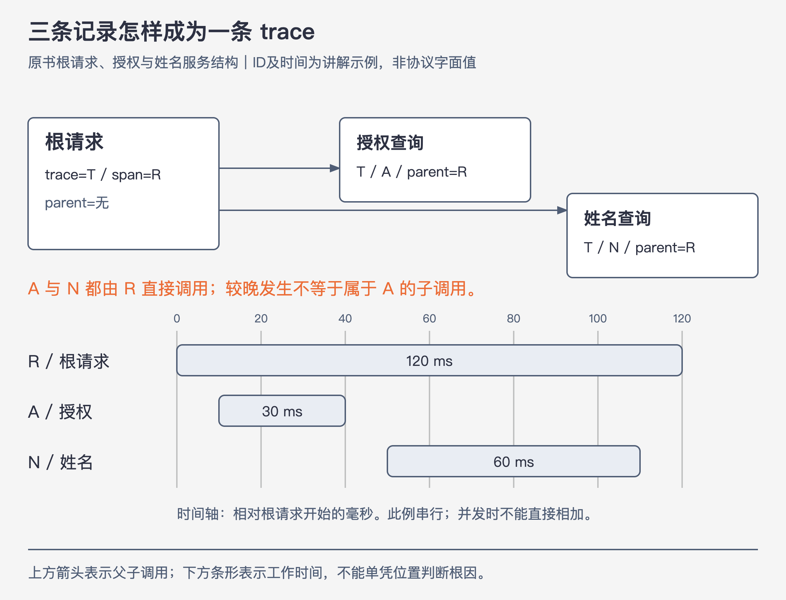

# 《可观测性工程》第6章｜将事件拼接成链路 · 书镜 V8.2 优化版

本章要回答：怎样把离散事件拼成一条可追踪的请求链？

网关、授权服务和用户服务都留下了事件，但时间相近不代表属于同一次请求。要看清“谁调用了谁、时间花在哪里”，记录之间还需要稳定的关联。本章接续宽事件，把这些关联展开成可以检查的字段和传播过程。

## 一、原书回顾：从事件关系构造trace

### 6.1 分布式链路追踪及其重要性

分布式链路追踪跟随一次请求穿过进程、机器或网络边界。作者以依赖造成的延迟传播解释它的价值：数据库变慢，三四层之上的许多服务都可能出现延迟，只看各服务曲线，很难区分等待发生的位置和问题的起点。

作者回顾Dapper以及Zipkin、Jaeger等项目的发展，说明工具实现虽不同，都在记录请求的执行关系。它对微服务尤其有用，也适用于自有系统调用云服务或外部SaaS的场景；跨出的边界越多，越需要核对哪些环节真的可见。（PDF 52）

### 6.2 链路追踪的组件

一个span记录一次有开始与结束的工作。根span位于本次trace的顶部，子span通过父子关系连接。A调用B、B调用C时，B既是A的子，也是C的父；同一个服务被调用两次，应有两个可区分的工作记录，服务名不能代替Span ID。

作者要求五类数据：Trace ID把记录归到同一请求；Span ID标识这一工作单元；Parent ID指向父span，根span没有父；开始时间与持续时间用于排列瀑布图。服务名和span名进一步说明“谁在做什么”。图6-1显示一个根span及更新Intercom、Salesforce、Stripe的三个阶段，Salesforce阶段占据大部分时长，因而值得继续调查。（PDF 53—54）

### 6.3 硬编码探针构建链路追踪

作者用Go写一个 `rootHandler`：调用授权服务，再调用姓名查询服务，最后按授权结果返回响应。至少有根请求、授权查询、姓名查询三个span。

改进按顺序发生：先生成Trace ID和Span ID；再记录开始与结束时间；增加服务名和工作名；最后把根span的关联信息放进出站请求头。接收服务读取关联信息，建立自身span，并把记录发到同一后端。后端据Trace ID分组，再依Parent ID接起来。没有传播这一步，三个服务只会各自生成不相连的记录。（PDF 54—57）

书中使用B3名称展示“把关联信息放进请求头”的简化代码。本版用协议无关的伪代码解释关系；真实B3或W3C Trace Context应由对应传播器编码和解码，不能直接把书中的简写当完整协议。

### 6.4 将自定义字段添加到链路span

父子关系说明执行路径，耗时说明时间分布，还不足以解释为何只影响部分请求。作者继续添加主机名和用户名，并指出构建ID、实例类型和其他运行条件也可能有用。沿同一trace既能查看路径，也能比较具体实例、用户和版本。

手写示例只是拆开机制。库通常负责ID、开始结束和发送等样板，使用专有库又可能导致切换后端时重新埋点。下一章因此引入厂商中立的OTel。（PDF 57—59）

### 6.5 将事件拼接到链路中

作者先接回第5章：在请求执行过程中，事件应持续追加有意义的变量、传入参数、返回结果和相关上下文。关联字段把工作接成一条链，这些逐步累积的内容则让人理解每段工作发生了什么；只有五类链路字段还不足以支持所有后续调查。

同样的关联方法可以用于RPC以外的工作：把结构化日志补齐必要关联字段，逐步得到更连贯的视图；给JSON解析等CPU密集阶段增加内部span；为批量上传中每个对象或流水线阶段建立span。

作者把日志拼接视为有用的入门办法，未将它推荐为长期主方案。无论事件来自哪里，都需要真实的共同上下文和工作关系，不能仅因时间接近或名称相似就拼在一起。（PDF 59）

### 6.6 结论

trace建立在相关事件之上，价值来自可追溯的执行关系。手工构造帮助理解字段与传播，正式应用更适合使用探针框架。第7章继续解决如何减少重复埋点，并保留足够的业务上下文。（PDF 59）

## 二、主题讲解：亲手把三条记录接起来



图6-A｜沿用原书“根请求调用授权与姓名服务”的结构，ID与时间为假设示例。连线表示父子调用关系；横向条形表示本例串行阶段的时间范围。

### 先看最后需要得到的记录

下表时间相对根请求开始计算，单位毫秒。`T`、`R`、`A`、`N`是方便阅读的缩写，不是可直接发送的协议ID。

| 工作 | Trace ID | Span ID | Parent ID | 开始 | 持续 |
|---|---|---|---|---:|---:|
| rootHandler | T | R | 无 | 0 | 120 |
| 授权查询 | T | A | R | 10 | 30 |
| 姓名查询 | T | N | R | 50 | 60 |

三条记录共享T，说明属于同一trace；A和N都指向R，说明它们是兄弟，不能因为N较晚发生就把A写成N的父。授权结束于40毫秒，姓名查询结束于110毫秒，根请求到120毫秒才结束。

本例两次调用串行且时间可信，子阶段共90毫秒，根时长剩余30毫秒。但这30毫秒只是未被这两个子span覆盖的时间，不能直接解释为CPU计算。若子阶段并发，或另有嵌套span，简单相加还会重复计算重叠区间。

### 关联信息怎样跨服务

以下是对原书手工探针的等价重构，保留“新建、继承、输出”的步骤：

```text
root = startRootSpan("rootHandler")
authHeaders = inject(root.context)
authorized = callAuthService(authHeaders)
nameHeaders = inject(root.context)
name = callNameService(nameHeaders)
writeResponse(authorized, name)
endAndExport(root)

// 在授权服务或姓名服务入口：
remote = extract(incomingHeaders)
child = startSpan(name, trace_id=remote.trace_id,
                  parent_id=remote.current_span_id,
                  span_id=newSpanId())
try:
    performWork()
finally:
    endAndExport(child)
```

`inject`把可传播的上下文编码到载体，`extract`在接收端还原；同进程传递通常不需要HTTP头，但仍需要把正确的当前上下文带到调用处。这里简化为每个服务一个span，实际框架可能同时建立客户端和服务端span；新增的中间span会改变直接父子ID，但不会改变“继承trace、建立真实父子关系”的原则。

**协议补充**：OTel官方示例以发送端Span ID作为接收端新span的父，使用W3C的 `traceparent` 传播；B3又有自己的字段及客户端/服务端关系约定。原书省略了一些协议细节，因此不要只发送它列出的两个头就假定完整兼容。[OTel上下文传播](https://opentelemetry.io/docs/concepts/context-propagation/)；[B3规范](https://github.com/openzipkin/b3-propagation)。

### 怎样确认真的接对了

从一条可控制的测试请求开始，检查根和下游记录：Trace ID是否相同，Span ID是否可区分，Parent ID能否找到对应父，开始和持续时间的单位是否一致。随后在后端展开trace，确认两个预期调用都出现，并核对工作名与实际代码路径。

若姓名查询的Parent ID意外是A，先查当前上下文是否仍指向授权span；若它生成了另一个Trace ID，先查出站是否注入、入站是否提取、传播格式是否兼容。若只缺一个span，除了传播，还要检查埋点是否执行、是否被采样及导出是否失败。**图里没有某个span，不能直接断言业务没有调用它。**

时间上也要保留证据边界：跨主机时钟偏移会扭曲瀑布图的位置；调用慢可能来自等待、网络、下游或本地处理。瀑布图告诉你继续调查哪里，不能单独给出根因类别。

## 检验理解

**一处错误关联。** R调用服务S两次，留下span A和B。记录为A的Parent ID=R，B的Parent ID=A，代码却显示两次调用都是R直接发出。这条trace有何问题？

核对：Trace ID相同不足以证明树正确。B被错误挂成A的子，可能是当前span未恢复或传播了错误上下文。应检查第二次调用创建时的当前上下文，并以实际调用关系确定父；不能按发生时间自动串成链。

**一段慢调用。** 数据库子span耗时300毫秒，能否把故障交给“基础设施问题”类别？

核对：只能说延迟主要落在数据库相关调用范围。查询内容、连接等待、锁、网络、负载和变更都是候选原因，要继续查看字段及对照。第11章会把这个区别用于开发和发布反馈。

## 来源、范围与阅读连接

- 原书定位：PDF物理52—59页；53、55—58页图与代码已补读。手写代码中字段名和耗时表示存在简化，本版未将它宣称为可编译实现。
- 三条记录、毫秒时间和排错情形为讲解案例。协议补充来自上述官方资料，核对日期2026-09-09；本版不绑定某一语言SDK版本。
- 本章接第5章的宽事件，第7章把手工动作交给OTel，第17章解释采样为何也会造成缺失span。

- 来源文件SHA-256：`78f8afbea15570feabe82aa74eac0d7a6ee19273131c7e70c171588640af1787`。
