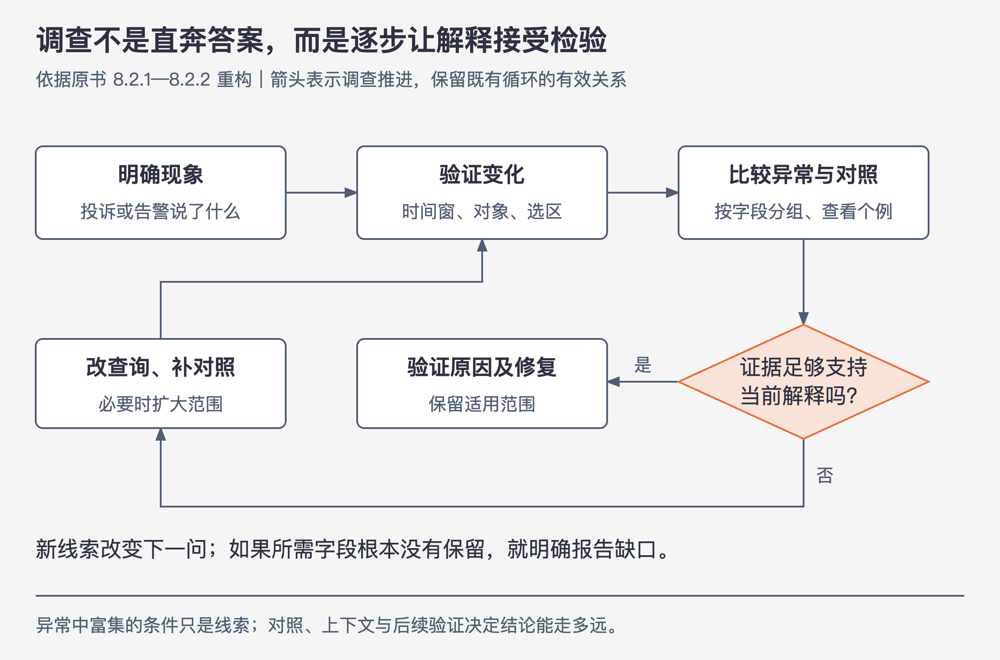

# 《可观测性工程》第8章｜通过事件分析实现可观测性 · 书镜 V8.2 优化版

本章要回答：怎样依据事件数据反复提出并检验问题，让每次结果决定下一问？

收集了宽事件，仍可能沿用旧习惯：先猜数据库有问题，再从数据里找支持；或者把事件画成几十张仪表盘，继续凭曲线形状猜原因。本章把调查动作拆开，让下一问由刚看到的结果决定。

## 一、原书回顾：让已有知识接受数据检验

### 8.1 从已有条件调试

资深工程师能快速判断，有时是因为记得某组曲线对应过什么故障。团队想把这些经验写进运行手册，但快速变化的系统可能组合出从未见过的故障条件；照旧答案操作，反而会误把症状当原因。

作者没有否定所有文档。对于反复出现、等待正式修复的问题，运行手册仍可记录临时缓解办法。服务负责人、联系方式、升级路径、依赖与查询入口，是应当维护的基本资料；试图枚举所有故障及解法，则容易过时。即便已经收集宽事件，若仍只用 `grep` 找已知字符串，也没有发挥开放式调查的能力。

Honeycomb团队早期同样依赖已有条件：关心新前端功能就看CSS和JS资源大小，再按 `build_id` 分解；关心新客户就按 `team_id` 过滤，计算p95响应时间。这些查询有价值，但问题已事先明确。下一节面对的是“知道用户很慢，却连从哪里问起都不知道”。（PDF 67—68）

### 8.2 从第一性原理调试

作者称之为从第一性原理调试：先检查自己确信的事情，再提出能被观察支持或推翻的假设。目标是减少对某个人记忆的依赖，让不熟悉系统的人也能沿数据逐步调查。

这不意味着没有任何前提。事件要已采集、字段含义要能理解、查询要能继续细分；资料不足时，只能说明未知。本版将作者的强目标理解为持续改善调查能力的标准，不承诺拿到任意有限数据就一定能诊断任何问题。（PDF 68—69）

### 8.2.1 使用核心分析循环

**核心分析循环（core analysis loop）**从客户投诉或告警出发：先明确要解释的现象，验证数据中是否确实有变化，再查看异常区域的示例行，按字段分组或过滤。若仍不能解释，就把当前发现作为下一轮起点，继续比较。

重点是保留调查上下文，并让假设有可能被推翻。分组既可以找到“共同点”，也应该寻找同样条件下的正常事件。只在失败集合中不断筛选，很容易把普通背景特征误当原因。（PDF 69；正常对照的使用见8.2.2）

### 8.2.2 自动化核心分析循环的暴力破解部分

机器适合比较大量字段。对选中的异常区域与区域外基线，分别计算每个字段值出现的比例，再按差异排序。例如原书的说明中，`request.endpoint=batch`在所选区域占100%，在基线占20%；`handler_route=/1/markers/`分别为100%与10%。这些差异帮助决定下一问。

Honeycomb的BubbleUp案例具体展示了这一过程：在热图上圈选慢请求区域，工具比较63个维度。其中 `global.availability_zone=us-east-1a`在异常集合中占98%，在基线中占17%，某种实例类型也更集中。团队据此怀疑该可用区的网络问题，联系云提供商，并结合其他客户同区域的报告，独立验证了该区域存在未报告的可用性问题。材料没有证明具体的网络故障机制。（PDF 70—72）

这里的98%是“选中异常事件里，有多少来自该AZ”，不是“该AZ的所有请求中98%异常”。自动比较给出了相关条件；后续验证使解释更可信。两步不能省成“AZ富集，所以AZ故障”。

作者还明确给出数据条件：核心分析循环依赖任意宽的结构化事件。指标缺少供继续切分的背景；日志需要先附加请求ID、链路ID及其他上下文，经过后处理重构为事件，再支持读取时聚合与复杂自定义查询。手动和自动循环都依赖这些基础，自动排序不能补回未保留的上下文。（PDF 72）

### 8.3 AIOps的误导性承诺

作者把异常检测比作自动选择基线并画出判定边界。**本版为解释误报与漏报，采用明确约定：边界之内判为正常，之外判为异常。** 正常范围太窄，会把正常发布、新功能或性能优化当异常；太宽则会漏掉真正问题。这里不要与BubbleUp中由人圈出的“异常事件区域”混用，两种框表达的对象不同。机器能迅速找峰值和差异，却难单凭这些数字判断变化是否有意、是否损害用户。

作者因此主张分工：机器负责遍历大量事件与维度，人提供目标、发布背景和业务含义，再指导下一轮分析。这是成书时对AIOps承诺的批评，不应写成对2026年所有AI工具能力的实测结论。无论工具如何发展，差异检测与价值判断、根因验证仍是不同任务。（PDF 72—73）

### 8.4 结论

正确的事件只是基础，调查方法决定能从中理解什么。核心分析循环让人提出和修正问题，让机器比较海量数据；第9章继续说明这套调查方法怎样与监控共存。（PDF 73—74）

## 二、主题讲解：用16条事件走完两轮调查



图8-A｜依据原书核心分析循环重构。箭头表示调查推进；证据不足时修改查询或补对照，差异本身不能直接越过验证。

### 初始材料：同一服务、同一路由、同一分钟

下面为本版构造的小样本，没有经过采样。仅为演示，定义 `duration_ms>500` 为慢请求；它不是SLO阈值，也不是生产推荐值。

| 请求ID | 版本 | 区域 | 耗时/毫秒 |
|---|---|---|---:|
| r01 | v2 | west | 800 |
| r02 | v2 | west | 900 |
| r03 | v2 | west | 850 |
| r04 | v2 | west | 950 |
| r05 | v2 | west | 80 |
| r06 | v2 | west | 90 |
| r07 | v1 | west | 820 |
| r08 | v1 | west | 880 |
| r09 | v1 | west | 100 |
| r10 | v2 | east | 100 |
| r11 | v1 | east | 70 |
| r12 | v1 | east | 80 |
| r13 | v1 | east | 90 |
| r14 | v1 | east | 100 |
| r15 | v1 | east | 110 |
| r16 | v1 | east | 120 |

客户说“新版变慢了”。第一步不接受或否定这个说法，先在此窗口划出6条慢请求与10条非慢请求。以下SQL表示查询逻辑，不绑定某一产品语法。

### 第一轮：哪些条件在慢请求中更常见

```sql
SELECT version, region,
       COUNT(*) AS requests,
       SUM(CASE WHEN duration_ms > 500 THEN 1 ELSE 0 END) AS slow
FROM events
GROUP BY version, region;
```

从数据得到：慢请求中，v2占 `4/6≈66.7%`，west占 `6/6=100%`；非慢请求中，v2占 `3/10=30%`，west也占 `3/10=30%`。版本与区域都富集，必须同时保留两个候选解释。

如果转而按版本的全部请求为分母，v2的慢比例是 `4/7≈57.1%`，v1是 `2/9≈22.2%`。这个差异仍不能证明新版本导致，因为v2流量更集中在west。下一问因此要把区域固定住。

### 第二轮：在同一区域，版本差异还在吗

```sql
SELECT version, COUNT(*) AS requests,
       SUM(CASE WHEN duration_ms > 500 THEN 1 ELSE 0 END) AS slow
FROM events
WHERE region = 'west'
GROUP BY version;
```

| 条件 | 请求数 | 慢请求数 | 慢比例 |
|---|---:|---:|---:|
| west、v2 | 6 | 4 | 66.7% |
| west、v1 | 3 | 2 | 66.7% |
| east、v2 | 1 | 0 | 0% |
| east、v1 | 6 | 0 | 0% |

固定west后，两版本的慢比例相同，削弱了“v2本身造成这次差异”的解释。当前证据把注意力转向west共享的条件，而非直接转成“west的基础设施就是根因”。样本很小，east的v2只有一条，不能据此证明版本在所有条件下都没有影响。

### 下一轮缺什么，就明确写出来

现在应比较west内的慢请求与非慢请求对照的下游、实例、错误、输入大小和trace。当前表没有这些字段，所以本次调查到此只能定位受影响群体，不能替材料补造数据库、网络或代码原因。

若另有可靠trace，可从r01与r05这类相同版本、相同区域但表现不同的请求出发，检查时间落在哪个工作阶段；若多个字段始终一起变化，则需要更有区分力的对照或可控验证。新版回退后延迟下降也要检查流量、时间与区域是否同时改变，不能只凭前后相邻就断言因果。

到这里，读者已经实际走过：投诉→确认慢请求→比较异常与对照→发现两个候选条件→固定一个条件复查→收窄解释并指出缺口。**没有得出根因，也可以完成一轮有结果的调查；结果可以是排除一个过强结论并明确下一份证据。**

### 把体力计算交给机器，保留对问题的判断

当字段从4个变成数百个时，人逐个分组成本很高。机器可以按同样方法列出“异常内比例、对照内比例、样本数、差异”，人决定哪些条件值得追问。若选区只是一次计划中的批任务，峰值可能符合预期；若对照窗口包含不同业务人群，差异也可能来自选择方式。先核对选区与基线，往往比继续增加算法更直接。

## 检验理解

**情形**：某字段在失败事件中出现90%，在成功事件中也出现90%。它能解释失败群体的独特性吗？

核对：当前比例没有显示区分能力。不能仅因“多数失败都有它”就称为原因；它可能是普遍背景条件。仍需检查样本量、字段缺失与更细条件，不能把一次无差异判断扩展为永不相关。

**情形**：你圈选一段高延迟区域，发现新版本与某实例类型同时富集，但两者在这批数据中总是一起出现。下一步怎样做？

核对：当前无法区分两者。寻找同版本不同实例、同实例不同版本的对照，或设计其他能区分解释的检查；对照不存在就报告不可辨识，不凭熟悉程度选择一个原因。

## 来源、范围与阅读连接

- 原书定位：PDF物理67—74页；图8-1至8-3已实际核对，98%与17%的分母按原图保留。
- 16条事件、SQL与阈值是本版假设演示；没有把它们写成Honeycomb案例的原始数据，也没有假称找到真实故障根因。
- 运行手册的保留项、机器与人的分工及AIOps批评均保留作者立场与成书时边界。
- 第1、2章建立调查观念，第5—7章提供数据和关联，第9章讨论与监控的配合，第13章从SLO告警进入同一循环。

- 来源文件SHA-256：`78f8afbea15570feabe82aa74eac0d7a6ee19273131c7e70c171588640af1787`。
