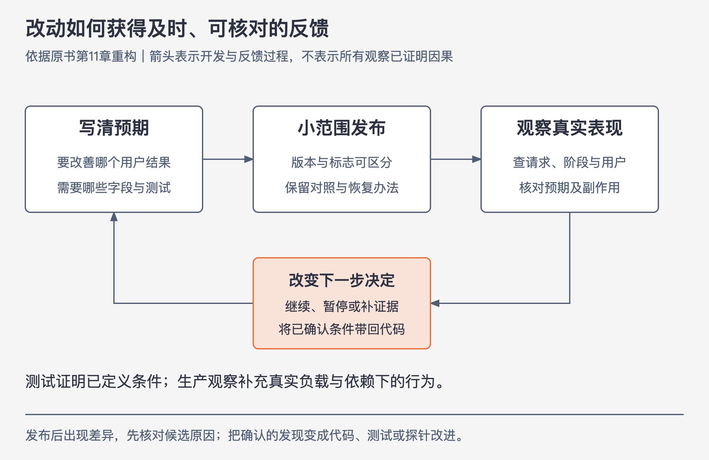

# 《可观测性工程》第11章｜可观测性驱动开发 · 书镜 V8.2 优化版

本章要回答：怎样把生产中的行为反馈接回开发过程，验证改动并改善交付？

测试通过后，代码在真实用户、负载和依赖下是否仍按预期工作？如果几周后才收到反馈，写代码的人已经忘了当时的判断，排查又要重新开始。本章把“怎样知道改动有效”提前到编写和评审代码时。

## 一、原书回顾：让生产反馈回到开发者手中

### 11.1 测试驱动开发

测试驱动开发（TDD）先把预期行为写成测试，再编写使测试通过的实现。它在受控、可重复的状态下定义预期行为，帮助开发者尽早发现偏离规范的问题。可重复性、隔离和模拟依赖是它的力量，也限定了它能证明什么：通过测试不等于每个真实用户都获得好体验，更不等于生产问题已经容易定位。

作者希望可观测性补充这层缺口，而非取消测试。两者分别帮助理解受控规范与真实运行状态。（PDF 87）

### 11.2 软件开发生命周期中的可观测性

提交后只等待运维报告，反馈可能延迟数小时、数天乃至数周。代码作者越晚回到问题，越难恢复当时上下文，沟通和定位成本也越高。

作者把快速调试与软件质量连起来：改动、发布、观察和修复之间应有短而可追溯的联系。不是每个线上问题都归最近一次提交，但最近的变更应有可供核对的实际行为。（PDF 87—88）

### 11.3 从哪里开始调试

可观测性先帮助找出需要深入调试的代码位置：哪类请求慢、在哪个组件开始等待、影响哪些用户。确认位置和条件后，再把可复现上下文带到本地调试器或分析器，检查更细的代码逻辑。作者用望远镜与显微镜说明这种尺度和顺序的区别。逐函数增加详细日志虽可能帮助调试代码，也会增加存储开销、淹没其他重要观测信息，不能替代系统范围的定位与理解。（PDF 88）

原书两例都从接入层按服务节点分组，比较平均、90%和99%延迟。第一例继续跟踪慢请求，发现超时从服务3开始，再转入本地调试。第二例先发现独立部署的写入服务节点变慢，再按数据库服务主机分组，看到慢查询集中在特定数据库主实例或机房；作者据此直接归为基础设施问题。（PDF 88—89）**本版校注：第二例给出的观察不足以排除代码、查询模式或路由影响；它只能确定下一步调查位置。**下面将位置、候选原因和验证动作分别展开，避免沿用这个跳步。

### 11.4 微服务时代的调试

一个请求跨越多个运行时，代码错误、用户行为、数据库容量、网络限制、负载均衡和服务发现可能共同影响结果。多个图表一起变慢时，需要先建立请求关系，才能选择该去哪个局部调试。不能把所有复杂性都塞进一个本地断点。（PDF 89）

### 11.5 探针如何提高可观测性

作者要求在合并前问：“怎么知道这个改动按预期工作？”构建ID、实例、用户和工作阶段等字段，让问题可以在发布后被具体检查。由代码作者及时接收反馈，有助于保持责任与上下文；作者将它描述为学习机制，不是惩罚。

部署后，作者要求分别检查：代码是否按预期运行，与旧版本相比是否有改进，用户是否因为改动更喜欢使用产品，以及是否出现异常。本版强调，技术表现与用户反应需要各自的证据；延迟下降且没有告警，仍未回答用户是否更喜欢产品。

书中举出发布后30分钟到1小时把相关告警送给提交者，以及用功能标志或小部分生产流量观察新功能。这些是实践示例，通知范围、轮值和时限应按团队安排，不是所有场景的硬规则。（PDF 89—90）

### 11.6 可观测性左移

“左移”是早在开发时设计验证生产行为所需的探针，使小改动上线后能被看见。开发者逐渐熟悉真实运行条件，才有依据使用小幅调整、降级与受控发布，减少把生产视为不可触碰的“玻璃城堡”的心态。

生产反馈不是放弃测试后的补救，更不是允许任意试验。它为预发无法覆盖的条件提供补充观察。（PDF 90—91）

### 11.7 利用可观测性加快软件交付

作者将小批量、功能标志和渐进式发布连起来。代码部署到生产与向用户开放功能可以分开，给工程师留出观察新功能的时间；这一过程仍依赖团队能以较快节奏把代码投入生产，只有功能标志却要等数周才能投产，并未满足前提。变更更容易区分，出现问题时也更容易定位和恢复。将部署工程化，让团队理解并共同改进流水线，避免变成少数人的专属知识；并重点追踪从编写到投入生产的时间。

作者批评一种回滚反模式：团队缺少评估当前版本和控制局部影响的手段，因而一遇到异常就停止部署，并回滚到上一个稳定版本。本版将这个批评放在作者描述的条件下理解，不把它解释为禁止必要回退。

为加快投产，作者建议由一名工程师以一个完整功能、一次独立合并来组织变更。作者判断，大多需要回滚并耗时数小时或数天解决的问题，与多位工程师同时且相互冲突地提交代码有关；这是作者对常见问题的归因，不是本版测得的普遍比例。

本段中文原文在“速度质量不能兼顾”与“相互促进”之间存在表述冲突。结合后续论述，本章保留的主线是：更短的反馈和更可控的变更，可以同时支持交付与质量。从编写代码到投入生产的时间是一个观察量，不能单独证明用户体验、故障率或全部工程健康。（PDF 91）

### 11.8 结论

把遥测与功能一起设计，让工程师在代码记忆仍清晰时验证生产表现；TDD与可观测性分别提供受控和真实条件下的反馈。下一章进一步用用户体验定义何时需要响应。（PDF 91—92）

## 二、主题讲解：一次反馈怎样改变代码决定

图11-A｜依据本章开发反馈关系重构。箭头表示反馈推进；是否继续发布由结果、对照与既定条件决定。

### 发布前写下能被推翻的预期

假设团队要减少报表查询次数。预期是“同一类报表、相同输入规模下，数据库调用由多次减少为一次，总延迟下降，错误比例不升高”。在span中记录版本、输入规模、查询次数、查询指纹、目标实例与各阶段耗时。这里的数字是讲解设定，不是原书实测。

小范围发布后，得到同一观察窗的摘要：

| 组别 | 报表请求数 | 每请求查询次数 | 数据库相关耗时 | 总耗时 |
|---|---:|---:|---:|---:|
| 旧版、相近输入 | 100 | 10 | 100毫秒 | 160毫秒 |
| 新版、相近输入 | 100 | 1 | 400毫秒 | 460毫秒 |

这份摘要确认“调用次数少了”，否定了“延迟因此下降”。不能用第一项达标掩盖用户更慢。下一步查看查询指纹、执行计划、扫描行数、等待及实例负载；这些当前没有给出，原因保持未定。

### 慢在某实例，不等于某类原因

假设进一步发现慢请求集中在数据库D。先记录观察：D相关调用阶段耗时较高。再列能够被不同证据区分的解释：新查询在D的数据分布上变差，D有其他负载或锁等待，路由把特定大请求集中到D，或者资源/网络发生异常。

用同一查询与相近输入在不同实例的表现、同一实例上的不同查询、变更前后执行计划及资源证据逐步比较。若缺少交叉对照，不宣布“基础设施问题”。这与第5、8章版本/区域的证据要求相同。

### 反馈如何回到实现和发布

当前足以支持暂停放量并调查，是否回退按团队既定影响与恢复策略决定。若随后确认新查询在某数据形态下扫描量过大，就将这种输入加入可重复测试，修改实现，再用相同字段检查下一次小范围发布。这个“若确认”是条件分支，不代表本例已找到原因。

最终回到代码的可以是一个测试、一项查询修改或一条更好的埋点，也可能是“现有材料无法区分，先补观察”。仅看到新版本出现图表不算反馈闭环；要说明它改变了哪个决定以及依据是什么。

## 检验理解

测试全绿，但新版本在某用户群体的请求中明显更慢。下一步是否应删除测试并只用生产观察？

核对：不应。先用事件和trace缩小实际条件，再将可复现的部分带回测试和本地分析；测试证明已定义条件，生产观察补充原来没有覆盖的条件。

如果新版本查询次数下降、总延迟上升，产品目标是缩短等待，能否宣布优化完成？核对：不能。中间指标改善不等于用户目标达成；应解释延迟落点和候选原因，并据影响控制后续发布。

## 来源、范围与阅读连接

- 原书定位：PDF物理87—92页；89页数据库实例例子的因果跳步及91页矛盾表述已明确校注。
- 报表数据和验证路径是讲解案例，不是作者实测。本版把观测位置、候选原因、验证结果和发布决定分开。
- 接第7章的自定义探针、第10章的团队使用；第12、13章定义用户影响与响应，第14章把同样方法用于交付流水线。

- 来源文件SHA-256：`78f8afbea15570feabe82aa74eac0d7a6ee19273131c7e70c171588640af1787`。
