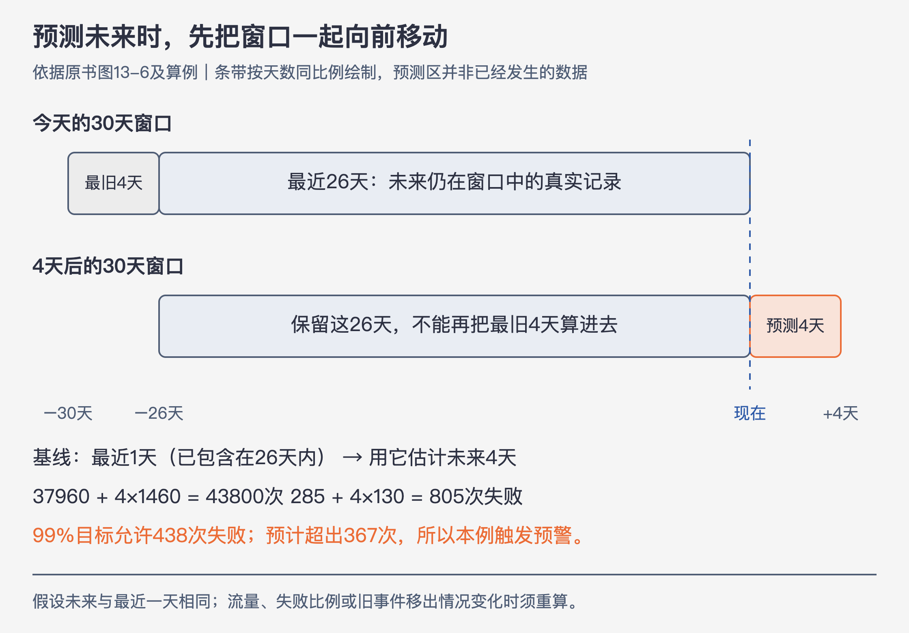

# 《可观测性工程》第13章｜处理和调试基于SLO的告警 · 书镜 V8.2 优化版

本章要回答：怎样用明确的窗口和分母预测错误预算消耗，并从告警继续调查？

还剩30%的错误预算，是否需要立即叫醒值班者？如果一个故障正在迅速烧掉它，可能很紧急；如果服务已经恢复，这个余额本身却不说明此刻仍在恶化。本章把“剩下多少”和“照当前趋势多久会用完”分开，并说明预测必须交代窗口、分母与假设。

## 一、原书回顾：从余额走向有条件的预测

### 13.1 在错误预算消耗完之前发出告警

错误预算表达目标允许的服务不良程度。对于事件型SLO，窗口内有N次合格请求，目标成功比例为q，则允许坏事件数为 `(1−q)×N`；减去已发生的坏事件，得到剩余预算。

原文把错误预算用尽表述为系统已不符合SLO。**本版数学校正：**按好事件比例计算，预算用尽意味着没有继续犯错的余量；严格说，坏事件数恰好等于允许值时，SLI仍等于目标；超过后才低于目标。把零余额用作告警边界，可以早于违反目标。不要把“预算零”与“已低于目标”混成同一判断。

作者强调目标越严格，人工响应时间越受限。书中把时间型可用性换算成月度停机分钟，必须先约定月长；事件型预算则以请求数为单位，不能在流量变化时随意换成停机时长。作者关于约99.95%以上目标较难靠人工预警避免违规的说法，是其响应时间经验，不是统一技术分界线。（PDF 101—102）

### 13.2 将时间定义成一个滑动窗口

固定窗口按自然月等边界重置；滑动窗口每次查看最近一段时间。月底一次故障、月初另一次故障不会因为跨月就从用户记忆中消失，因此作者偏好滑动窗口，并常以30天为起点。

滑动时，最旧的事件离开，新事件进入，成功与失败数量都会更新。低水平消耗能否持续被补偿，取决于坏事件比例是否在目标允许范围内，不能泛称任何“低消耗”永远不会用完。30天也要结合业务规划与用户期望选择，7、14或90天的取舍是上下文问题。（PDF 102—103）

### 13.3 预见性地创建预测消耗告警

零余额告警容易设置，但可能已经太晚。作者先比较“剩余预算低于30%就告警”：它提前预留余量，却可能让团队把仍可使用的30%也视为已经花完，长期等待余额恢复。预测告警改问：按当前状态继续，是否会在选定时限内触底？

预算紧张后怎样调整功能交付，应预先形成团队政策。本章偏向优先处理可靠性风险，没有给出所有团队通用的冻结或恢复条件。（PDF 103—104）

### 13.3.1 前瞻性窗口

**前瞻性窗口**是要预测未来多远；**基线窗口**是用哪一段近期数据估计未来。一个月后可能略低于目标，与一小时内大量失败，需要不同响应速度。

作者经验是基线与前瞻保持相近量级，常用前瞻为基线的四倍：最近1小时预测未来4小时，最近6小时预测未来24小时。跨日夜、周末或季节直接延长直线可能失真，四倍不是统计定理。（PDF 105—106）

作者把计算中的构建块称为单元（unit）：可以是一段判好或坏的时间片，也可以是一次用户事务。接下来的原书算例沿用通用单元，数字不自动代表实际请求量。

**短期消耗告警。** 只用近期故障与典型流量估计，不完整考虑整个窗口已经消耗多少。原书第一个例子目标99%，典型预算438个单元：最近6小时5次失败，向未来24小时线性推为20次，加本基线5次共25次，未接近438；若按过去1天50次失败向未来8天推，得到400次，加现有50次共450次，越过预算。但8天外推已经超过前述经验范围，只用于展示算术，不能把长期预测当作已验证。（PDF 107）

作者再改变流量：最近6小时仅50个单元，却有25个失败。按失败次数随时间线性外推，未来一天是100次；按50%的失败比例乘以未来正常单元总量，风险会大得多。这个变化说明夜间少量请求不能代表白天绝对流量。

此段原书有算术差异：25加100应为125，文中写105；43800除30应为1460，文中写1440。若沿典型月43800、30天的设定，未来一天1460个单元、50%为坏就是730个坏单元，已超过438预算。若另行假设未来1440个单元，则为720个坏单元；两者都表明风险，但不能把不同分母混写为同一演算。（PDF 107）

**上下文感知消耗告警。** 保留整个相关历史窗口的好坏数量，再加未来预测。它能让已经用掉90%与只用掉10%预算的服务受到不同评价，代价是更多计算与状态。作者提到自家一次实现曾产生每天超过5000美元的Lambda费用，用以说明扫描历史也有成本，不能当成所有实现的价格。（PDF 107—108）

原书向未来4天预测时，取“最近26天真实数据＋未来4天预测”，而不是“最近30天＋未来4天”。具体算法与数字在后面的主题讲解中完整重算。（PDF 108—110）

### 13.3.2 基线窗口

基线太短，会把短暂波动外推成长时间故障；太长，会稀释刚发生的严重退化。作者建议同时观察多个尺度：短窗口支持及时响应，较长窗口支持规划。

“两小时内会耗尽”触发，而“一天内会耗尽”未触发，并不一定矛盾；它们可能各自使用最近30分钟与更长基线，看到的趋势不同。先核对基线，不能把两次预测都理解成同一条固定斜率。（PDF 110）

### 13.3.3 对SLO消耗告警采取行动

告警后先区分稳定消耗、突然大幅下降，还是长期小幅恶化中叠加一次事件。原图以剩余51.4%、31.4%、1.3%的不同曲线示例提醒：同一个当前余额可能来自不同过程，紧迫性需要看近期变化和历史。

图13-11附近，正文说查看过去90天中每一天的30天累计表现，图注却称90天滑动窗口。本版区分“图展示多长历史”和“每个点怎样计算SLI”；不要仅因为图横轴有90天，就把SLO计算窗口改成90天。之后仍要从失败事件进入用户、依赖和请求条件的调查。（PDF 111—112）

### 13.4 使用SLO与时间序列数据的可观测性数据

按时间片计量，把一整分钟或五分钟判为好/坏；按事件计量，则逐个请求判断。原书给出的时间片规则是“每分钟的请求p95小于300毫秒”：必须等待这一分钟结束才能计算。若只有94%的请求小于300毫秒，就不满足这个p95条件，整分钟被判坏。两者的单位与SLI含义不同。若一段时间内94%的请求小于300毫秒，事件型测量会将其余6%的请求判坏；这绝不等于只消耗6%的错误预算。

对于30天、99.99%的时间型目标，允许坏时间是 `43200×0.0001=4.32分钟`。一个坏分钟消耗约23.15%的时间预算；原书近似写25%。对于事件型目标，必须用坏请求数除窗口允许的坏请求数，不能沿用4.32分钟作分母。

更细粒度有助于表示部分失败和缩短等待，但不会凭空增加预算。严格SLO若在数十秒内消耗完，人工确认和登录可能来不及，仍需相应自动恢复与服务设计。作者也提到更短窗口的计数指标可作缓解；核心是测量保留了什么粒度，不能把“时间序列”这个容器名称当作所有计数都无用的证明。（PDF 112—113）

### 13.5 结论

选择预测方法要同时考虑流量、时间尺度、历史余额、计算成本与响应能力。SLO指出预算风险，事件与trace让团队进一步回答谁受影响、哪里发生了问题。第14章继续把这种观察扩展到软件交付过程。（PDF 113）

## 二、主题讲解：把预测真正算一遍

### 26天历史加4天预测，才是未来的30天



图13-A｜依据原书图13-6重构。条带表示时间区间；最旧4天到预测时已离开窗口，最近1天用于估计未来4天，不能另加成第五天历史。

沿用原书上下文感知例子：目标99%，窗口30天。现在保留到未来窗口中的最近26天，共37960个单元、285次失败；这26天内的最近1天，有1460个单元、130次失败。假设未来每天都与最近一天相同：

1. 未来4天的单元总量：`1460×4=5840`。
2. 未来4天的失败量：`130×4=520`。
3. 未来30天窗口总量：`37960+5840=43800`。
4. 未来30天窗口失败量：`285+520=805`。
5. 允许失败量：`43800×1%=438`。
6. 预计剩余预算：`438−805=−367`，预测SLI约为98.162%。若规则是“预计4天后预算用尽或超支则告警”，本例触发。

最近1天的130次失败已经包含在285里；我们只额外加入未来复制的四天，不能再把今天加一次。更早的4天会离开未来窗口，也不能保留在预测分母中。

相反，假设最近1天只有20次失败，其余已知26天总量与失败量仍分别为37960、285，未来失败预计80次，总失败365，低于预算438，按这个4天预测规则不触发。它不保证其他更短尺度的告警也不触发。

对应原书代码的等价伪代码是：

```text
historical = countUnits(now - 30days + horizon, now)
baseline = countUnits(now - baselineWindow, now)
ratio = horizon / baselineWindow
projectedTotal = historical.total + ratio * baseline.total
projectedBad = historical.bad + ratio * baseline.bad
allowedBad = (1 - target) * projectedTotal
alert = projectedBad > 0 and projectedBad >= allowedBad
```

这里的 `>=` 是预算用尽预警规则，不把SLI恰好等于目标说成已低于目标。边界时间点需使用一致的半开区间，避免同一事件重复计数；具体实现还要处理窗口离散粒度和舍入。

### 94%成功，到底扣掉多少预算

再构造一个独立案例，避免与上一例混用分母：某30天窗口有1000000次合格请求，目标99.99%，允许100次坏事件。窗口中某一分钟有1000次请求，940次好、60次坏。

- 这分钟的坏事件比例是 `60/1000=6%`。
- 它消耗整个30天预算的 `60/100=60%`。
- 若同一30天窗口其他时间已有20次坏事件，窗口坏事件共80次，剩20次预算，SLI为99.992%。

如果这分钟有10000次请求且仍只有94%好，就有600次坏事件，已经是整窗100次预算的6倍。可见“94%成功”没有给出预算消耗比例；还需要请求量、SLO目标和完整窗口分母。

### 预测的条件什么时候会变

线性失败次数预测假设单位时间负载近似可比；比例预测还需要估计未来合格请求量。夜间低流量、突发故障、周期任务、流量迁移、采集延迟或SLI定义变化，都可能改变输入。假设不成立时，应更新预测或明确范围，不能把虚线当未来观测。

告警后先确认数据口径和当前用户影响，再查看坏事件中的差异，按第8章的循环调查。若预算因旧故障滑出窗口而恢复，不能把恢复全部归功于刚部署的修复；滑动窗口本身也在改变分子与分母。

## 检验理解

**窗口移动。** 目标99%，要预测未来2天的30天窗口。保留下来的28天有28000次请求、120次失败，最近1天1000次请求、110次失败。假设未来与最近1天相同，会触发“预计用尽则告警”吗？

核对：未来总量30000，失败 `120+2×110=340`，允许300，预计超支40，触发。最近1天的110次失败包含在28天的120次里，之前27天还有10次，输入满足包含关系；最近1天不重复相加；早于这28天的两天不进入未来窗口。

**两个百分比。** 窗口目标99.9%，总请求200000，某批1000次里50次坏。该批坏比例及占整窗预算的比例分别是多少？

核对：坏比例5%，整窗允许200次坏，因此这批消耗25%的预算。若没有整窗请求数，就不能只凭5%算出预算占比。

**短长预测不一致。** 最近30分钟突然恶化，但最近6小时总体仍好，两小时预警先触发是否一定是误报？核对：不是。先核对各自基线与当前影响，短窗口可能正在捕捉新故障；也需排查短暂波动及采集缺口。

## 来源、范围与阅读连接

- 原书定位：PDF物理101—113页；图13-1至13-11及109页Go代码已补读。正文与图注的窗口冲突、短期算例算术差异均已注明。
- 37960/285、1460/130的预测演算沿用原书数字；其他百万请求、两天预测及百分比案例为讲解构造。公式使用明确单位与窗口，未新增通用生产阈值。
- 前瞻四倍是作者经验，预测成立依赖基线代表性；没有用一次代理演算证明真实服务必然按此运行。
- 接第12章SLI与预算、第8章调查循环和第17章采样权重；第14章延伸到软件供应链。

- 来源文件SHA-256：`78f8afbea15570feabe82aa74eac0d7a6ee19273131c7e70c171588640af1787`。
