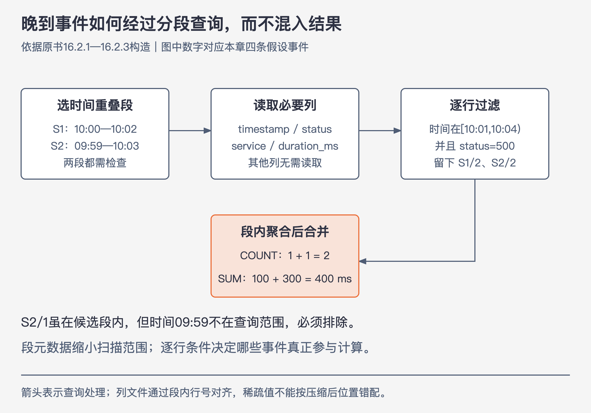

# 《可观测性工程》第16章｜高效的数据存储 · 书镜 V8.2 优化版

本章要回答：为了支持连续调查，存储与查询系统应怎样组织事件、读取和聚合数据？

排障时，查询等几分钟才返回，会打断下一问；只支持预先建索引的字段，又可能在关键处查不下去。本章从这种工作负载出发，解释时间分段、按列读取、查询时聚合和并行恢复怎样配合。Honeycomb的Retriever是作者展示的一种实现，不是唯一架构。

## 一、原书回顾：按调查需要选择数据抽象

### 16.1 可观测性的功能要求

事件可能有许多字段和高基数值，调查前不知道哪几个重要，所以任意相关字段都应可查询，结果要足够快以支持迭代。时间是常用入口，可以优先用来缩小搜索空间；新数据也应在数秒内可用，不能只查已压缩完的旧数据。

观测存储自身还要可靠。业务故障时，若观测后端也不可用或丢了材料，调查会失去依据。作者把查询速度、新鲜度、可扩展性与持久性共同作为要求。（PDF 133—134）

### 16.1.1 时序数据库不能完全胜任可观测性

传统TSDB擅长复用有限标签组合：新增测量只向已有序列加一个数。把用户ID等字段加入标签后，每个新组合都可能新建序列；若几乎每个事件组合都独特，创建序列的成本便无法有效摊薄，出现基数爆炸。

作者据此反对把宽事件直接塞进为预聚合指标设计的结构。这个限制来自数据布局与工作负载，不能仅凭“数据带时间戳”就判断TSDB一定适合。（PDF 134—135）

### 16.1.2 其他可能的数据存储

文档型存储能接收键值对，却未必能快速执行任意组合分析；为所有字段建索引又增加空间与写入成本。Scuba用大量内存换取快速扫描，但只能查询保存在RAM中的数据。作者给出成书时的价格对照：1TB内存约4000美元，1TB SSD约100美元；有限内存容量因此限制可查询的历史量。作者认为，对许多具有相当规模的组织，这可能只够几分钟的数据，而不是数小时或数天。这个案例把查询速度、容量、保留窗口和经济成本连起来；价格及规模判断均保留成书时语境。

本节列出当时的trace后端及列式方向，关注的是“能按Trace ID取一条链”与“能跨大量span任意分组”的差别。列出的产品和能力描述不是本版对当前版本的比较测试。（PDF 135—136）

### 16.1.3 数据存储策略

按行放置有利于一次取出某条记录及相邻行；按列放置有利于只扫描查询涉及的字段。作者用Bigtable、Dremel及ColumnIO解释这些访问模式：行键排序、更新与合并有额外代价，纯列扫描又需要处理时间范围和分片管理。

Bigtable通过内存中的mutation日志和不可变覆盖文件栈暂存更新，较高层的键值覆盖较低层，再定期压实合并到基础层。原书也将这一过程称为“压缩”，这里指重写、合并覆盖层，不只是对字节编码压缩。观测数据是一写多读，而且新数据必须在几秒内可查询：要么频繁压实，要么查询时读取并合并多个覆盖层，两边都会增加工作。

locality group允许列组分开存储，但在作者讨论的布局中，检查组内一列仍要读取整组，再丢掉无关数据。预先选择列组或只给常用字段建索引，又要求提前知道访问方式。为每列建索引的成本也很高：作者引用Dapper Depots的例子，仅服务、主机和时间戳三个字段的索引，体积已达到追踪原数据的76%。这是特定案例，不是所有索引的固定比例。

作者讨论的纯列式模型也有代价：列数据不保证按给定行的顺序存储，定位一行可能需要扫描很多数据，甚至整表。Dremel和ColumnIO通过按日期等方式手动分表，让用户在查询时选择和连接相关表；分片太大时难以有效查询，分得太小又需要管理、选择和连接大量碎片。只做到按列读取，还没有解决定位数据及分片管理的问题。

本章选择混合思路：先按时间分段，再在每段内按列存储。这样既缩小需要扫描的段，也减少读取的列。这里描述的是具体组织方式，不能把所有“列族数据库”与分析型列文件布局当成同一种东西。（PDF 136—138）

### 16.2 案例研究：Honeycomb的列式数据存储实现

Retriever展示如何同时处理写入无序、新鲜查询、冷数据与高基数结果。作者反复说明可用其他实现达到类似要求，重点是每个选择解决什么问题，又引入什么代价。（PDF 138）

### 16.2.1 按时间分区存储

事件开始时间与到达时间可能不同。Retriever把新事件追加到租户当前活动段，维护段内最早和最晚事件时间；关闭后冻结为只读。书中示例按一小时、25万条或1GB等条件封段，这些是实现参数示例。

查询先选择与时间范围重叠的段，段之间允许重叠，不必为每条晚到事件重写旧文件。代价是回填很旧的数据会拉宽段的时间范围，使更多查询都要扫描它；必要时才增加更复杂的分段机制。（PDF 138—139）

### 16.2.2 按段列式存储

每个段按字段存列文件，事件有段内序号，列值通过序号对齐。原页图中 `field1`在第0行缺失，第1、2行为foo，第3行为bar；列文件只需保存非空行号与值。字典把重复值映射为编号，presence位图保存哪些行有值，再结合稀疏、运行长度及LZ4等压缩减少体积。

**本版校注：**141页稳定字段例子的键值说反了，应为 `timestamp`作字段名、具体时间作值。若每次都创造 `timestamp_某个时间`这一新列，只写一次，列管理成本就无法摊薄。“任意宽”支持增加有意义字段，不鼓励把高基数值塞进字段名。（PDF 139—141）

### 16.2.3 执行查询工作负载

作者给出六步：选时间重叠段；读取过滤、分组和输出需要的列；逐行检查精确时间与过滤条件；段内按组聚合；跨段合并；排序并选Top K返回。处理一行后可释放该行临时内容，内存主要保留聚合状态，而非整表。

`COUNT`累积个数，`SUM`累积值，`AVG`由总和与个数得到，`MAX`保留最大值。跨段平均不能简单平均各段均值，应先合并总和与计数。p99与 `COUNT DISTINCT`更复杂，作者举t-digest和HyperLogLog作为近似摘要方向，使用时要保留估计性质。

**代码校注：**142页文字示例筛选 `y>0`，图内却在 `y>0`时跳过，过滤方向冲突。本版按“保留满足WHERE的行”解释算法，不复制这个反向判断。（PDF 141—142）

### 16.2.4 查询链路追踪数据

取根span可筛 `parent_id`为空；取某条trace则筛Trace ID，并读取时间、持续时间、名称和父子ID。与把整条trace当成只能按ID取出的封闭对象相比，保留span作为可独立查询事件，能将某个慢span与其他trace中的同类工作比较。（PDF 142—143）

### 16.2.5 实时查询数据

不能等段关闭并压缩才允许查询。Retriever的开放列文件可读，查询需要时触发必要的刷出；其他实现可以读内存中的开放结构，或频繁刷新，但各有共享状态、I/O与成本代价。

作者选择让采集专注写文件，查询专注读文件，减少两者在内存状态上的耦合。新鲜度是接收至可查询的实测延迟，不是“数据最终会进存储”的承诺。（PDF 143）

### 16.2.6 利用存储分层降低成本

较新的数据常在本地SSD，封闭段压缩后可转入S3等持久对象存储；查询旧数据时取回所需段与列。冷热分层利用访问频率差异，仍要让历史基线可查。取回、解压和扫描的耗时都属于用户看到的查询成本。（PDF 143）

### 16.2.7 利用并行加速

各段可以独立扫描，再由reduce合并，因此对象存储加并行worker可能比单个本地worker更快。瓶颈常在少数拖尾任务：Retriever示例中约90%完成时重发余下较慢任务，原任务不立即取消，采用先返回的那份结果，以额外请求换较低尾延迟。

**补充说明：**同一段的竞争结果只能计入一次，否则会把重试变成重复统计。这种方法也增加成本，不能从案例推出无条件重试所有任务。（PDF 143—144）

### 16.2.8 处理好高基数数据

分组种类极多时，聚合状态可能耗尽内存。作者提出按组哈希分散reduce，或按资源限制返回组数、估计可能进入Top K的组，必要时拒绝过大的查询。十万条线也未必适合一张图。

这说明“允许高基数”不等于没有资源上限。限制、近似与截断需要被识别，不能把只返回Top K误读成其他组不存在。（PDF 144）

### 16.2.9 扩展与持久化策略

无状态receiver验证事件后写入Kafka；采集worker按分区顺序消费，确定性地产生段文件。Kafka提供重启后的缓冲与重放，保存期限围绕灾难恢复需要设置，而非承担全部长期查询存储。

查询必须覆盖该租户可能写入的所有相关分区及时间重叠段，再合并。为冗余读取同一分区的worker可生成一致输出，选一份上传并核对其他副本；重启用偏移恢复，替换节点可用快照加后续重放。采集与查询分离，让采集延迟不必阻止旧数据查询，查询峰值也不直接堵住写入。

作者报告2021年11月的Retriever可查询约700TB、跨两个月历史的数据，每秒摄取超过150万个span，查询中位约50毫秒、p99约5秒。它说明一个具体规模实现，不是本版基准测试或所有部署的性能保证。（PDF 144—145）

### 16.2.10 构建专属高效数据存储的注意事项

先明确需要支持的开放调查，再决定抽象、分段和成本。按时间分段的分布式列存储是一个可行组合；为了某种熟悉数据库勉强改变调查方式，可能把最重要的需求丢掉。小规模下的可行性也不能直接证明大规模表现。（PDF 145—146）

### 16.3 结论

速度、新鲜度、任意字段分析与容错必须一起考虑。Retriever给出完整的取舍实例，其他后端可能需要不同的扩展和分片工作。原书这一章末尾写“下一章”讨论遥测流水线。（PDF 146）**本版章序校注：**同一份PDF的147页是第17章“如何使采样精准且便宜”，162页才是第18章“使用流水线进行遥测管理”。因此本版按实际章首页导航：下一章先讲采样，第18章再讲传输与处理。

## 二、主题讲解：四条事件怎样得到一个查询结果

以下为讲解用的单租户数据，按到达顺序写入两个段。所有数据均未采样，时间在同一天，耗时单位毫秒：

| 段/段内序号 | 事件时间 | 服务 | 状态 | 耗时 |
|---|---|---|---:|---:|
| S1/1 | 10:00 | api | 200 | 10 |
| S1/2 | 10:02 | api | 500 | 100 |
| S2/1 | 09:59 | api | 500 | 200 |
| S2/2 | 10:03 | api | 500 | 300 |

S2/1是晚到事件，因此S2的时间元数据跨09:59到10:03，不能把“后写入段”自动当成“只含较晚事件”。现在查询：

```sql
SELECT service, COUNT(*), SUM(duration_ms)
FROM events
WHERE timestamp >= '10:01' AND timestamp < '10:04'
  AND status = 500
GROUP BY service;
```



图16-A｜依据本章算法构造。箭头表示查询数据经过的处理步骤；晚到事件虽然位于候选段，仍要接受逐行时间过滤。

1. **选择段。** S1范围10:00—10:02，S2范围09:59—10:03，都与查询窗口重叠，不能丢掉任一段。
2. **选择列。** 读取timestamp、status、service、duration_ms。若原事件另有用户代理、请求正文等字段，这次不必读取。
3. **精确筛行。** S1/1太早且非500；S2/1时间09:59，虽然是500也不在窗口。留下S1/2和S2/2。
4. **段内聚合。** S1得到api计数1、总耗时100；S2得到api计数1、总耗时300。
5. **跨段合并。** api计数2，总耗时400。若求均值，则400/2=200毫秒。

只检查段是否重叠、不再检查行时间，会错把S2/1加入，得到计数3、总耗时600。只按到达时段找数据，也可能遗漏晚到记录。两级时间判断分别负责缩小工作量与保证结果范围。

### 稀疏列怎样仍然对齐原行

若只有S2/2有 `error_type="timeout"`，这一列不能写成“第一个值就是原第1行”。应保留行号2或对应的存在位图，再重建到S2/2。字典压缩改变存储表示，不应改变字段属于哪条事件；这一关系是宽事件能被重新拼回来的前提。

### 成本节省发生在哪里

时间元数据排除完全无关的段，按列布局跳过不需要的字段，段内聚合减少跨网络传输，分层减少长期存储成本。每一步都保留可解释的边界：没有相关段与没有匹配行不同，数据尚未可查询与数据已被丢弃不同，Top K结果与全部分组不同。

## 检验理解

一个段的时间范围与查询窗口重叠，是否可以把段内所有500请求都计入？核对：不能，还要逐行检查时间，否则晚到或回填事件会污染窗口。

两个段的平均耗时分别为10毫秒和100毫秒，第一段100次请求、第二段1次。整体均值是否55毫秒？核对：应为 `(100×10+1×100)/101≈10.89毫秒`，合并总和和个数，不能等权平均两个均值。

慢任务重发后两个尝试都返回同一段结果，能否都相加？核对：不能，同一逻辑段只计一次；重发降低等待，不产生新的业务事件。

## 来源、范围与阅读连接

- 原书定位：PDF物理133—146页；图16-1至16-5、140—142页列编码和聚合代码已补读。
- 键值方向及WHERE条件的原书冲突已经校注。四条事件、SQL和均值题为本版演示，未作为Retriever原始数据或当前数据库基准。
- 原书各产品、价格和规模按成书时经验理解。本章承接第15章成本选择，连接第17章采样和第18章流水线。

- 来源文件SHA-256：`78f8afbea15570feabe82aa74eac0d7a6ee19273131c7e70c171588640af1787`。
