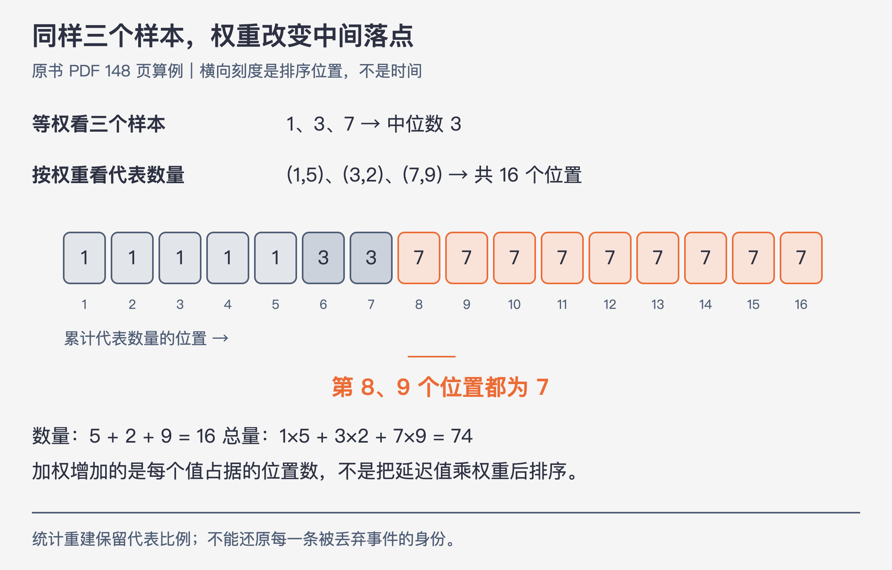
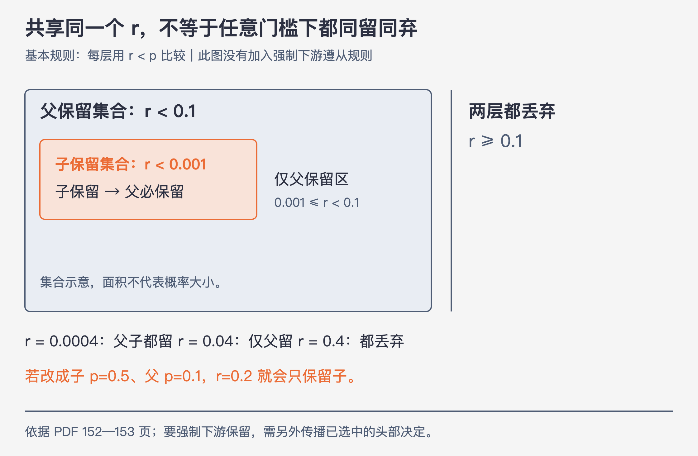
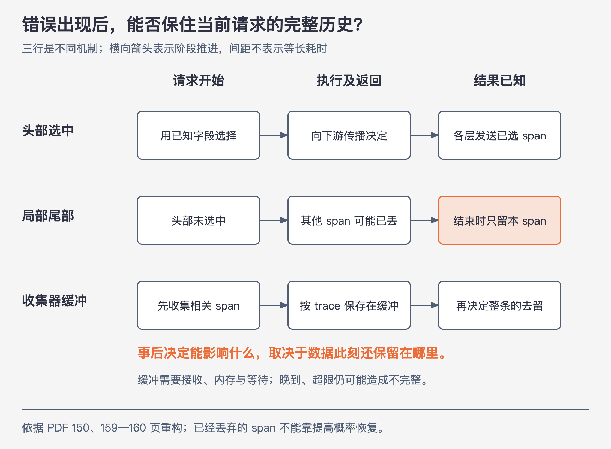

# 《可观测性工程》第17章｜如何使采样精准且便宜 · 书镜 V8.2 优化版

本章要回答：怎样减少遥测数据量，同时说明哪些上下文还能调查、样本怎样参与统计？

一次故障留下了一条报错 span，但它的调用者早已被丢弃。报错仍能告诉你“这里出了问题”，却不能回答“什么请求、经过哪些服务，走到了这里”。与此同时，若为避免遗漏而保存所有请求，观测系统的开销又可能接近业务系统。

本章沿着作者的代码改进过程，解释怎样在两者之间做选择。始终分开三个问题：**哪些事件值得保留，什么时候作决定，留下的样本怎样参与统计。**第16章解决保存和查询的成本，本章开始减少需要保存的数据量。

## 一、原书回顾：从单个事件走到整条链路

### 17.1 使用采样策略来优化数据采集

大量请求产生近似的正常事件，逐条保存的边际收益很低；排障时又不能只保留错误，因为判断异常需要成功请求作为对照。作者因此选择一部分有代表性的事件，并附带统计重建所需的元数据。

这里保留的是被选中事件的完整字段。预先聚合可能把“用户、端点、版本、耗时”压成一个总数，之后再也无法沿这些字段细分；事件采样减少记录条数，却让已保留的记录仍能被过滤、分组和查看。代价是没有被保留的具体事件无法逐条找回。小系统也可以采样，但样本少时，遗漏罕见故障的风险更明显。（PDF 147）

### 17.2 使用不同的采样策略

“采样”并非一个完整方案。接下来先改变选择标准，再处理 trace 的决策时机：同样是保留一成，随机保留、按错误类型保留和按整条链路保留，会留下不同的调查材料。

### 17.2.1 恒定概率采样

每个事件按固定概率保留，例如 `p=1/1000`。这里统一用 `p` 表示保留概率，用 `w=1/p` 表示每条样本在统计上代表的事件数量。本书示例字段 `sampleRate` 指后者，即代表倍数；这不是所有 SDK 的通用命名。

若服务实际接收约100000次请求，留下约100条样本，只报“100次请求”就少算了。估计请求数应为 `100×1000=100000`；延迟总和也逐条乘1000后求和。全部样本权重相同时，计算分位数无需把延迟数值乘1000。分位数是样本分布的估计，仍有抽样误差，不能保证稀有慢请求必定出现。

恒定概率简单，但不适合直接满足三个目标：偏重错误、照顾流量差几个数量级的不同用户、在流量暴涨时保护分析后端。后两个目标引出了流量和内容感知。（PDF 148）

### 17.2.2 近期流量采样

近期流量少就提高 `p`，流量激增就降低 `p`。问题随即变成：不同时间留下的样本代表数量不同，不能再用一个固定倍数处理全部事件。

作者给出三对“值、代表数量”：`(1,5)、(3,2)、(7,9)`。等权看三个样本，中位数是3；按权重展开，它们代表16个值：前5个为1，接着2个为3，后9个为7。第8和第9个都为7，所以加权中位数为7。算分位数时增加的是每个值的出现次数，**不是把值本身乘权重后排序**。

同一份数据还可估计数量 `5+2+9=16`，总量 `1×5+3×2+7×9=74`，加权平均 `74/16=4.625`。这些是按采样机制估计总体，不能据此逐条恢复未保留的原始事件。（PDF 148；数量、总量和均值为对原书例子的补充演算）

### 17.2.3 基于事件内容采样

按字段或字段组合决定保留概率。例如HTTP错误、创建订单、付费用户请求，可能比普通成功请求更值得保留。分类键可以只用HTTP方法，也可以组合方法、请求大小和用户代理。

作者指出，仅按内容配置固定比例，更适合键的取值种类较少、各类相对比例较稳定的情况；例如HTTP方法只有有限几种。这是适用性判断，不是算法能否运行的绝对门槛。其中一个会在故障时翻转的假设是：错误通常比成功少。若错误突然大量出现，固定保留所有错误就可能压垮后端。因此业务优先级决定资源如何分配，具体 `p` 还得结合流量与预算，不能用“更重要”直接推出“任何时候都提高概率”。（PDF 149）

### 17.2.4 键和历史相结合的方法

作者把前两种思路结合：以 `[客户ID，数据集ID，错误代码]` 等组合为键，观察过去30秒该键出现多少次，再分别调整保留概率。高频组合少留一些，低频组合尽量保留；流量结构变化后再更新。关键是按键统计，避免一个大客户的正常流量吞掉其他客户的调查材料。（PDF 149）

### 17.2.5 选择动态采样选项

作者比较三种工作负载：九成请求近似相同的首页、查询模式重复的数据库代理，以及通读缓存之后的后端。缓存已过滤掉许多重复访问，剩下的请求可能更独特。对前三者机械使用同一策略，会对“重复”和“重要”作出错误判断。应先看具体事件和查询需求，再决定用哪些键及怎样分配预算。（PDF 149）

### 17.2.6 对链路追踪进行采样

trace由多个服务的span组成。各服务独立随机丢弃span，即便每一层都留下了一些数据，也很难拼出同一条完整trace。

**头部采样**在请求开始时，利用端点、客户ID等已知字段作决定，并向下游传播已选中的决定。**局部尾部选择**在一个span结束后才利用错误、耗时决定保留该span，已经结束或被丢弃的其他span不会因此回来。若要依照结束属性保留**完整trace**，作者要求先收集并缓冲相关span，再作整条链路的决策；通常需要外部收集器，付出接收、内存、等待和计算成本。（PDF 149—150）

### 17.3 将采样策略转化为代码

本节代码行为据原始PDF150—160页的代码图片补读，由本版转述为伪代码；它与可直接提取的原书正文、后面的新增算例分开。作者不断修改同一个Go请求处理程序：调用下游服务，记录开始时间、结果及错误，再决定是否发送事件。下面保留每一步新增的行为，用等价伪代码替代重复的HTTP和计时器样板。伪代码解释机制，不是生产SDK接入方案。

### 17.3.1 基本案例

起点是不作选择，每次调用结束都发送：

```text
start = now()
result, error = callAnotherService()
writeResponse(result)
RecordEvent(request, start, error)
```

观察量随请求量增长。要减轻发送和存储成本，下一步在记录动作前增加判断。（PDF 150）

### 17.3.2 固定速率采样

```text
sampleRate = 1000              # 本书的代表倍数 w
r = uniformRandom(0, 1)
if r < 1 / sampleRate:
    RecordEvent(request, start, error)
```

这是每个事件有 `1/1000` 的概率保留，长期数量才接近千分之一；不是保证每1000次正好挑一个。接收端若不知道这个倍数，便无法正确估计数量。（PDF 150—151）

### 17.3.3 记录采样率

改为 `RecordEvent(request, sampleRate, start, error)`，把作决定时实际使用的倍数与样本一起发送。策略从1000改成100之后，旧样本仍代表1000，新样本代表100，不能统一拿最新100重算。

原图17-1中，1:00留下两个 `ok,w=100` 和一个 `err,w=1`；1:01留下三个 `ok,w=80` 和一个 `err,w=1`。图17-2把它们重建为200次成功、1次错误，以及240次成功、1次错误。7条记录估计代表442次事件。过滤错误后，也应只对符合条件的样本权重求和。（PDF 151—152）

### 17.3.4 一致的采样

将每层重新抽随机数改成：从上游 `Sampling-ID` 取得同一个判定值 `r∈[0,1)`，没有可用ID时才生成，再传向下游。各层使用 `r<p` 判断。

相同 `r`、相同 `p`，结果一致。若父 `p=1/10`、Redis子 `p=1/1000`，子保留的集合包含在父保留的集合里：子留下时父必留下，父留下时子可能不留。反过来，子概率比父大时，就可能只留下子。共享ID提供共同判定值，并不会自动让任意不同门槛变得相同。

原书还保留了运行时调节途径：改变外部采样配置或特征标志，可调整代表倍数而不重新编译；下一节再把手工调节变成按流量自动计算。

这还不同于17.3.9的“显式传播已选中决定，要求下游遵从”。前者比较各自门槛，后者让选中决定覆盖下游本来的选择规则。（PDF 152—153）

### 17.3.5 目标速率采样

作者设每秒目标保留5个事件，初始代表倍数为1。请求处理时增加计数，定时读取上一分钟的数量、计算下一窗口倍数，再重置计数：

```text
sampleRate = max(1, requestsInPastMinute / (60 * targetEventsPerSec))
p = 1 / sampleRate
```

例如上一分钟有30000次请求，目标一分钟保留300条，得到 `w=100,p=0.01`；上一分钟只有120次，则 `w=1,p=1`，全部保留也达不到300条。这种调节令输出更可预测，但上一窗口不等于下一窗口，突增与随机波动仍可能超出目标。代码也注明生产计数器要处理竞态，因此这是估计与调节示例，不是硬限流器。（PDF 154—155；具体数字演算为补充）

### 17.3.6 具有多个静态采样率

给正常与异常使用不同概率，可以提高错误、慢请求和低流量群体出现的机会。原书演示在调用结束后检查“有错误或耗时超过500毫秒”，然后选异常倍数，否则选普通倍数。

这里500毫秒只是本例条件。正文以普通 `1/1000`、异常 `1/1` 或 `1/5` 说明思想，可见代码普通代表倍数为1000，与正文的1/1000一致；当前代码的异常倍数为5，对应1/5。不要将这些示例值当通用配置。无论取哪个值，若错误突然占据大量流量，固定异常概率仍可能产生过量输出。（PDF 155—156）

### 17.3.7 按键和目标速率采样

作者为普通请求分配每秒4条，为异常请求分配每秒1条目标输出。分别维护两类计数，按各自上一窗口流量更新倍数，再按结束时的分类选择对应倍数。这样异常有自己的份额，成功对照也保留。

两类的计数、更新和判断代码重复；若再加第三类，请求处理程序会继续膨胀。下一步将按类别复制代码改成按键查表。（PDF 156—157）

### 17.3.8 任意多的键上的动态速率采样

作者使用三张映射：`counts[k]` 记录数量，`sampleRates[k]` 记录当前代表倍数，`targetRates[k]` 记录目标速率。示例 `SampleKey` 由错误消息 `ErrMsg`、后端分片 `BackendShard`、延迟桶 `LatencyBucket` 组成；按100毫秒划延迟桶，避免每个毫秒都变成新键。新键默认倍数1；明确排除的键返回负哨兵；其他键查表并按窗口更新。

把关键分支展开，可见每一步怎样影响当前事件（据158—159页图页补读转述，沿用17.3.5的倍数下限；目标速率假设大于0）：

```text
// 窗口更新，interval以秒计，targetRates[k]以事件/秒计
sampleRates[k] = max(1, counts[k] / (interval * targetRates[k]))

// 请求结束后，以错误、分片和延迟桶组成k
if neverSample(k):             # 原书默认实现为false
    sampleRate = -1            # 明确排除，不进行1/sampleRate比较
else:
    counts[k] += 1
    sampleRate = sampleRates.get(k, 1)  # 新键默认全留
if sampleRate > 0 and r < 1 / sampleRate:
    RecordEvent(request, sampleRate, start, error)
```

例如一个键上一窗口60秒有600次请求，目标每秒2条，下一窗口倍数为5，保留概率为0.2。新键尚无历史倍数时默认1；明确排除键返回−1而不发送。这些分支仍依赖正确的窗口与并发实现，并非已验证的生产代码。

这把重复分支收进同一套机制，也把复杂性移到了键设计、窗口更新与资源管理上。作者提到成书时的 `dynsampler-go` 可承担这类逻辑；理解键和概率的含义，仍是正确选用库的前提。（PDF 158—159）

### 17.3.9 把它们放到一起：每个关键目标速率采样的头和尾

头部能看到请求入口的属性，尾部能看到执行结果。原书组合它们时，先检查 `Upstream-Sample-Rate` 携带的上游决定；若已选中，沿用其决定与代表倍数。否则本层作头部判断，并把共享ID及头部结果传给下游。结束时，头部选中的事件直接记录；未选中的事件才尝试本层尾部判断：

```text
r = obtainSharedSamplingValue()
headDecision = inheritedSelectedDecisionOrLocalHeadDecision(request, r)
result, error = callAnotherService(r, headDecision)
if headDecision.selected:
    recordWithHeadMetadata(result, error, headDecision)
else:
    tailDecision = decideUsingCompletedSpan(result, error, r)
    if tailDecision.selected:
        recordThisSpanWithTailMetadata(tailDecision)
```

代码注释明确：最后这个局部尾部决定无法再向下游传播。它可以多留一条有用的span，但不等于完整trace。原书随后另提收集器缓冲，才能将整条链路的选择推迟到结果已知时。提高后续请求的头部保留概率与保存当前请求已经发生的历史，是两件不同的事。（PDF 159—160）

此伪代码保留分支与时序，省略原图中的类型、作用域及边界判断瑕疵。头尾选择合并后的有效纳入概率也需要按实际规则核算，不能把某个局部分支的倍数自动当成所有组合策略的正确权重。

### 17.4 结论

采样库可以代替重复实现，无法替你决定哪些业务字段重要、需要哪些成功对照，以及何时愿意付出整链路缓冲的成本。作者把选择什么、何时选择和怎样选择，都归到业务问题与资源约束之下。第18章接着讨论：选出的遥测数据怎样经流水线处理与路由。（PDF 160—161）

## 二、主题讲解：用一组样本和一条请求检查方案

### 先把样本算对，再谈“节省了多少”



图17-A｜依据原书148页重画。方格表示累计代表数量的位置，不表示请求时间；第8、9个位置落在值7这一组。

对保留下来的第 `i` 条事件，记值为 `x_i`，有效保留概率为 `p_i>0`，权重为 `w_i=1/p_i`：

- 估计事件数：`N̂=Σw_i`。
- 估计总量：`T̂=Σ(w_i×x_i)`。若 `x_i` 是毫秒，结果仍以毫秒计。
- 加权平均：`T̂/N̂`。
- 加权分位数：按 `x_i` 从小到大排序，对权重累计，寻找目标百分位落入的值组。

**补充演算**：三个样本为 `(20毫秒,w=4)、(50毫秒,w=2)、(200毫秒,w=1)`。累计权重为4、6、7；估计事件数7，延迟总和 `80+100+200=380毫秒`，平均约54.29毫秒。中间第4个位置落在20毫秒这一组，所以加权中位数是20毫秒，直接对三条样本取中位数却是50毫秒。

生产工具的分位数插值规则可能不同；本章采用原书“按权重展开”的直观定义。它展示的是如何恢复代表比例，不能消除抽样波动，也无法发现样本中完全没有出现的事件类型。若某类 `p=0`，便没有这一类的样本，不能拿 `1/p` 来补救。多个独立丢弃环节或头尾联合选择存在时，先核对事件最终被纳入的实际概率，再谈权重。

### 同一个r，为什么仍可能只留下一半链路



图17-B｜按原书一致采样机制构造的集合图。父子共享同一个r，但各自比较自己的p；本图没有加入强制下游遵从规则。

父 `p=0.1`、子 `p=0.001`，取三个实际判定值走一遍：

| 共享r | 父：r<0.1 | 子：r<0.001 | 留下什么 |
|---|---|---|---|
| 0.0004 | 是 | 是 | 父子都留 |
| 0.04 | 是 | 否 | 仅父保留 |
| 0.4 | 否 | 否 | 都丢弃 |

若将子概率改成0.5，`r=0.2` 就会仅留下子。关键关系是门槛集合的包含方向，不能概括为“用了Trace ID就永不断链”。

若你的目标要求父一旦选中，全部下游都留下，就要加上17.3.9的传播规则，并核对各层都能收到和遵守决定。即使选中，采集遗漏、传播断开、传输丢失也可能导致缺span；采样策略本身不是交付完整性的证明。

### 尾部知道错误时，历史数据还在不在



图17-C｜原书150、159—160页机制的时序重构。横向箭头只表示时间推进；三行是三种数据保留机制，不是同一请求连续经历的三个阶段。

**假设请求**：网关A调用服务B，B调用C；A在响应处理的最后才发现错误。下面三种对照情形采用不同的数据保留机制，分别判断历史信息是否还在。

1. 若A在开始时选中并传播了“保留”决定，B、C遵从该决定，结束后各自发送span，可以保住这次选中的上下文。
2. 若开始时未选中，而且B、C结束后已经丢弃各自span，A结束时才局部保留，新增的只有A当前仍掌握的span。B、C已经丢弃的内容不能由A的一个标记恢复。
3. 若全链路数据先送入收集器并缓冲，错误结果到达后，收集器才有材料决定保留A、B、C。缓冲需要内存和等待窗口，还要处理晚到span、超时和超限；“作了尾部决定”本身不能证明所有span已到齐。

所以检查尾部方案时，应沿真实数据路径问：哪些span在何处暂存，何时可能被丢弃，最终决策能影响哪个缓冲区。仅提高下一次请求的 `p`，不会改变当前缺失的历史。

### 错误激增时，优先级与保留概率可能反向变化

下面是讲解用的假设窗口，资源单位为“事件/秒”，不把它等同于字节或内存成本。总目标输出100条/秒，给错误60、成功40；先假设窗口内流量稳定，且每类采用独立、已知概率：

| 窗口 | 输入错误/秒 | 输入成功/秒 | 错误p及w | 成功p及w | 期望输出 |
|---|---:|---:|---|---|---|
| 平稳期 | 20 | 8000 | p=1，w=1 | p=0.005，w=200 | 20+40=60条/秒 |
| 故障期 | 6000 | 4000 | p=0.01，w=100 | p=0.01，w=100 | 60+40=100条/秒 |

错误仍有更高的预算份额，故障时其保留概率却从1降到0.01，因为输入增加了300倍。如果反过来“错误越多，概率越高”，全量错误输出就会达到6000条/秒。

这是一种固定分配示例，空闲的40条预算没有自动转移；也可以另设计重分配规则，但须说明规则。按上一窗口估计时，突增的第一个窗口仍可能超预算；若需要硬上限，限流与丢弃会改变纳入概率及调查能力，必须单独记账。整条trace的span数不同，按trace条数配额也不等于按事件数或字节数控制成本。

## 检验理解

**一组新样本。** `(延迟毫秒,w)` 为 `(8,3)、(40,1)、(90,2)`。估计请求数和延迟总和是多少？按展开后两个中间位置取平均，中位数是多少？

核对：数量6，总和 `8×3+40+90×2=244毫秒`。排序后是8、8、8、40、90、90，中间两个位置为8和40，中位数24毫秒。若工具采用“累计权重首次达到50%”的约定，则返回8毫秒；因此比较分位数前要先统一定义，不能把算法约定差异误当采样错误。逐条原始请求仍不能恢复。

**两层门槛。** 父 `p=0.2`、子 `p=0.02`，共享 `r=0.015` 和 `r=0.15` 时分别留下谁？若另有“父选中则下游强制保留”的规则，第二种结果有什么不同？

核对：只按门槛，前者都留，后者仅父留；加入并实际传播强制保留规则后，第二种也都留。必须先说清使用哪套规则。

**末端错误。** 最下游C结束时才发现错误，头部未选中，其兄弟span已丢弃。单独保留C能否补回完整trace？

核对：不能。C只保留自己仍掌握的信息；若要求完整上下文，就要在作最终决定前保留相关span，例如送入可按trace汇集的收集器缓冲，并承担相应资源与等待成本。

## 来源、范围与阅读连接

- 原书正文：第17章，原始PDF物理147—161页；加权分位数位于148页可提取文字。
- 图页补读：150—160页代码、表格和图17-1至17-4由本版实际查看页图后记录于《第17章代码与图表的逐页补读记录》，本章对其中代码行为及数值差异作视觉转述，不是原书逐字源码。17.3各段页码指向相应原始页面。
- 本书中文标题、章节顺序及关键字段沿用原书；`p`、`w`、`r`是本版为消除“采样率”歧义而统一的讲解记号。伪代码为保留行为与时序的改写，不是可部署代码。
- 原书算例与本版构造的数字、请求时序已就近区分。500毫秒、4/1条每秒等是书中示例，不是通用阈值。
- 本章承接第16章的数据存储成本，连接第6章的上下文传播与第18章的遥测流水线。组合策略的有效纳入概率、生产并发控制及SDK接入需按具体实现另行验证。

- 来源文件SHA-256：`78f8afbea15570feabe82aa74eac0d7a6ee19273131c7e70c171588640af1787`。
