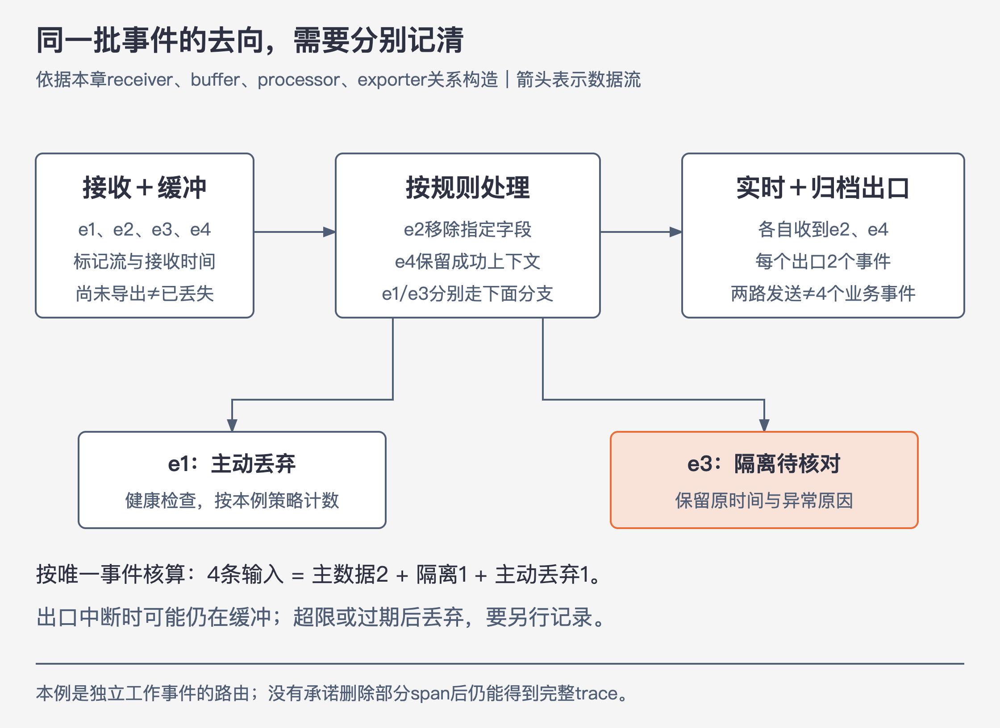

# 《可观测性工程》第18章｜使用流水线进行遥测管理 · 书镜 V8.2 优化版

本章要回答：多来源、多去向的遥测数据，怎样通过流水线管理去向、质量与成本？

本章由Slack的Suman Karumuri与Ryan Katkov撰写。应用少、后端少时，直接发送遥测很简单；当同一批数据要进入多个后端，且各有留存、访问、成本与质量要求，配置散在每个应用里就越来越难改。遥测流水线把接收、缓冲、处理和导出放到可管理的中间层。

## 一、原书回顾：管理数据去向，也管理理解能力

### 18.1 遥测流水线的属性

作者先说明流水线能承担哪些职责，再讨论组件及运行挑战。以下属性可以按实际需求组合，不要求小团队一次建设全套。

### 18.1.1 路由

集中配置目的地，让同一事件流进入不同后端，避免每次改变分析工具都发布全部应用。trace、日志可以各有出口，同一数据也可以为实时分析与长期查询分流。路由提供选择，但不同出口的转换和过滤可能让结果不再等同。（PDF 163）

### 18.1.2 安全与合规

访问主体、存储地点、保留和删除要求可能不同。作者以敏感个人信息及当时的合规需求说明集中检查、编校、告警与自助删除的用途。本章讲数据处理能力，不替特定组织判断其法律义务；需要处理哪些字段仍须有明确政策。（PDF 163）

### 18.1.3 工作负载隔离

把高吞吐与低吞吐流放在同一集群，可能让大量写入或查询挤占其他用途。按工作负载分区或分后端，可以分别设定容量与留存，减少一个日志风暴影响所有用户。隔离改变资源边界，不等于删除低流量的数据。（PDF 163）

### 18.1.4 数据缓冲

后端不可用时，磁盘或消息队列暂存数据，恢复后重放；流量峰值时也能平滑输入。Slack用Kafka并配合生产者有限磁盘缓冲，书中Kafka最多保留三天，目的是跨越一定范围的中断。

缓冲有容量与期限。如果持续输入高于输出，积压仍会增长；本版将它理解为有限的恢复能力，不把“有Kafka”当成不会丢数据的保证。（PDF 163—164）

### 18.1.5 容量管理

作者区分速率限制、采样和排队。短时超量可以等待；长期超量则可能需要丢弃或按策略选择，软限制与硬限制也可能组合。事故时优先最新数据有助于判断当前状态，较旧数据在空闲后回填。

**跨章补充：**流量增大时，若要压低输出，通常降低保留概率p；第17章中的代表倍数w随之提高。丢弃、采样与排队影响不同：前两者减少材料，后者推迟可见。还要保留成功对照和有效权重，不能假定被删内容必定没有异常信号。（PDF 164；统计边界见第17章）

### 18.1.6 数据过滤和增强

对于指标，作者给出删除含高基数字段的时间序列、预聚合这些字段，或删除时间戳格式错误等无效数据的选择；这些操作改变保留粒度，不能只概括为无损“处理”。日志可以清理敏感字段，trace可按需要选择高价值记录或过滤低价值span。流水线还可增加进程外信息，如区域、容器、主机或地理信息。

**本版分析：**新增字段应说明来源，过滤应说明丢掉什么。增加区域标签可以帮助分组，却不能补回应用从未产生的业务结果；删除字段后也会失去沿它调查的能力。（PDF 164—165）

### 18.1.7 数据转换

作者承认转换为通用事件格式可能有较高计算成本，但认为选择技术更灵活、减少同一事件的格式重复、方便进一步增强等收益值得这项成本。将多种输入转成通用事件格式，也能减少重复接入并方便连接后端。Slack把Zipkin、Jaeger等格式转成自己的SpanEvent，再用于实时工具和数据仓库。

**本版分析：**共同格式要保留字段的意义、类型与关联。换成同一种JSON结构，不自动得到相同的业务语义，也不能把缺少工作完成信息的日志变成完整事件。（PDF 165）

### 18.1.8 确保数据质量和一致性

异常时间戳可能污染查询。作者举出Candy Crush用户调整设备时间导致未来时间戳的例子，讨论删除、纠正异常时间戳或转存其他位置的处理。原文“上报时的时间戳”等替换措辞不够清楚，本版不据此指定精确的替换规则。处理方式改变了后续能回答的问题，需要保留依据。

质量管理还包括类型与结构检查、敏感信息处理，以及低价值日志或span过滤。作者另举尾部采样：根据已经报告的高延迟等所需属性，只选择一部分追踪记录进入后端。它与单纯删除低价值span是不同选择；完整trace的保留条件另见第17章。原书给的是可选机制，不是宣称任何未来时间都应无条件删除。（PDF 165）

### 18.2 管理一个遥测流水线：解剖

receiver从应用或其他缓冲读取，buffer暂存，processor转换与处理，exporter把数据送往后端。简单形态是接收→缓冲→导出；复杂形态可在中间加入处理及第二段缓冲。source、sink这些别名不应掩盖组件还能继续串联。

表18-1分别列出指标、日志与trace能执行的操作：不同数据类型的过滤和变换规则不一样，所以需要清楚划分流水线和责任。（PDF 166—167；图表已补读）

### 18.3 管理遥测流水线时的挑战

规模增加后，不仅要让组件能运行，还要证明输入到输出保持预期行为。作者接着分开六种关注点，不能用单个“服务存活”状态代替全部验收。

### 18.3.1 性能

输入数量、格式及处理开销都可能变化。某段处理变慢会积压，恢复时又可能把峰值推给下一段；扩容应先定位瓶颈，而非只看总吞吐。（PDF 167—168）

### 18.3.2 正确性

多组件、多格式让端到端变换难以核对。需要确认字段是否正确转换、计划删除的是否正是那些数据，并监测处理错误与质量问题。**本版分析：**返回成功只证明一次动作，不证明整批事件没有被错误过滤。（PDF 168）

### 18.3.3 可用性

后端和组件可能中断。receiver、buffer和exporter需具备合适的恢复方式，让短时故障不立即切断全部观测。本版保留其设计目标，也明确故障持续时间超出缓冲能力时仍可能产生缺口。（PDF 168）

### 18.3.4 可靠性

代码或配置变更期间，要看端到端延迟与饱和度。作者的具体例子是PII漏滤：先从日志搜索系统清理已经落地的相关数据，再重新处理并回填。只修改未来规则，不能自动清除已保存内容。重处理需要缓冲中仍有足够历史数据，系统也须能承受大量历史回填；若缓冲中已没有所需历史，就不能凭重跑命令恢复。回填本身也会竞争资源，需要核对容量及正确性。（PDF 168）

### 18.3.5 隔离

高吞吐客户或流可能让共享集群饱和。隔离输入、处理或目的地，让不同流的容量与故障影响有边界，而不是由最吵的流决定所有人的体验。（PDF 168）

### 18.3.6 数据时效性

作者认为端到端可查询延迟通常应在秒量级，最坏为几十秒；业务仍在运行，遥测却可能迟迟不可查。Slack用固定速率的合成消息检查端到端路径，书中示例每分钟100条、每10秒查询，并从多个区域发出。合成消息需要标识或从正常业务查询中排除，避免污染结果。

原书还以过去5分钟内、给定1分钟收齐所有消息的次数来描述时效性SLO；没有在本节给出完整的窗口对齐及迟到处理实现。

**本版分析：**合成数据验证它所经过的路径；没有覆盖的流或区域仍需另查。队列消费速度只是中间信号，产生至可查询的时间才更接近实际时效性。（PDF 168—169）

### 18.4 用例：Slack的遥测管理

Slack把开源组件与内部Murron结合，统一入口、格式及流定义。这是逐步演进的历史架构，不是本版要求照搬的部署拓扑。（PDF 169）

### 18.4.1 指标聚合

作者把Slack当时的PHP/Hack需求归因于每请求一个进程的模型：直接使用Prometheus的pull方式，只有主机上下文，缺少所需的进程上下文。因此其部署按请求产生数据，先推送到本地Go守护进程，按窗口聚合，再由Prometheus抓取该进程的指标端点。Go、Java服务则可直接暴露抓取端点。图18-3中Prometheus发起pull，不能把方向画成应用把每次请求直接推给Prometheus。（PDF 169）

### 18.4.2 日志和链路追踪事件

Murron接收多种编码，将消息包在含流名、主机、容器和进程元数据的封装中，方便路由与后续增强。SpanEvent保留ID、时间、持续时间、父ID、Trace ID、名称、类型与标签，让事件不仅能被Trace UI查看，也能进入更通用分析。SpanEvent之间仍用有向无环因果图表达关系；统一格式保留了追踪结构。作者以CI/CD系统的探测说明，这种表示也能支持传统探针之外的数据分析。

Wallace在核心云基础设施之外接收客户端遥测，减少核心系统中断时一起失去数据的风险；适配器将Zipkin、Jaeger格式转成SpanEvent，再经Murron写入Kafka。三个出口服务不同目的：Elasticsearch用于实时显示和告警，Secor经S3进入Presto仓库，Honeycomb出口过滤部分span并转到相应数据集。

作者报告实时路径约数秒，仓库典型约两小时；当时Elasticsearch通常保留7天，Honeycomb最多保留60天，Presto后端Hive最长保留两年。Murron处理每秒数百万消息、120多个流，使用20个Kafka集群的200多个主题。这些是当时Slack的部署数据，不是这些产品今天的限制或必需规模。（PDF 169—171）

### 18.5 开源替代方案

作者从Scribe的磁盘缓冲与多级转发讲到模块化日志、指标和trace工具，再讨论更高效实现语言的价值。可迁移的是使用现有组件和插件形成流水线，具体项目的当前维护与能力需另查，不能把书中的清单直接当现时选型结果。（PDF 172）

### 18.6 管理遥测流水线：自建与购买

作者明确认为，在当时已有大量可扩展、模块化工具可用的背景下，再投入工程资源重写遥测流水线基础，在经济上没有意义；自定义需求可以通过扩展现有工具满足。Slack历史上自建的理由也不一定仍适用。成熟组件能提供基础能力，商业服务可能减少运行与界面成本；开源也要维护。按第15章比较总成本、内部能力与变化需求，再决定自建哪部分。（PDF 172）

### 18.7 结论

从当前需求出发，保留接收、缓冲、处理与导出的模块边界；不要为尚未出现的所有未来需求先实现一套系统。规模越大，越要把数据含义、时效性与恢复行为作为运行工作的一部分。（PDF 172—173）

## 二、主题讲解：同一批四条事件，逐步看它们去了哪里

这是独立的讲解场景，每条为单独工作事件；本例不承诺完整trace。策略已经明确：健康检查事件不进入调查后端，敏感字段在导出前移除，未来时间异常的事件送入隔离区，其余事件进入实时分析和归档。

| ID | 收到的内容 | 需要处理的问题 |
|---|---|---|
| e1 | 健康检查成功 | 本例认定无需送调查后端 |
| e2 | 下单失败，含一个应移除的字段 | 保留失败上下文，删除该字段 |
| e3 | 客户请求，设备时间在未来 | 暂不当作真实发生时间进入主数据集 |
| e4 | 下单成功 | 保留成功对照 |

图18-A｜依据本章组件关系构造，事件身份和策略为假设。箭头表示数据去向；隔离、丢弃与等待分别保留标识，不统称为丢失。

**接收。** 验证基本结构，给事件带上流名和接收时间，缓冲四条原始记录。接收时间是处理元数据，不能偷偷替换成原业务发生时间。

**处理。** e1按已声明规则丢弃并计数；e2移除指定字段，保留订单关联、状态和错误种类；e3进入隔离区，附“时间异常”的原因和原时间，等待核对；e4保持成功对照。区域或容器信息可以增强，但应知道来自哪个元数据源。

**导出。** 主数据集只有e2、e4，实时分析和归档各有一份。两个出口合计四次发送，不等于四个不同业务事件，也不能拿它与四条原始输入直接判定“完全一致”。按唯一事件身份看，四条输入的去向为：主数据2、隔离1、主动丢弃1，当前无处理中记录。

**遇到中断。** 实时后端不可用时，e2、e4可能仍在缓冲等待，归档也可能先收到。这是一个出口延迟，不能说原事件已丢失；恢复后需验证该出口实际收到。如果缓冲超限或过期，则是另一种结果，必须明确丢弃数量及范围。重放时还要避免把同一事件重复计入统计。

### 为什么这些选择影响调查

去掉全部成功事件会失去对照；把未来时间直接当真会污染窗口；用接收时间代替事件时间而不说明，会改变“什么时候发生”的答案。格式统一只是起点，工作边界和字段意义仍需成立。

把最新数据放在前面，可以帮助当前故障调查，但历史仍在排队，报表可能暂不完整。隔离区让可疑数据有去处，也需要明确容量、留存与处理责任。这些限制是本例选择的后果，不能用一句“流水线确保数据质量”覆盖。

## 检验理解

输入1000条，主后端看到800条，能否断言丢了200条？核对：先按事件身份检查主动过滤、隔离、缓冲未发、出口失败与重复发送；有去向的延迟或隔离与永久丢失不同，不能只看两个总数。

为保护后端，错误突增时仍全量保留错误，并删除全部成功事件，是否满足本书要求？核对：既可能超容量，也会失去对照。按业务价值与预算分配概率，记录有效权重，并说明完整trace所需的额外机制。

## 来源、范围与阅读连接

- 原书定位：PDF物理162—173页；图18-1至18-5及表18-1已补读。Murron、Wallace、SpanEvent和各出口保持原案例身份。
- 四条事件、去向核算和中断情形为本版假设；对敏感数据的处理依据本例政策，未替用户系统作合规判定或配置修改。
- 接第14章共享上下文、第16章存储和第17章采样；第19章开始把技术效果连接到业务与组织采用。

- 来源文件SHA-256：`78f8afbea15570feabe82aa74eac0d7a6ee19273131c7e70c171588640af1787`。
