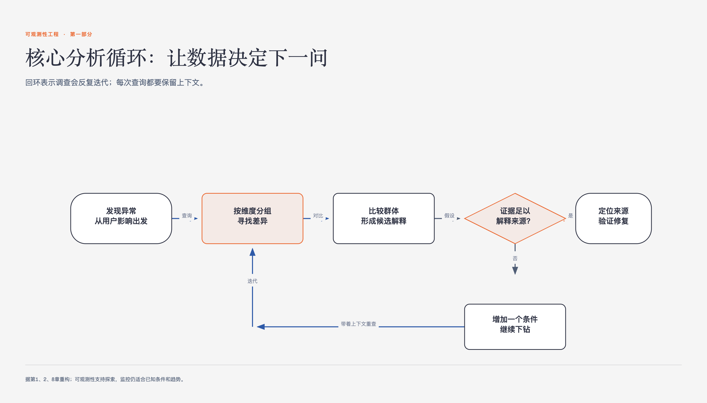

# 《可观测性工程》第1章 什么是可观测性 · 原书回顾与主题讲解

本章要回答：怎样从系统外部输出推断内部状态，以及这种能力与传统监控有什么不同。

图1-1｜核心分析循环让数据决定下一问

## 一、原书回顾：作者怎样展开

### 1.1 可观测性的数学定义

本节追溯术语起源，指出卡尔曼在1960年定义的可观测性是基于外部输出推断内部状态的数学特征。作者强调这属于控制论范畴，与机械工程紧密相关，旨在为后续将其引入软件领域奠定理论基石，并暗示软件系统需对此进行适应性转化。

### 1.2 把可观测性应用到软件系统

作者将数学定义转化为软件工程需求，提出软件可观测性需具备了解内部运行、预测未知状态及仅通过外部工具洞察的能力。通过列举一系列关于异常定位、性能分析及用户行为追踪的具体问题，界定可观测性为一种无需预定义代码即可理解任何系统状态的度量能力。

### 1.3 关于软件可观测性的错误描述

本节批判将可观测性等同于指标、日志、链路“三大支柱”或遥测同义词的观点。作者指出这种定义源于供应商的商业逻辑，限制了思维广度，强调可观测性并非特定工具的组合，而是一种思考如何收集有效调试数据的方法论，旨在纠正行业内的认知偏差。

### 1.4 为什么现在可观测性很重要

作者论证传统监控方法在现代系统中已失效。指出监控基于被动假设，仅能处理已知故障模式，而现代分布式系统复杂性超越了人类直觉和预设阈值的处理能力。通过对比过去与现在的架构差异，说明监控无法应对动态、多服务环境中的不可预测故障，引出对更灵活方法的迫切需求。

### 1.4.1 这真的是最好的方法吗

本节深入剖析监控作为默认方法的局限性。指出随着系统抽象化，监控基于的静态假设（如单体应用、固定节点）不再成立。作者强调监控被视为唯一方法而非选项之一，导致团队在面对复杂系统时撞墙，揭示传统方法在理解系统问题来源上的无力感。

### 1.4.2 为什么指标和监控不够用了

作者列举监控基于的过时假设，如单体应用、静态节点、仅关注正常运行时间等，并与现代系统特征（多服务、混合持久化、动态弹性、无限维度相关性）进行对比。指出人类大脑无法容纳现代系统的所有相关性，传统监控因维度有限而无法揭示隐藏问题，凸显高基数高维数据的必要性。

### 1.5 使用指标进行调试与使用可观测性进行调试的对比

本节对比两种调试范式。指出指标调试依赖已知故障模式和直觉，适用于简单系统；而可观测性调试从异常状态出发，保留完整上下文，面向未知问题。强调现代分布式架构使请求跳转复杂化，传统调试器失效，必须通过保留上下文来理解跨服务的交互，而非仅依赖阈值告警。

### 1.5.1 基数的作用

解释基数概念，指出高基数（如唯一ID）对精确定位问题至关重要，而低基数适合聚合。批评基于指标的工具难以处理高基数数据，导致必须在事前预设查询维度，无法事后探索。强调这种限制增加了成本并阻碍了对未知问题的发现，引出对维度灵活性的需求。

### 1.5.2 维度的作用

阐述维度指数据键的数量，高维数据能提供丰富上下文，支持任意组合查询以发现隐藏模式。通过示例说明少量维度不足以覆盖现代系统的无限故障排列，强调收集用户、代码、系统交叉点的丰富细节对于理解复杂关联和定位问题来源的关键作用。

### 1.6 使用可观测性进行调试

描述可观测性工具鼓励收集丰富遥测数据以支持开放式探索。指出其核心在于迭代调查，通过提出未预测的问题逐步深入，直至定位问题。对比监控的被动性，强调可观测性使工程师能理解任何新颖状态，无需预先定义故障模式，从而克服对未知故障的恐惧。

### 1.7 可观测性适用于现代系统

重申可观测性在现代分布式系统中的必要性。指出传统架构中可观测性有益，但在由松散耦合、动态组件组成的现代系统中，它是应对罕见且不可预测故障的作者认为更合适的手段。强调SRE难以通过传统仪表盘保证可靠性，可观测性工具提供了必要的“手术刀”和“探照灯”。

### 1.8 结论

总结可观测性在软件系统中的新内涵，强调其通过灵活收集和分析遥测数据来应对复杂性。重申反对“三大支柱”的错误定义，提出真正的支柱应支持高基数、高维度和可探索性。为后续章节对比可观测性与传统监控方法做铺垫，确立其作为现代系统调试核心方法论的地位。

## 二、主题讲解：理解可观测性的核心机制

### 从已知到未知的调试范式转换

传统监控基于“已知故障模式”的假设，通过预设阈值被动检测异常。当系统复杂度超过人类直觉处理能力时，这种方法失效。可观测性则采用“从异常状态出发”的主动范式。它不预设问题，而是保留每个请求的完整上下文。通过开放式的探索，工程师可以针对特定异常状态迭代提问，利用保留的上下文线索逐步深入，从而发现隐藏在复杂交互中的问题来源。这种转换解决了现代分布式系统中故障不可预测且难以复现的痛点。

### 高基数与高维度的数据价值

可观测性的核心优势在于处理高基数和高维度数据的能力。基数指数据中唯一值的数量，高基数数据（如用户ID、请求ID）能精确定位具体实例，而传统指标工具因存储限制难以处理。维度指数据键的数量，高维数据包含丰富的上下文信息，支持任意组合查询。通过收集用户、代码和系统交叉点的丰富细节，可观测性能够揭示传统监控无法捕捉的复杂关联模式，帮助工程师在海量数据中快速定位导致异常的具体因素，而非仅依赖聚合后的低精度指标。

### 可探索性与系统状态的动态理解

可观测性赋予系统“可探索性”，即无需预先定义故障模式即可理解任何系统状态的能力。传统监控是被动且受限的，仅能检测已知的故障情况，导致工程师对未知问题感到恐惧。可观测性工具鼓励收集丰富的遥测数据，支持迭代调查。工程师可以针对任何新颖或怪异的状态提出问题，通过开放式探索逐步揭示系统内部机制。这种能力使得团队能够应对现代系统中频繁出现的罕见故障，无需发布新代码或重启服务即可深入洞察系统行为。

### 现代系统架构对可观测性的需求

现代分布式系统由多服务、混合持久化和动态弹性基础设施组成，请求在多个服务间频繁跳转，复杂性远超单体应用。传统监控基于静态节点和固定阈值的假设，无法适应这种动态环境。在云原生系统中，定位性能瓶颈极其困难，因为故障可能发生在任何跳转环节。可观测性通过保留完整上下文和提供高维数据分析能力，适应了这种复杂性。它帮助工程师理解跨服务的交互，应对无限可能的故障排列，是现代系统可靠性工程一项重要基础能力。

## 检验理解

**情形**：假设你正在调试一个电商系统的支付超时问题。传统监控显示支付服务整体响应时间在阈值内，但部分用户报告失败。你拥有该系统的可观测性平台，其中包含高基数的请求ID和高维度的事件日志（包括用户ID、商品类别、数据库查询耗时、网络延迟等）。

**问题**：请描述如何利用可观测性的高基数和高维度特性，区分并定位导致特定用户支付超时的具体原因，并说明这与传统监控方法的本质区别。

### 核对思路（先作答再看）

首先，利用高基数特性，通过具体的“请求ID”或“用户ID”直接定位到失败的具体实例，而非依赖聚合后的平均指标。其次，利用高维度数据，分析该特定请求的上下文，如检查其关联的数据库查询耗时、网络延迟或特定商品类别的处理逻辑。通过组合查询这些维度，可能发现该用户请求涉及一个罕见的数据库锁竞争或特定的网络抖动。传统监控仅能显示整体服务正常，无法提供这种细粒度的上下文关联，因此无法定位根因。可观测性通过保留和查询丰富上下文，实现了从“检测异常”到“理解异常”的转变。

## 来源、范围与阅读连接

- 原书定位：PDF 18-27。
- 源文件 SHA-256：`78f8afbea15570feabe82aa74eac0d7a6ee19273131c7e70c171588640af1787`。
- “原书回顾”只归纳本章作者的展开；“主题讲解”和理解检查属于书镜重构。
- 边界：原书未提供具体的性能基准测试数据，仅定性描述。
- 边界：原书未详细展开“三大支柱”工具的具体技术实现细节。
- 边界：原书未提供具体的数学公式推导，仅引用卡尔曼的定义。
- 阅读连接：第一章给出定义和判断标准；第二章转向工程师实际怎样用仪表盘调试，以及这种习惯为什么难以应对陌生系统。
