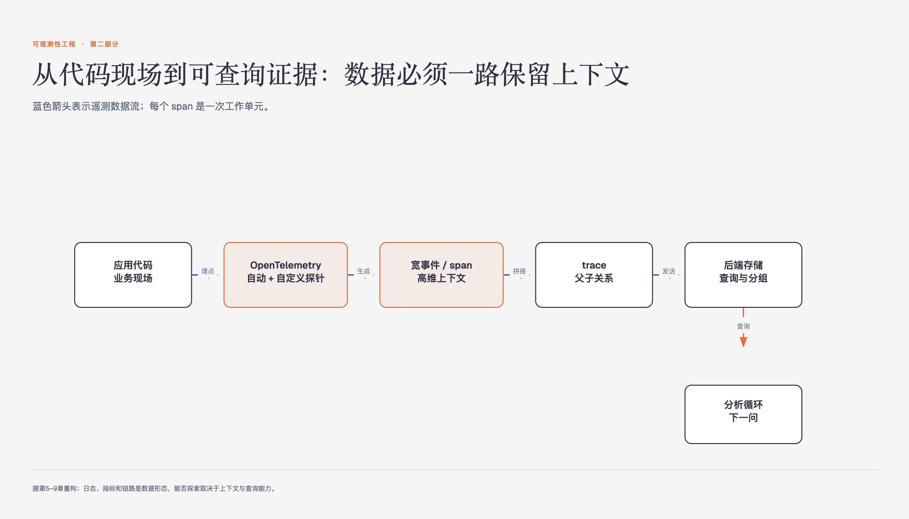

# 《可观测性工程》第5章 结构化事件——可观测性的构建块 · 原书回顾与主题讲解

本章要回答：指标和传统日志为什么不足以支撑开放式调查，结构化事件需要保留什么。

图5-1｜从应用代码到可查询证据的数据链

## 一、原书回顾：作者怎样展开

### 5.1 通过结构化事件进行调试

本节定义事件为记录特定请求与服务交互全过程的Map数据，包含ID、参数、耗时等键值对。作者指出，通过对比不同事件的异常值并基于多维度过滤分组，可高效定位问题。这种结构化记录为后续深入分析奠定了数据基础。

### 5.2 指标作为构建块的局限性

作者界定指标为预聚合的标量值，指出其仅反映特定时间段内的系统状态聚合，缺乏事件上下文与请求级颗粒度。通过页面加载时间与请求数的例子，说明指标无法重建单个请求生命周期，且无限增加指标无法解决并发与关联问题，故不适合作为可观测性核心构建块。

### 5.3 传统日志作为构建块的局限性

本节先区分非结构化数据与结构化数据，再说明现代日志实践为什么要从方便人阅读的文字，转向可被机器查询的事件。作者随后分两小节展开，不能把“日志结构化”直接等同于“已经获得完整事件”。

### 5.3.1 非结构化日志

非结构化日志通常把一次工作拆成多行给人阅读的文字，包含时间、级别和若干上下文。生产日志量变大后，不同格式、跨行叙述和大量噪声会增加解析与关联成本；它更适合在已有怀疑后查证线索，难以独立支持开放式分组和比较。

### 5.3.2 结构化日志

结构化日志把字段写成机器可解析的键值对，但一行结构化日志仍可能只是一项工作的一部分。作者希望把同一工作单元的输入、运行条件、发现的属性和结果尽量合成一个宽事件；若仍拆成多条消息，就要依赖请求ID等字段重新拼接。JSON只是表示形式，工作单元是否完整才是判断重点。

### 5.4 在调试中有用的事件属性

作者强调事件需支持“任意宽”结构，容纳高基数维度以应对未知故障模式。通过根因分析案例，说明高基数查询能力对定位复杂分布式问题至关重要。限制字段预设的Schema约束与可观测性目标相悖，事件必须足够灵活以容纳运行时动态产生的各类属性。

### 5.5 结论

本章总结指出，可观测性的核心构建块是任意宽的结构化事件。它克服了指标颗粒度粗和日志非结构化的缺陷，支持任意维度切片以回答调试中的新问题。结构化事件通过记录完整工作单元信息，赋能调查人员深入理解系统内部状态。

## 二、主题讲解：结构化事件：可观测性的核心构建块

### 从指标局限到事件重构

传统监控系统依赖指标，即预聚合的标量值。例如，页面加载时间指标仅反映某段时间内的平均值，丢失了单个请求的上下文。这种聚合导致无法重建特定请求的生命周期，也难以区分不同请求的行为差异。相比之下，结构化事件记录的是特定时间点发生的离散快照。即使在同一时间段内发生多个请求，每个事件仍保留独立的参数、耗时和状态码。这种颗粒度使得调查人员不仅能看到聚合结果，还能回溯到具体的请求实例，从而发现指标掩盖的异常模式。

### 结构化日志与机器可读性

传统日志旨在让人类阅读，通常是非结构化的文本，包含大量噪声且难以被机器解析。虽然非结构化日志包含时间戳和严重级别，但多行叙述使得关联同一工作单元的不同步骤变得困难。结构化日志通过JSON等格式，将事件定义为机器可解析的数据对象。它明确区分了输入、处理过程和输出结果，使得系统能够自动提取关键属性。这种机器可读性是实现自动化调试和复杂查询的前提，解决了非结构化日志在大规模生产环境中的解析瓶颈。

### 任意宽结构与高基数查询

可观测性要求事件支持“任意宽”结构，即不预设固定Schema，允许动态添加维度。现代分布式系统中，调试往往涉及高基数维度，如特定的用户ID、地理位置或固件版本。传统数据库难以高效处理此类高基数查询，而结构化事件系统需支持对这些细粒度维度的切片和聚合。例如，定位特定iOS版本用户的故障时，需跨多个高基数字段进行关联查询。这种灵活性确保系统能应对未知的故障模式，而非仅依赖预先定义的监控指标。

### 事件属性与调试实践

有效的结构化事件应包含请求上下文（如用户ID、购物车ID）和运行时信息（如容器版本、执行耗时）。在调试时，通过对比异常事件与正常事件的共同维度，可快速定位根因。例如，若某类错误仅在特定用户群体中出现，高基数查询能迅速筛选出该群体的共同特征。事件记录的完整性决定了调试的深度，任何缺失的关键上下文都可能导致调查中断。因此，事件设计需平衡信息密度与存储成本，确保捕获所有对后期调试有价值的细节。

## 检验理解

**情形**：假设你正在调试一个电商系统的支付失败问题。系统提供了两种数据视图：视图A是每秒支付成功率的聚合指标；视图B是包含用户ID、支付网关响应时间、错误码和客户端版本的JSON结构化事件。

**问题**：如果支付失败率突然升高，但视图A显示整体成功率仍在阈值内，你应如何利用视图B区分是特定用户群体的问题还是全局性故障？请说明具体的查询思路。

### 核对思路（先作答再看）

首先，视图A的聚合性质可能掩盖局部异常。利用视图B的结构化特性，应执行高基数查询：按“用户ID”或“客户端版本”等维度切片，计算各子组的失败率。若发现仅“iOS 11.0.4”版本的用户失败率高，则定位为特定版本兼容性问题；若所有版本均失败，则可能是支付网关全局故障。通过对比不同维度的事件属性，可精准定位根因，这是聚合指标无法做到的。

## 来源、范围与阅读连接

- 原书定位：PDF 46-51。
- 源文件 SHA-256：`78f8afbea15570feabe82aa74eac0d7a6ee19273131c7e70c171588640af1787`。
- “原书回顾”只归纳本章作者的展开；“主题讲解”和理解检查属于书镜重构。
- 边界：保持语气克制，避免使用模板化连接词。
- 边界：确保每个章节的字数限制在指定范围内。
- 阅读连接：有了能保留上下文的事件，下一章继续说明怎样用父子关系把事件拼成一条请求链。
