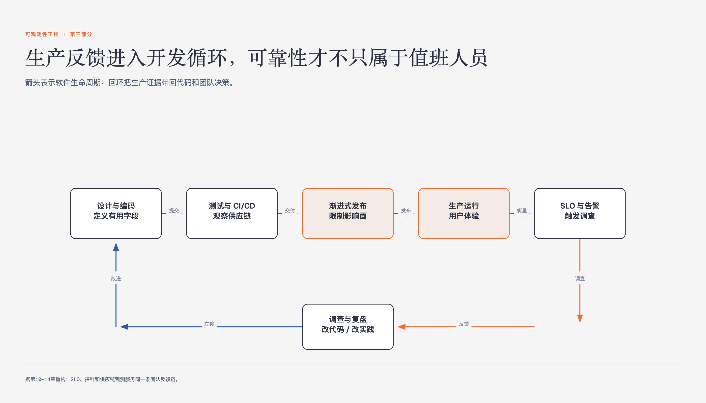

# 《可观测性工程》第10章 在团队中应用可观测性实践 · 原书回顾与主题讲解

本章要回答：团队应从哪里开始采用可观测性，怎样控制成本并逐步扩大使用。

图10-1｜把生产证据带回开发与交付

## 一、原书回顾：作者怎样展开

### 10.1 参与社区

本节指出可观测性作为新兴实践，加入志同道合社区是快速学习与建立人脉的最佳途径。作者强调社区不仅能提供双向帮助，还能揭示行业发展方向。建议通过CNCF技术咨询小组、Slack群组及Twitter等渠道积极参与，并在求助前先贡献价值。这为后续从具体痛点切入奠定了外部支持与知识基础。

### 10.2 从最大的痛点着手

作者反对从小型服务入手，主张从棘手痛点切入以快速证明价值。通过解决不稳定服务或数据库阻塞等难题，能激发团队好奇心并争取决策者支持。建议通过展示解决方案和分享文档来推动采用。这种高价值展示策略为后续选择具体工具提供了紧迫性和必要性依据。

### 10.3 购买代替自建

本节论证了购买商用方案优于自建的理由，旨在最小化投入以快速证明ROI。作者指出开源工具如Prometheus、ELK和Jaeger各有局限，难以单独提供完整可观测性。推荐使用OpenTelemetry进行探测以避免供应商锁定，并强调需验证工具是否具备高维度调试能力，而非仅具备传统监控功能。

### 10.4 反复完善你的探针

作者强调探针需个性化定制，建议从困难服务试点开始，将最佳实践推广至团队。通过值班工程师使用新工具调试问题，能直观感受其高效性。随着探针成长，需引入命名约定以规范数据。这一迭代过程为后续温和改进和复用现有数据流提供了操作基础。

### 10.5 温和改进，积极复用

本节针对沉没成本谬误，建议抓住机会将现有数据流整合至可观测性工具。通过复用ELK、结构化日志或APM数据，降低用户适应门槛。混合使用新旧工具可帮助团队在熟悉环境中探索新价值，避免从零开始的阻力。这种渐进式整合策略为最终全力冲刺完成项目做好了铺垫。

### 10.6 全力冲刺

作者指出解决痛点后需制定计划完成剩余工作，避免项目长期未完成。建议设立里程碑如黑客马拉松来推动全员参与，并通过创建通用代码库实现可观测性抽象，避免重复造轮子。这一冲刺策略旨在将方案转化为团队首选，确保项目闭环并为后续章节关于驱动开发的讨论奠定基础。

### 10.7 结论

本节总结可观测性实施需结合团队具体情况，强调参与社区、解决痛点、快速迭代及避免虎头蛇尾的重要性。通过展示高价值ROI和持续改进，帮助团队开阔视野。结论指出本章技巧旨在启动旅程，后续章节将深入探讨可观测性如何驱动开发，彻底改变传统编码观念。

## 二、主题讲解：可观测性落地的策略与执行

### 从痛点切入的价值证明机制

在团队中引入可观测性时，最大的障碍往往不是技术难度，而是如何证明其价值。作者建议从最大的痛点着手，例如解决长期困扰团队的不稳定服务或数据库阻塞问题。这种策略的核心在于通过解决高难度问题来快速展示可观测性的能力，从而获得管理层和团队的支持。相比之下，从小型服务入手难以体现可观测性在复杂调试中的优势。通过解决棘手问题，团队能直观看到可观测性在发现未知问题上的价值，进而激发好奇心并推动更广泛的采用。这一机制强调了在实施初期，价值证明比技术完美性更为关键。

### 工具选型与OpenTelemetry的战略意义

在工具选型上，作者主张购买商用解决方案而非自建，以快速证明投资回报。自建方案往往需要大量精力且难以满足完整可观测性需求，而开源工具如Prometheus、ELK和Jaeger各有局限，无法单独提供高维度调试能力。OpenTelemetry（OTel）被推荐为关键中间层，它允许应用程序独立于具体后端进行探测，从而避免供应商锁定。这种策略使得团队可以灵活尝试多种解决方案，选择最能满足需求的工具。OTel的前期少量投资将在后续工具评估中带来最大投入产出比，确保最终方案具备真正的可观测性而非仅是传统监控。

### 探针迭代与数据复用的渐进策略

探针的完善是一个迭代过程，需结合团队最佳实践进行个性化定制。作者建议从困难服务试点开始，将成功经验推广至团队，并通过值班工程师的实际使用来验证其高效性。随着探针的成熟，需引入命名约定以规范数据。在推进过程中，应温和改进并积极复用现有数据流，如将ELK日志或结构化日志整合至可观测性工具。这种策略降低了用户适应门槛，通过混合新旧工具帮助团队在熟悉环境中探索新价值。渐进式整合避免了从零开始的阻力，使可观测性更容易被团队接受和采用。

### 项目冲刺与通用化抽象的闭环管理

在解决主要痛点后，团队需制定全力冲刺计划以完成剩余工作，避免项目长期未完成。作者建议设立里程碑如黑客马拉松来推动全员参与，并通过创建通用代码库实现可观测性抽象，避免重复造轮子。这一策略旨在将方案转化为团队首选，确保项目闭环。通过抽象总结，可观测性变得更加通用化，便于在其他应用程序中复用。这种闭环管理不仅提升了团队士气，还为后续章节探讨可观测性如何驱动开发奠定了坚实基础，确保技术实践能持续产生价值。

## 检验理解

**情形**：假设你所在团队已初步引入可观测性工具，但部分老员工因习惯传统监控仪表盘而抵触新工具，且团队面临多个非核心服务的简单故障，缺乏展示高价值的机会。

**问题**：基于本章策略，你应如何调整实施重点以克服阻力并证明价值？

### 核对思路（先作答再看）

首先，应避免从简单故障入手，转而寻找团队中最大的痛点（如不稳定服务）进行调试，以快速展示可观测性在复杂问题排查中的价值，从而争取支持。其次，针对老员工的抵触，可采用温和改进策略，复用现有数据流（如将传统日志整合至新工具），降低适应门槛。最后，通过试点团队的成功案例推广最佳实践，并在项目后期设立冲刺里程碑，确保项目闭环，避免虎头蛇尾。

## 来源、范围与阅读连接

- 原书定位：PDF 82-86。
- 源文件 SHA-256：`78f8afbea15570feabe82aa74eac0d7a6ee19273131c7e70c171588640af1787`。
- “原书回顾”只归纳本章作者的展开；“主题讲解”和理解检查属于书镜重构。
- 边界：未提供具体工具性能数据。
- 边界：未提供具体ROI数值。
- 边界：未提供具体社区成员数量。
- 阅读连接：采用路径确定后，第十一章把可观测性放进开发、测试、发布和生产反馈。
