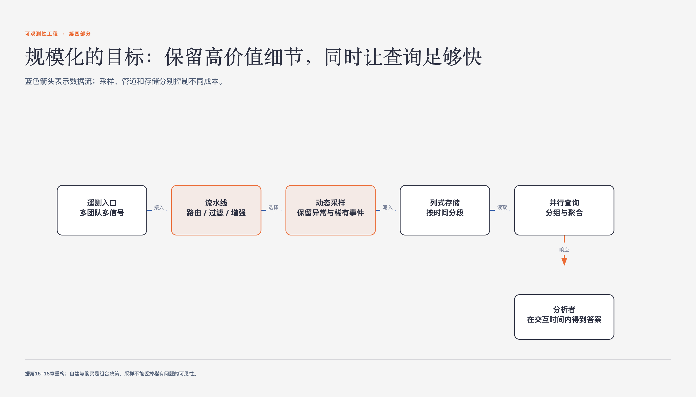

# 《可观测性工程》第15章 自建与购买以及投资回报率 · 原书回顾与主题讲解

本章要回答：怎样比较自建、购买和组合方案的真实成本与收益。

图15-1｜流水线、采样、存储和查询分别控制不同成本

## 一、原书回顾：作者怎样展开

### 15.1 如何分析可观测性的投资回报率

作者指出分析ROI需从量化成本入手，承认供应商偏见但强调客观核算。通过对比商业账单与开源免费表象，揭示人们常低估维护成本和时间机会成本。本节确立分析框架，引出下文对自建与购买具体成本的拆解。

### 15.2 自建的真实成本

本节以机会成本为核心，指出工程时间是稀缺资源，自建会分散对核心业务的注意力。通过计算财务成本与收益对比，引出开源软件隐形成本的详细案例，为后续分析具体成本构成做铺垫。

### 15.2.1 开源软件的隐形成本

通过ELK堆栈案例，展示看似免费的开源方案实际包含硬件、人力及招聘培训成本，总成本远超商业方案。引用海蒂·沃特豪斯观点，强调需认清免费软件背后的非显著成本，为讨论自建优势提供对比基准。

### 15.2.2 自建的优势

阐述自建能平衡预算压力，并培养内部专业知识。通过深入整合解决方案，团队能深刻理解业务需求与技术限制，形成扎根于组织文化的竞争优势，为后续讨论自建风险提供平衡视角。

### 15.2.3 自建的风险

指出自建面临产品管理专业知识缺失、组件集成摩擦及采用率低的风险。强调自建非一劳永逸，需持续维护且易因优先级不足被放弃，引出购买软件作为另一种选择的成本分析。

### 15.3 购买软件的真实成本

从最明显的财务成本入手，指出供应商需盈利，价格包含利润率。本节确立购买成本的分析起点，引出对隐形财务成本如模糊定价策略的深入探讨，为全面评估购买成本奠定基础。

### 15.3.1 商业软件的隐形财务成本

分析按量付费等定价策略带来的预测困难，指出随着使用规模扩大，成本可能激增。建议要求供应商提供透明估算，避免锁定在预算膨胀的工具中，引出购买软件的非财务成本分析。

### 15.3.2 商业软件的隐形非财务成本

揭示时间成本背后的供应商锁定风险，指出迁移专用代理或探针库耗时费力。推荐OpenTelemetry标准以降低锁定风险，平衡购买带来的时间节省，引出购买商业软件的好处分析。

### 15.3.3 购买商业软件的好处

强调购买节省时间价值，提供现成解决方案和精简用户体验。指出可借助供应商的专业知识积累，避免重复造轮子，为讨论购买风险及最终平衡策略提供正面论据。

### 15.3.4 购买商业软件的风险

指出购买可能导致内部专业知识发展不足，商业产品难以完全适配特殊需求。提出通过建立对接团队来减轻风险，自然过渡到购买与自建非二元选择的结论部分。

### 15.4 购买与自建不是二元选择

提出在商业解决方案基础上自建的混合模式，推荐可观测性团队作为集成点。强调高绩效组织应聚焦核心业务，利用供应商API解决最后一公里问题，平衡成本与灵活性。

### 15.5 结论

总结需权衡自建与购买的总拥有成本，包括量化与隐形成本。重申购买通常是最佳选择，但需建立对接团队适应业务需求，为下一章数据存储优化做铺垫，完成本章论述。

## 二、主题讲解：可观测性决策中的成本权衡与混合策略

### 1. 机会成本在自建决策中的量化逻辑

在评估自建可观测性方案时，核心难点在于量化“机会成本”。机会成本指因选择自建而放弃的其他高价值任务的价值。例如，工程师花费时间维护ELK堆栈，意味着他们无法开发核心业务功能。量化逻辑要求将工程师的时间成本（薪资+福利）乘以投入维护的时间，再与自建带来的潜在收益（如节省的软件许可费）进行对比。若维护成本高于许可费，且核心业务价值更高，则自建在经济上是不合理的。这种量化迫使团队从“能否构建”转向“是否应该构建”，避免陷入免费软件的陷阱。

### 2. 供应商锁定与非财务成本的评估机制

购买商业软件虽节省初期时间，但引入供应商锁定风险，这是一种非财务成本。锁定机制源于专用代理、探针库或数据格式的独特性，导致迁移成本极高。评估机制应关注数据可移植性：是否支持OpenTelemetry等开放标准？若使用专有格式，未来迁移需重写采集代码和重新配置仪表板，消耗大量工程时间。此外，还需评估供应商对路线图的控制权，若关键功能不在其规划中，业务响应速度将受限。因此，非财务成本评估需结合技术栈的开放程度与业务对灵活性的需求。

### 3. 混合策略下的团队角色与集成价值

混合策略主张在商业解决方案基础上进行自建，核心在于重新定义可观测性团队的角色。团队不再负责构建底层基础设施，而是作为集成点，负责将商业工具与业务需求对接。具体机制包括：编写标准化库以简化埋点，管理供应商API以实现数据可编程访问，以及优化数据查询以支持特定业务分析。这种模式利用商业软件的成熟度降低基础成本，同时通过自建集成层满足独特业务需求，实现成本与灵活性的平衡。团队价值从“构建工具”转向“优化工具使用效率”。

### 4. 总拥有成本（TCO）的综合评估框架

总拥有成本（TCO）评估需涵盖显性与隐性成本。显性成本包括自建的人力硬件支出与购买的软件许可费。隐性成本包括自建的机会成本（工程时间浪费）与购买的锁定风险（迁移成本）。综合框架要求：首先列出所有直接财务支出；其次估算维护所需的人力时间成本；再次评估因工具不适配导致的业务延迟成本；最后考虑长期演进中的升级与迁移风险。通过这一框架，团队可避免仅关注短期节省，从而做出符合长期商业价值的决策。

## 检验理解

**情形**：一家初创公司计划自建可观测性平台以节省软件许可费。工程师团队每月投入40小时维护开源组件，同时因工具不稳定导致生产事故响应时间增加20%。公司核心业务正处于快速扩张期，急需工程师专注于新功能开发。

**问题**：基于TCO框架，分析该自建决策的隐性成本，并说明为何混合策略可能更优。

### 核对思路（先作答再看）

已知成本是每月40小时维护，以及事故响应时间增加20%；前者可按人力成本估算，后者需要再结合事故次数和用户影响，不能直接换算成客户流失或收入损失。还要比较商业许可费、迁移成本、数据可移植性与团队真正需要的定制能力。混合方案是候选项：购买通用底座、只自建必要集成可能减少维护，但是否更优仍要用这些数据比较。

## 来源、范围与阅读连接

- 原书定位：PDF 126-132。
- 源文件 SHA-256：`78f8afbea15570feabe82aa74eac0d7a6ee19273131c7e70c171588640af1787`。
- “原书回顾”只归纳本章作者的展开；“主题讲解”和理解检查属于书镜重构。
- 边界：TCO量化依赖准确的人力成本与业务价值估算，数据获取可能存在难度。
- 边界：混合策略要求团队具备较强的API集成能力，对工程素质有较高要求。
- 边界：供应商锁定风险评估具有前瞻性，实际迁移成本可能因技术架构差异而波动。
- 阅读连接：自建或购买都必须满足同一工作负载；第十六章先分析高基数、低延迟查询对存储的要求。
