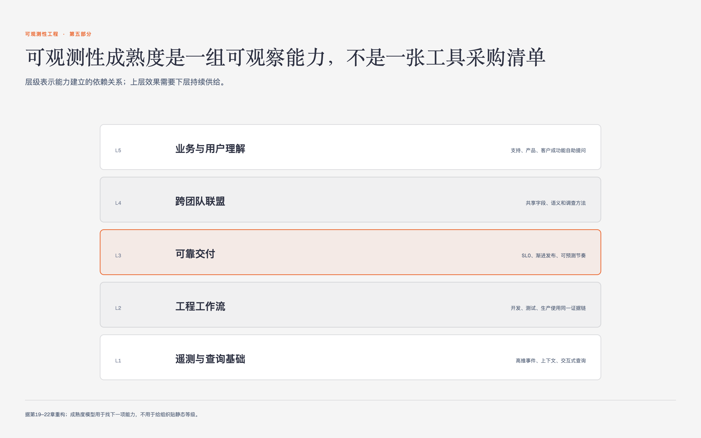

# 《可观测性工程》第19章 可观测性的商业案例 · 原书回顾与主题讲解

本章要回答：怎样把可观测性的工程效果转成组织愿意投入的商业案例。

图19-1｜可观测性能力从数据基础走向业务理解

## 一、原书回顾：作者怎样展开

### 19.1 被动引入变更的方法

本节指出组织常因服务中断等危机被动引入可观测性，通过根因分析推动变革。作者认为这种基于恐惧的简化修复往往治标不治本，且缺乏可观测性会导致工程团队陷入救火循环，引发告警疲劳和业务损失。这揭示了传统运维模式的脆弱性，自然引出对可观测性具体商业价值的量化分析。

### 19.2 可观测性的投资回报

本节阐述可观测性核心价值在于解决“未知的未知”，通过Forrester研究量化其商业利益。作者列举了四个主要收益：通过提升正常运行时间增加收入，通过缩短MTTD和MTTR节省人工成本，通过预防事故避免损失，以及通过减少员工倦怠降低流失率。这些论点为后续主动引入变更提供了数据支撑。

### 19.3 主动引入变更的方法

本节提倡主动识别异常症状，以TTD和TTR等指标为基础构建商业案例。作者指出，早期成果能验证可观测性在减少意外中断、提升团队满意度和客户留存率方面的二级与三级效益。这种从被动响应转向主动预防的策略，为如何系统性地将可观测性落地为实践奠定了逻辑基础。

### 19.4 将可观测性引入实践

本节强调可观测性是需全员参与的社会技术实践，而非简单的技术复选框。作者主张建立心理安全的不指责文化，明确工作范围并配置基础设施预算。通过消除工程与运营的人为障碍，团队能更好地调试系统并关注业务健康度，从而确保可观测性真正融入开发运维流程。

### 19.5 使用合适的工具

本节讨论工具选型，推荐OpenTelemetry作为统一探针标准以避免供应商锁定。作者建议将指标、日志和链路跟踪视为交互数据而非孤立支柱，并对比了商业一体化方案与开源组合方案的优劣。强调选择内聚解决方案能降低工程师在系统间传递上下文的负担，提升故障处理体验。

### 19.5.1 探针

本节聚焦探针技术，指出OpenTelemetry已成为支持多后端分析的新兴标准，消除了对特定服务商代理的依赖。作者强调不应简单划分数据类别，而应关注数据如何交互以支持具体用例。通过统一标准，团队可以灵活演示不同分析工具的功能，为后续数据存储与分析的选择提供基础。

### 19.5.2 数据存储与分析

本节分析数据存储与分析的架构选择，指出商业方案通常绑定存储与分析，而开源方案需分别处理。作者提醒评估开源软件的许可变更及维护成本，如ELK堆栈的管理负担。建议避免为每种数据寻找独立解决方案，选择内聚平台能显著降低工程时间和基础设施成本，提升可用性。

### 19.5.3 向你的团队推出工具

本节指导如何向团队推出工具，强调应将工程周期投资于业务需求而非定制解决方案。作者建议设立专门的观测性团队协助产品团队集成，而非创造独立的管理负担。通过评估平台是否促进创新，团队能更高效地达成解决方案，确保工具服务于业务目标而非成为新的技术债务。

### 19.6 知道何时你有足够的可观测性

本节定义可观测性“足够好”的标准，即系统具备可预测交付能力和可靠性。作者指出，当自助式数据请求能力显著提升且产品管理猜测行为减少时，表明实践已成熟。团队应关注真实用户获益而非浅层指标，通过持续补充遥测技术来应对新问题，从而平衡操作负担与商业价值。

### 19.7 结论

本节总结可观测性需作为持续性实践处理，类似安全与测试，必须与代码变更绑定。作者强调通过心理安全文化和关键结果判断可观测性是否足够，确保新代码符合观测性标准。这为下一章关于跨团队联盟以加速文化落地做好了铺垫，重申了持续维护可观测性对业务健康的重要性。

## 二、主题讲解：可观测性的商业逻辑与实践落地

### 从被动救火到主动预防的商业逻辑

服务中断常成为团队投资可观测性的触发点。商业案例不能只写“未知的未知”，还要记录现有MTTD、TTR、值班成本和中断影响，再观察引入实践后这些指标怎样变化。团队满意度、客户留存和收入属于更远的结果，需要另外排除产品、流量和组织变化等解释。

### 构建社会技术实践与文化基础

可观测性同时涉及工具和团队实践。作者主张用不指责的复盘、明确的工作范围和基础设施预算，让工程与运营围绕同一份生产证据协作。文化口号本身没有效果，仍要看团队是否真的共享查询、补充埋点并把调查结果带回代码和流程。

### 工具选型与“足够好”的衡量标准

工具选型应优先考虑OpenTelemetry等统一标准以避免供应商锁定，并选择内聚解决方案以降低系统间上下文传递的负担。判断可观测性“足够好”的标准包括自助式数据请求能力的提升和产品管理猜测行为的减少。当团队能自信地通过遥测数据理解生产行为，且神秘事件比例下降时，表明实践已成熟，此时应关注持续补充遥测技术以应对新问题。

## 检验理解

**情形**：某团队引入可观测性后，发现检测到的事件总数大幅增加，但MTTR并未显著下降。

**问题**：根据文中观点，这是否代表可观测性已达到“足够好”的状态？请说明理由。

### 核对思路（先作答再看）

不能据此判断。事件增加只说明检测或分类发生了变化，既可能暴露了过去看不见的问题，也可能只是重复告警或数据噪声。MTTR没有下降也不能单独否定价值，还要看自助查询比例、从告警到可调查证据的时间、重复事故和用户影响是否变化。结论应来自一组前后指标及具体调查记录。

## 来源、范围与阅读连接

- 原书定位：PDF 175-181。
- 源文件 SHA-256：`78f8afbea15570feabe82aa74eac0d7a6ee19273131c7e70c171588640af1787`。
- “原书回顾”只归纳本章作者的展开；“主题讲解”和理解检查属于书镜重构。
- 边界：原书未提供具体的MTTD/MTTR数值案例，仅提及趋势。
- 边界：原书未详细展开OpenTelemetry的技术实现细节。
- 边界：Forrester材料及收益分类由作者用于商业论证；作者所在公司提供可观测性产品，具体财务收益需用本组织数据独立验证。
- 阅读连接：商业案例说明为什么投入；第二十章继续找出工程之外也需要生产证据的利益相关者。
