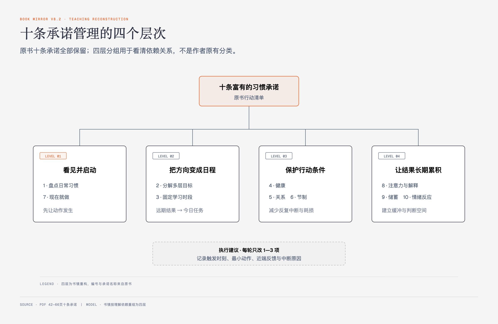

# 《富有的习惯》Part1第五章｜富有的习惯养成方案 · 原书回顾与主题讲解

本章要回答：作者的十条“富有的习惯承诺”分别要求什么？它们怎样从一句愿望落到每天的动作，又有哪些结论说得超过了现有证据？

## 一、原书回顾：从四种运气到十条承诺

### 四种运气

作者先承认成功离不开运气，再把运气分为四类。**随机的好运**，如中奖和意外遗产，个人无法安排；**随机的坏运气**，如事故和疾病，也可能超出控制；**机遇**被解释为长期好习惯结出的果实；**厄运**则被解释为坏习惯累积后的后果。前两类强调不可控，后两类强调可以通过行为提高或降低发生概率。

随后，作者把“机遇”写得更强，声称养成富有的习惯能够保证好运出现，又把失业、投资失败、离婚和生病等复杂结果广泛归入坏习惯结出的“厄运”。这一步从可控概率跳到了保证和单因解释，原章没有给出足够证据。

### 富有的习惯承诺1：我要培养自己的日常富有的习惯，每天照做不误

作者要求先盘点，不急着评价人格：把每天反复做的坏习惯写在左栏，为每一项写一个具体的好习惯放在右栏。示例包括每天学习、运动、完成待办、联系潜在客户、少刷网页、在想拖延时提醒“现在就做”、控制热量和酒精、维护联络等。右栏随后成为每日跟进清单。

这一节的有效动作是把“我不自律”改成可以观察的句子。原书又把好习惯与成功、坏习惯与失败做了过于整齐的二分，忽略了资源、疾病、照护责任和环境约束。

### 富有的习惯承诺2：我会设定每日、每月、每年的目标以及长期目标，然后全心投入追求自己的目标

作者把目标按时间层级拆开：

### 当日目标

开始一天前列出有较高可能完成的事项，为任务设时间，优先处理重要项；完成约80%就视为当天成功，晚上复盘。

### 当月目标

把月末前要完成的结果拆成每周和每天的动作。例如月签五张保单，反推每周面谈数和每日电话数。

### 今年和来年的目标

选择自己确实想做、也有把握推进的目标，再拆出训练计划；原书以注册会计师考试为例。

### 长期目标

把愿望拆成多年可累计的动作；原书用五年买房反推每月、每次发薪的储蓄额，并建议用愿景板持续提醒。

作者的核心结构是“远期结果—阶段结果—重复动作”。他把家庭事务写成会妨碍工作的分心来源，这个处理过于单向；现实目标要同时纳入照护、健康和休息，而不是把工作以外的一切都排除。

### 富有的习惯承诺3：我每天都要提升自我价值

作者建议每天至少留30分钟、不受打扰地学习行业资料、自我提升内容或新技能，也可以考证、攻读学位、参与创造性项目、寻找业务机会。学习要围绕当前目标，而不是用泛读制造忙碌感。

原书把“看电视、读杂书”整体写成浪费，界线过粗。是否有价值应看它与当前目标、恢复和生活质量的关系。

### 富有的习惯承诺4：我每天都要关注自己的身体健康

作者把健康习惯拆成饮食记录、热量管理、体重记录和有氧运动，主张先连续30天记下吃了什么，再决定减少哪些高热量食物；他强调“管理摄入”不同于极端节食，并建议每周至少四天、每次20—30分钟有氧运动。书中还提供一份按日记录体重、运动与三餐热量的月表。

原章同时提出“户外慢跑比室内器械多消耗约三分之一热量”“有氧运动是最有效的减脂运动”等强结论，却没有在本章给出来源和适用条件。热量与运动安排涉及身体状况，不能把固定数字当作人人通用的处方。

### 富有的习惯承诺5：我每天都要建立并维护可持续的人际关系

作者把关系维护写成持续动作：记住姓名、生日和家人情况，在重要时刻致电或送贺卡，及时回复，主动提供帮助；可以用联系人系统保存对对方真正重要的信息，并在见面前复习姓名。他还建议按球友、邻居、同学、工作伙伴、社区等情形分类联系人。

作者又建议远离“焦虑抑郁者”，并把他们的处境归因于坏习惯。这种表述把健康状态与道德评价混在一起，不能沿用为关系原则。更稳的边界是识别持续操控、伤害或单向索取的具体行为，而不是按心理状态排斥人。

### 富有的习惯承诺6：我每天都会生活得很有节制

“节制”在原章中覆盖饮食、饮酒、消费、娱乐、工作和情绪。作者用沃伦·巴菲特长期住在同一所房子、日常乘商业航班等轶事，反对为了攀比而扩大住房、车辆和消费，并提醒没有储蓄和安全垫的人更容易被收入中断击穿。

可用判断不是“富人都低调”，而是消费和投入是否与自己的资源、目标和风险承受能力匹配。原书把成功者写得过于一致，也把情绪强烈直接等同于失败，证据不足。

### 富有的习惯承诺7：我会告诉自己“现在就做”，将当天的任务按时完成

作者把拖延和救火连接起来：重要任务推后，时间变紧，错误和遗漏增加，新的紧急问题又打断下一项工作。他建议提前安排待办，在想拖延时立即说“现在就做”，进入任务后让专注接管。

这条承诺适合已经明确、规模可控的动作。若任务含义不清、风险高或需要休息，直接逼自己开工未必正确；应先把任务拆小、澄清下一步和完成条件。

### 富有的习惯承诺8：我会用致富思维面对生活

作者建议减少持续输入负面信息，用正面肯定、感恩清单和视觉化调整注意力。原书的正面肯定包含“我会完成待办”“我每周给父母打电话”等行为句，也包含“我一年挣30万美元”“我拥有度假屋”等结果句，并声称重复后相应机会会显现。

### 正面肯定

原书建议把肯定句做成随身清单，早、中、晚反复读。行为句可以提醒下一步；把尚未发生的结果当成已经发生，不能替代计划和证据。“积极”也不应变成压制悲伤、焦虑或合理风险判断。

### 富有的习惯承诺9：每次发放薪水后，我会拿出10%进行储蓄

作者提出“先付钱给自己”：发薪后先把10%转入储蓄、投资或退休账户，定期查看净资产和养老目标，并在需要时咨询会计师、律师或理财规划师。他把完全不储蓄、长期依赖信用卡和投机当养老计划视为高风险行为。

10%是书中的固定启发式，不是适合所有收入、债务和福利制度的唯一比例。现实顺序还要考虑基本生活、紧急债务、保险、税务和本地退休制度。

### 富有的习惯承诺10：我每天都会控制自己的想法和情绪

作者推荐“思考—评估—反应”：在刺激与行动之间留出时间，减少愤怒、嫉妒或悲伤带来的冲动决定；也建议用建设性项目替代无所事事时的负面想法。

原章把成功者写成能驱除所有负面情绪，又用监狱人口暗示失败者因不思考而犯罪，这是一种没有证据支持的过度外推。更可用的目标是识别情绪、延迟高风险反应，并在持续困扰时寻求支持，而不是要求自己不再有负面感受。

## 二、主题讲解：十条承诺其实分成四个可管理层次

一个人想改善财务，最容易犯的错是把十条同时当作每日考试。更清楚的读法，是先看它们分别在管理什么。

图1-1｜十条承诺管理的四个层次。分组是书镜讲解重构；承诺名称与主要动作来自原书。

第一层是**看见并启动**：承诺1盘点重复行为，承诺7让下一步及时发生。第二层是**把方向变成日程**：承诺2拆目标，承诺3固定学习。第三层是**保护承载行动的条件**：承诺4处理健康，承诺5维护关系，承诺6控制过度消耗。第四层是**让长期结果可累积**：承诺8管理注意力与解释，承诺9形成资金缓冲，承诺10在情绪到行动之间加一道判断。

实施时每次只改一到三项，并写下四个字段：触发时刻、具体动作、最小完成量、近端反馈。例如“工作日8:30打开行业资料，读10分钟，记一条能在今天使用的做法”。这比“提升自我价值”更容易执行和复盘。

十条承诺不是财富公式。它们主要作用在时间、技能、关系、健康、支出与决策这些中间变量上；最终收入还受起点资源、行业、制度、家庭责任和随机事件影响。

## 检验理解

**情形**：一位负债者同时设定每天运动、读书、联系五人、记账、冥想和早起，连续四天后全部停止。

**问题**：按本章四层结构，怎样重新设计第一周？

### 核对思路（先作答再看）

先盘点最影响现金与执行的一条枢纽问题，例如冲动消费或从不查看账单；把动作缩到固定时刻记录一笔支出，并设置自动转入很小的安全金额。健康或学习可以保留一个最小动作。第一周的目标是形成可观察、可恢复的重复，不是一次通过十项考试。

## 来源、范围与阅读连接

- 原书定位：PDF 42—66页。
- 源文件 SHA-256：`397897b4647e69ba569a1f31bdc2a374246d32c4f1ba5c24c7cd2fd2c1d7f167`。
- 原书标题保留：四种运气、十条“富有的习惯承诺”，以及当日、当月、年度、长期目标与正面肯定等小节。
- PDF 53—54页为体重、运动和热量跟踪表，已通过页面渲染与macOS Vision OCR复核。
- 医疗、运动、心理和财务数字均只按作者建议呈现；本卡没有把它们升级为专业处方。
- 下一章开始逐人回看十条承诺怎样被放进生活；这属于寓言式应用，不是临床或财务试验。
