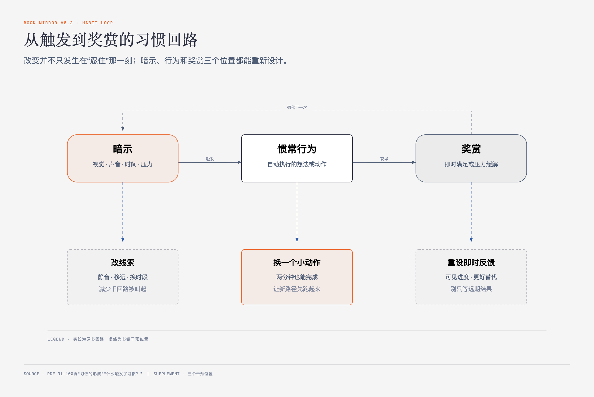

# 《富有的习惯》Part2第一章｜认识习惯 · 原书回顾与主题讲解

本章要回答：作者怎样解释习惯的作用、形成、来源和触发，又在哪里把一个可用模型说成了过强的生物决定论？

## 一、原书回顾：从自动行为走到信念练习

### 习惯的作用

作者把习惯分成下意识的行为、想法和决定，认为习惯能减少每次重新思考的负担。他把基底核称为习惯的“命令和控制中心”，又用父母示范、镜像神经元和儿童模仿解释习惯怎样早期形成。随后，他把教育、财富、健康乃至后代生活几乎全部归因于习惯，远超过本节材料能支持的范围。

作者还引用一项对5万个美国家庭的调查和格罗斯曼博士的说法，断言童年形成的习惯在9岁后就很难改变；但他并没有说成年人此后无法形成新习惯，而是列出四种入口：与新的生活环境互动、受职业导师影响、主动自我提高、从挫折中吸取教训。调查规模、9岁阈值和这套解释都按作者转述保留；当前章节没有提供足以独立核验研究设计与因果边界的资料。

### 习惯与大脑的关系

原书用“脑细胞频繁互动—被贴上习惯标签—基底核发出执行命令”的比喻说明自动化。它引用一项96人研究，称养成新习惯平均66天，简单行为与复杂行为所需时间不同，范围可以从18天到254天；作者由此反对只凭新年决心硬撑，也预告后文会用环境和行为设计降低阻力。

这一脑科学叙述高度简化，尤其“基底核给脑细胞贴标签”“标签一生不能摆脱”是作者的解释性语言，不能当作准确的神经机制。

### 习惯会改变人的DNA

作者引入基因表达和表观遗传，主张饮酒、药物、垃圾食品、缺乏运动、不学习和负面情绪会“开启坏基因”，阅读、运动、冥想和乐观则会“关闭坏基因、开启好基因”，还把影响延伸到后代。

这里把生活方式、压力、疾病风险、基因表达和DNA本身混为一谈，并使用“恶性基因”等非严谨概念。可保留的最低判断是：生活方式可能影响健康和部分生物过程；原章没有给出足以支持每条具体基因、疾病和遗传结论的证据。

### 习惯的形成

作者借查尔斯·杜希格的说法，把习惯执行分为**暗示—惯常行为—奖赏**。孩子看见麦当劳金色拱门，要求停车吃麦乐鸡，是他给出的完整例子：视觉线索触发，停车购买是行为，吃到食物是奖赏。咖啡壶、周五下班和打开电脑也可能分别触发喝咖啡、喝酒或查邮件。

### 习惯从何而来？

原书列出父母、导师、非正规教育、挫折、正规教育、文化、环境、兄弟姐妹、伴侣、朋友、同学、工友、祖父母、姻亲、队友和公众人物等来源。随后重点展开四类：

### 习惯来源｜1．父母

孩子观察和模仿，早期行为被带入成年；作者以巴菲特、肯尼迪家族、运动员和教练家庭为例，但这些名人轶事不能排除资源和选择偏差。

### 习惯来源｜2．导师

导师提供经验、反馈和机会；书中列举大量名人与导师关系，强调长期职业指导。

### 典型案例——杰米·戴蒙和他的导师

作者用杰米·戴蒙追随桑迪·威尔、共同收购与合并金融机构的经历说明，导师关系可以跨越单次建议，长期影响职业选择与机会。这个成功者个案不能给出导师制的总体效果。

### 习惯来源｜3．非正规教育——阅读

书籍让读者借用别人的经验，作者以比尔·盖茨的阅读和图书馆投入为例。

### 习惯来源｜4．从挫折中得来的经验教训

失败消耗时间和金钱，也可能促使人分析决策、形成新的做法；作者称其企业主样本中27%至少失败过一次。

### 什么触发了习惯？

作者列出六类触发事件。改变的第一步，是把某个习惯与它的触发事件配对。

### 触发事件｜1．视觉

标志、摆在眼前的物品和环境画面会唤起关联动作，原书以麦当劳金色拱门和啤酒广告为例。

### 触发事件｜2．听觉

闹铃、新邮件提示音和婴儿哭声会启动起床、查邮件或照护动作。

### 触发事件｜3．时间

早、中、晚本身会成为提示，让一组固定日程自动展开。

### 触发事件｜4．压力

作者认为疲惫和压力会把人推回低耗能的熟悉动作；这解释了为什么越忙时旧习惯越容易出现。

### 触发事件｜5．人际交往的对象

特定同伴会与喝酒、赌博、运动或其他行为绑定。调整相处场景可能改变触发频率。

### 触发事件｜6．信念和情绪

自我评价与情绪会影响人选择什么动作。作者主张先觉察，再把限制性信念改成支持行动的说法。

### 信念和情绪如何影响习惯？

原书把潜意识、网状激活系统、海马体和信念连接起来，主张人会优先注意与生存、目标和既有信念一致的信息。作者用自己的童年经历说明：父亲一句“你很蠢”让他减少学习，八年级老师的肯定与一次99分考试又改变了他的学习投入。

这个案例更稳的机制是“评价改变期待—期待改变准备行为—考试结果提供反馈”，而不是一句话直接改写大脑程序。作者随后列出“穷人注定贫穷”“我不聪明”“没人喜欢我”等限制性信念。

### 练习：来自未来的信

假设来到五年、十年或更久以后，给现在的自己写信，描述住在哪里、做什么工作、完成了什么目标。它先形成生活蓝图，不证明蓝图必然实现。

### 练习：给自己写讣告

从希望别人怎样记住自己倒推一生想完成什么。原书鼓励大胆写，但实际行动仍要再拆解。

### 练习：列出梦想和心愿清单

从未来的信和讣告中提取五年内最想实现的项目，删掉重复与不重要项。

### 练习：设定目标

只有在梦想与心愿清楚后，才把它们拆成可执行目标；下一章继续展开。

## 二、主题讲解：改变从看见触发链开始

想象你每次坐到办公桌前就先刷消息。只说“我自控力差”没有可操作信息；把链写出来就不一样：坐下和提示音是暗示，打开应用是惯常行为，短暂的新鲜感是奖赏。你可以静音、把手机放远，也可以在坐下后先打开一个只需两分钟的任务，用另一份即时反馈替换旧奖赏。

图2-1｜习惯回路及三个可干预位置。主回路来自原书“暗示—惯常行为—奖赏”；干预位置属于书镜讲解。

父母、导师、环境和信念不是四种宿命，而是触发和学习来源。它们可以解释某些行为为何容易自动发生，却不能单独决定财富、疾病或智力。更好的使用方式是提出小假设：某个触发是否真的出现？改掉它以后行为频率是否改变？新动作的奖赏是否足够及时？

## 检验理解

**情形**：有人每天晚上九点一听到群聊提示音就打开手机，随后刷到凌晨。他决定只写一句“我要早睡”。

**问题**：按本章模型，这句话漏了哪三个可观察点？

**补充情形**：一位成年人认为“我9岁前没养成好习惯，现在已经来不及”。按作者的完整说法，这个判断漏掉了什么？

### 核对思路（先作答再看）

漏了暗示、行为和奖赏：九点提示音是什么触发，打开后连续刷多久，行为提供了什么即时满足。只有写清这三点，才知道应改通知、改手机位置、安排替代活动，还是调整群聊边界。

“9岁后较难改变”并不等于成年人无法形成新习惯。按作者自己的边界，成年人仍可能通过新的生活环境、职业导师、自我提高和从挫折中学习，形成新的做法。

## 来源、范围与阅读连接

- 原书定位：PDF 85—106页。
- 源文件 SHA-256：`397897b4647e69ba569a1f31bdc2a374246d32c4f1ba5c24c7cd2fd2c1d7f167`。
- 原书关键术语保留：基底核、暗示、惯常行为、奖赏、触发事件、信念、网状激活系统。
- 脑科学、基因表达、疾病、智力和儿童发展结论按作者归属保留；原章提供的来源信息不足以逐项核验，主题讲解没有将其转写为医学事实。
- 下一章区分核心习惯和普通习惯，并列出全书最长的一组富有/贫穷习惯。
