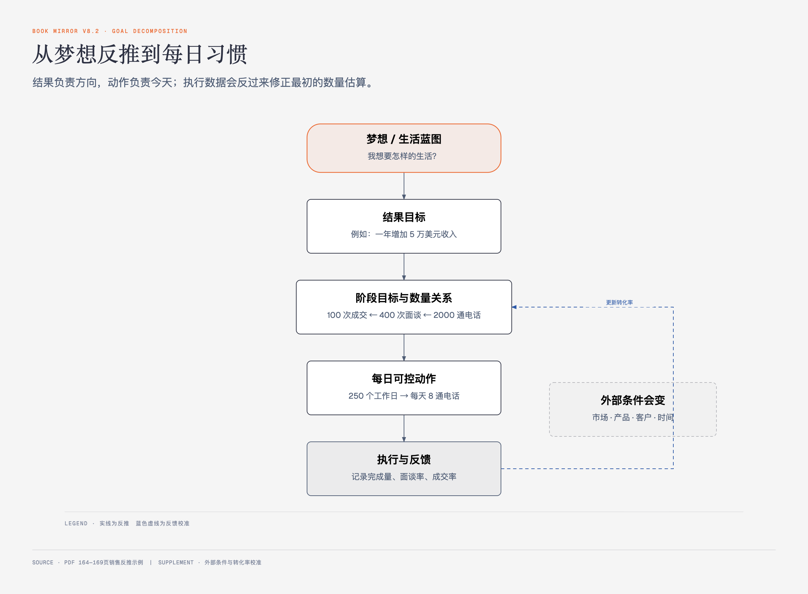

# 《富有的习惯》Part2第三章｜围绕梦想和目标培养习惯 · 原书回顾与主题讲解

本章要回答：梦想、目标和习惯在原书中分别是什么？怎样从远期愿望反推到今天能做的动作？

## 一、原书回顾：从生活蓝图反推每日电话

### 寻找梦想

作者把梦想定义为对未来理想状态的清楚描述。第一步写出十年、十五年或二十年后的生活细节，第二步从描述中提取收入、住房、工作和生活等心愿清单。梦想先回答“想去哪”，还不是行动计划。

### 未来的镜中人

原书用七步补全生活蓝图：理想伴侣、理想工作、身体状况、住宅、日常活动、物质财富，最后汇总成约1000字的总体蓝图。每个分项约100字，目的在于逼迫模糊愿望变得可描述。

这套问题明显偏向伴侣、收入、住房、车辆和物质财富；读者可以按自己的价值补入照护、公共贡献、学习和闲暇，但应标明这是个人改写，不冒充原书。

### 目标设定

作者用两问把梦想变成目标：为了实现心愿必须做什么？这些活动是否在自己的能力范围内？可执行且可掌握的活动才算目标；缺少能力时，先把获得知识或技能设为目标。

他用销售例子做完整反推：要增加5万美元收入，单件佣金500美元，需要100次成交；四次面谈成交一次，需要400次面谈；五通电话约到一次面谈，需要2000通电话；按一年250个工作日计算，就是每天8通电话。最终收入是梦想，每日8通电话才是可重复动作。

### 围绕单个目标设定习惯

作者用盖房比喻：生活蓝图像房屋图纸，目标像各项施工，日常习惯则是每天自动执行的工序。总结为四步：写生活蓝图、列梦想心愿、为每个梦想设清晰目标、围绕每个目标培养日常习惯。

## 二、主题讲解：反推必须保留转化率和可控边界

图2-2｜梦想—目标—任务—习惯的反推链。箭头表示分解；实际结果还受转化率和外部条件影响。

销售例子有价值，因为每一步都能检查；它也有风险，因为把历史转化率当成稳定常数。五通电话约一次、四次面谈成一单若发生变化，每天8通就不再足够。行动一段时间后必须用真实数据重算，而不是把最初计划当契约。

目标还要尽量落在自己能控制的动作上。“一年赚20万”受他人决定和市场影响，“每周完成十次合格客户访谈”更可控。结果目标保留方向，行为目标负责今天。

## 检验理解

**情形**：一位创作者希望一年卖出1000份课程，直接把目标写成“每天卖出3份”。为什么这还不是足够好的习惯设计？

### 核对思路（先作答再看）

销售结果不能由他单方面执行。还要继续反推到可控动作，例如产出内容、接触潜在用户、完成演示，并用真实转化率估算数量；随后定期重算。

## 来源、范围与阅读连接

- 原书定位：PDF 164—169页。
- 源文件 SHA-256：`397897b4647e69ba569a1f31bdc2a374246d32c4f1ba5c24c7cd2fd2c1d7f167`。
- 原书术语保留：寻找梦想、未来的镜中人、目标设定、围绕单个目标设定习惯。
- 本卡没有把示例中的佣金和转化率当作通用基准。
- 下一章提供两日觉察、加减评估、三阶段跟进和六种改变捷径。
