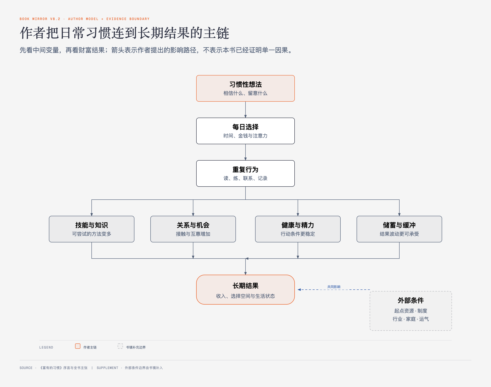

# 《富有的习惯》序言｜作者把成功归因于什么 · 原书回顾与主题讲解

本章要回答：作者准备怎样把“富人与穷人的差别”讲成一套可以照着做的习惯方案？这套说法能当作什么，不能当作什么？

## 一、原书回顾：序言提出的整本书问题

### 富人与穷人的行为有何区别？

作者先交代自己的材料来源：他称自己用五年调查了233位百万富翁，其中177位白手起家，同时调查了128位处在贫困线附近的人。他列出运动、阅读、经营人脉、决策、礼仪、追求目标和拒绝干扰等差异，并用比例展示这些行为在受访富人中的出现频率。

### 富人怎样说话？

作者把沟通视为维护关系的日常动作，列出不聊八卦、在生日和人生重要时刻致电、主动问候、重要发言前先整理想法等做法。这里的重点不是口才，而是持续投入关系、减少破坏关系的言行。

### 富人怎样思考？

作者进一步把行为追到“习惯性想法”：相信自己能改变处境，相信努力与坚持，保持乐观，控制负面情绪，坚持诚实。他的主张是，重复的想法会带来重复的行为，行为长期累积后改变结果。

### 如何百分之百地实现自己的目标？

序言预告后文会区分梦想、目标和完成目标所需的步骤。这里用了“百分之百”这样的强说法，但还没有给出足以保证结果的条件或证据。

### 怎样找到人生的主要目标？

作者承诺用一套步骤帮助读者描绘理想生活，再从中筛出愿意长期投入的活动。他把“人生目标”与热情、坚持连接起来。

### 如何培养成功、富有而幸福的孩子？

作者认为习惯可以经由家庭教育传递，因此把同一套运动、学习、目标和自我管理建议延伸到孩子身上。序言没有展示儿童样本或长期追踪，应用时要保留这一证据缺口。

### 如何找到帮助自己达到目标和实现梦想的贵人？

作者把导师和支持者视为降低试错成本、扩大机会的重要来源。后文的寓言故事也用“受帮助的人继续帮助下一位”串起人物。

### 如何找到改变习惯的捷径？

序言预告“习惯堆叠”、从小习惯开始、按早间—日间—晚间逐步加入新动作等方法。所谓“捷径”指降低改变难度，并不等于不需要重复和时间。

### 通往财富的三条路径是什么？

作者承诺介绍不同的财富积累路径，但序言只提出问题，没有在此完成论证。

### 怎样才能交好运？

作者区分偶然机会与由长期准备、尝试和关系带来的“机会运”。他的用法会把一部分看似幸运的结果解释为可重复行动提高了遇到机会的概率。

### 不当老板也能变得富有

作者指出其百万富翁样本中只有51%是企业主，其余人在组织内工作。这一数字用来反驳“只有创业才能致富”，却不能说明受薪者采用某组习惯就一定能达到同样结果。

### 如何拓展收入渠道？

作者称许多富人拥有至少三种收入来源，并将在后文讨论怎样开辟新渠道。这里仍是研究观察和写作预告，没有给出每个人都应同时经营三种收入的统一处方。

### 习惯为什么很重要？

作者用“日常活动中有40%—85%是习惯”强调自动化行为的分量，并准备从大脑、触发因素和重复练习解释习惯形成。比例跨度很大，序言没有给出测量口径。

### 如何提高智商？

作者把阅读、学习、运动和睡眠进一步连接到认知表现，并使用“更新大脑”等强承诺。后文会展开建议，但这类结论不能只凭本书转写为神经科学事实。

### 如何延长寿命？

作者声称一些日常活动可以“至少增加十年寿命”，同时改善生活质量。序言没有给出足以支持这个数字的来源或适用条件，不能把它当作医学保证。

### 成功艰难，但作者仍承诺唯一终点

序言结尾一面提醒读者，成功并不容易，需要时间与坚持；作者称白手起家的富人平均花了12年积累财富。另一面，他又把采用富人日常习惯的道路写成“只会通往一个地方”：充满机遇、成就、财富、健康和幸福的人生。平均12年与唯一成功终点都是作者原话强度下的主张；当前调查设计既不能保证每个人达到同一结果，也没有展示失败者分布。

## 二、主题讲解：把整本书读成“可试验的习惯假设”

先看一个普通情形：同样是想提高收入，一个人每晚只是担心，另一个人固定拿出30分钟学习行业知识、联系一位客户，并记录实际结果。一个月后，两人的差别不一定已经体现在财富上，却会先体现在知识、联络次数、机会和反馈上。作者真正想抓住的，是这条可以每天重复的中间链。

图0-1｜作者把日常习惯连到长期结果的主链。箭头表示作者提出的影响路径，不代表本书已经证明单一因果。

原书的可用核心可以写成一条假设：**想法影响选择，选择变成重复行为；重复行为改变能力、关系、健康与资金安排；这些中间变化再影响长期机会。** 这条链比“养成富人习惯就会发财”更准确，因为它保留了中间变量，也保留了外部环境、起点资源和运气。

阅读时把三层证据分开：第一层是作者调查中的比例；第二层是书中寓言式人物的变化；第三层是作者从前两层推出的建议。比例说明样本内共现，故事说明作者希望读者怎样理解，建议则需要在自己的处境里小规模试验。三层不能互相冒充。

## 检验理解

**情形**：甲每天学习行业资料30分钟，三个月后仍未加薪；乙没有固定学习习惯，却因公司整体调薪增加了收入。

**问题**：这个例子是否推翻了作者关于习惯的全部主张？又是否说明学习习惯必然带来加薪？

**补充问题**：作者怎样同时描述成功的时间成本和结果确定性？

### 核对思路（先作答再看）

两种说法都过强。甲的结果提醒我们，习惯先改变能力和机会暴露，收入还受岗位、组织、市场和时间影响；乙说明收入也可能由外部事件改变。更合适的检验是继续看甲的知识、工作质量、面试机会或客户转化是否发生可观察变化，再判断这项习惯在当前环境中有没有作用。

作者说成功艰难，白手起家的富人平均花了12年；同时又承诺沿着富人习惯前进的道路只有一个终点，即机遇、成就、财富、健康和幸福。前者强调时间成本，后者给出强确定性，两者都应当作为作者主张保留，而不是当作本序言已经证明的规律。

## 来源、范围与阅读连接

- 原书定位：PDF 4—11页，序言。
- 源文件 SHA-256：`397897b4647e69ba569a1f31bdc2a374246d32c4f1ba5c24c7cd2fd2c1d7f167`。
- 版本：中文电子书，作者托马斯·科里，译者程静、刘勇军。
- 作者自述的调查样本为233位百万富翁与128位贫困人士；本书未在序言中提供抽样框、问卷全文、统计方法或同行评审信息。
- 本卡保留作者的数字与强承诺，但将其归为作者主张；主题讲解没有把相关性改写成因果。
- 下一单元进入Part1导言，查看作者怎样从一位现金流困难的客户转向“问日常行为”。
