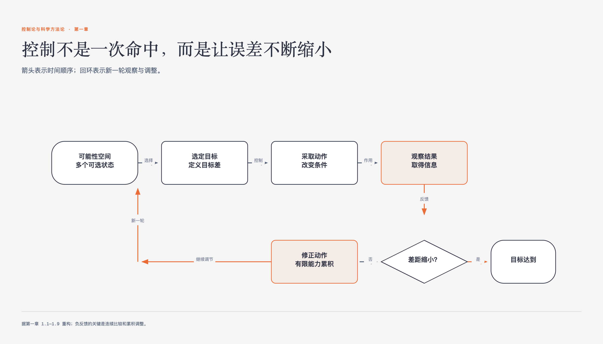

# 《控制论与科学方法论》第一章 控制和反馈 · 原书回顾与主题讲解

本章要回答：控制论的核心概念与基本控制方法。

图1-1｜负反馈怎样把有限控制能力累积成更精确的结果

## 一、原书回顾：作者怎样展开

### 1.1 可能性空间

本节从生命起源中L型氨基酸的选择切入，引出控制论的基础概念——可能性空间。作者指出，控制的前提是被控对象存在多种发展可能，且人能进行选择。通过鸡蛋变小鸡的例子，说明可能性空间随状态演化而分支，形成类似生命之树的复杂结构。这为后续讨论人如何通过选择改造世界奠定了逻辑起点。

### 1.2 人通过选择改造世界

本节深入探讨可能性的根源，指出事物的不确定性源于内部矛盾，如“矛与盾”寓言所示。作者强调，这里的控制指人在可能性空间中进行有方向的选择。通过人造纤维合成的案例，说明人类通过改变条件（如温度、压力）在可能性空间中筛选出特定状态。最后归纳控制的三个环节：了解空间、选择目标、控制条件。

### 1.3 控制能力

本节定义控制能力为控制前后可能性空间之比，以天平精度和射击环数为例说明其量化方式。通过“称乒乓球”的智力游戏，演示如何利用天平每次三分之一的缩小能力，计算称出废品的可行性。作者借此表明，工具的选择需匹配其控制能力，为后续介绍具体控制方法提供评估标准。

### 1.4 随机控制

本节介绍最省事的“随机控制”，即通过碰运气在可能性空间中寻找目标。以神农尝百草和米勒合成氨基酸实验为例，说明在未知领域，随机探索是获取知识的有效手段。同时指出其局限：若目标不在探索范围内或速度太慢，则效率低下，需扩大探索范围或借助高速计算。

### 1.5 有记忆的控制

针对随机控制效率低的问题，本节引入“有记忆的控制”。通过找信的例子，说明排除已验证非目标状态可逐步缩小可能性空间，提高效率。同时警示记忆控制的陷阱，如误记目标或沉淀顺序不当导致信息丢失，强调需避免削弱控制能力的状态，合理控制顺序。

### 1.6 共轭控制

本节阐述如何扩大控制范围，以曹冲称象为例，说明通过L变换将不可控对象转化为可控对象（大象变石头），再经逆变换还原。这种LAL结构揭示了工具使用的本质：感受器将物理量转为信号，效应器将信号转为动作，从而扩展了人的控制能力，适用于从杠杆到自动控制的广泛场景。

### 1.7 负反馈调节

本节引入负反馈，以鹰抓兔子为例，说明系统通过不断比较自身位置与目标差距，调整动作以缩小差距。作者指出负反馈的两个关键条件：自动缩小差距的反应及差距缩小的累积效应。区别于仅单次作用的“半反馈”，负反馈通过连续调节实现精确控制，是生物和工程控制的核心机制。

### 1.8 负反馈如何扩大了控制能力

本节解释负反馈扩大控制能力的机制，即有限控制能力的累积。通过鹰多次俯冲和居里夫妇提炼镭的例子，说明每次反馈都将上一次的结果作为新输入，使可能性空间逐步缩小。这种“做起来看”的策略，使单次能力不足的系统能实现高精度控制，体现了目的性与负反馈的内在联系。

### 1.9 正反馈与恶性循环

本节对比正反馈，即目标差不断扩大的过程。以对诗越说越险、军备竞赛和心脾两虚为例，说明正反馈往往导致失控或恶性循环。但作者指出，正反馈在信号放大和系统结构演化中也有积极作用，且与负反馈可相互转化，为后续探讨信息与系统结构埋下伏笔。

## 二、主题讲解：控制论基础：可能性空间与控制能力

### 可能性空间与控制的前提

控制论的研究起点是“可能性空间”。许多受控制对象在当前条件下存在多种可能状态。例如，鸡蛋可能变成小鸡或破蛋，这构成了其可能性空间。控制的前提是被控对象必须存在多种可能性，且人能在其中进行选择。如果未来只有一种确定结果（如真空中光速），则无所谓控制。因此，这里的控制指人在不确定性中通过选择引导事物向特定方向发展。

### 控制能力的量化与评估

控制能力定义为控制前后可能性空间的大小之比。空间缩小得越多，控制能力越强。例如，天平精度越高，能确定的小数位数越多，控制能力越强。在“称乒乓球”问题中，天平每次称量可将可能性空间缩小为原来的三分之一。若需从12个球中找出轻重未知的废品（24种状态），需控制能力至少为24。三次称量的总能力为27，大于24，故可行。这提示我们在选择工具时，需评估其控制能力是否满足目标需求。

### 随机控制与有记忆控制

随机控制是通过不断尝试寻找目标，适用于未知领域，如米勒合成氨基酸。但其效率取决于探索速度和范围。若目标不在范围内或速度太慢，则无效。有记忆控制通过排除已验证的非目标状态，逐步缩小可能性空间，提高效率。例如找信时不再重复翻动已查过的抽屉。但需注意避免记忆陷阱，如误判目标或操作顺序不当导致信息丢失，从而削弱后续控制能力。

### 负反馈与正反馈机制

负反馈通过不断缩小目标差来扩大控制能力。如鹰抓兔子，每次俯冲都基于当前位置与目标的差距进行调整，使有限能力累积，实现精确控制。居里夫妇提炼镭也是通过不断富集放射性物质，逐步逼近目标。相反，正反馈使目标差扩大，如军备竞赛或心脾两虚，常导致失控或恶性循环。但正反馈在信号放大和系统演化中也有重要作用，且可与负反馈相互转化。

## 检验理解

**情形**：假设你正在设计一个自动灌溉系统，目标是保持土壤湿度在特定范围内。系统使用湿度传感器（感受器）和阀门（效应器）。

**问题**：如果传感器故障，始终读取错误的低湿度值，阀门因而持续开启并使土壤过湿，这个回路还是正常的负反馈吗？请说明故障发生在哪一环，以及怎样恢复调节。

### 核对思路（先作答再看）

控制器原本按负反馈设计，但传感器卡死后，真实湿度变化不能再改变测量值，反馈通道已经失效。此时阀门依据一个固定的错误信号工作，系统接近开环运行；结果会持续偏离目标，但不能只因“越调越错”就把它判为正反馈。修正时要恢复可信测量，例如校准或更换传感器，并用合理范围检查或冗余传感器发现卡死读数。

## 来源、范围与阅读连接

- 原书定位：PDF 18-52。
- 源文件 SHA-256：`d7e36856c845f065d60b2a5eba593b5b2a6b834f329091143bdc8218c52f469f`。
- “原书回顾”只归纳本章作者的展开；“主题讲解”和理解检查属于书镜重构。
- 边界：控制能力定义仅基于原书中的M/m比值，未引入其他数学定义。
- 边界：正反馈的“恶性循环”描述仅引用原书中的例子，未扩展其他领域。
- 阅读连接：控制离不开信息。下一章沿着“怎样知道、怎样传递、怎样去伪和保存”继续追问。
