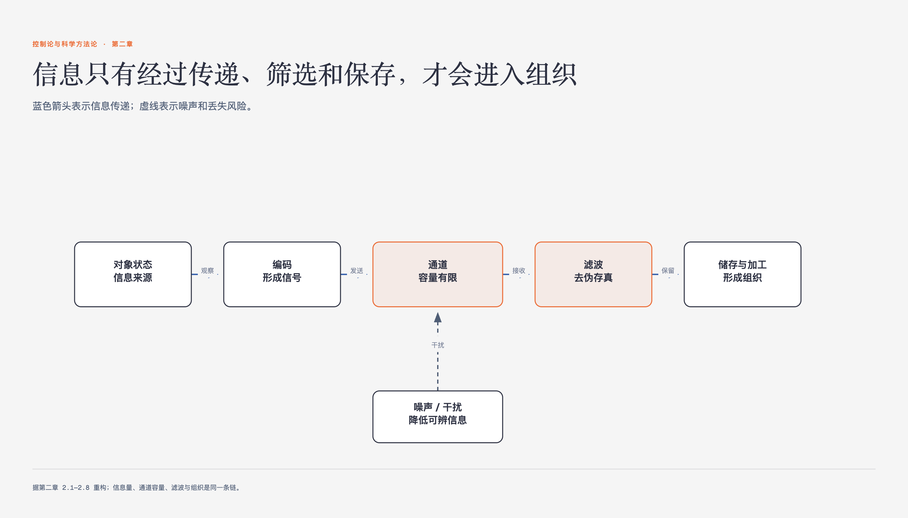

# 《控制论与科学方法论》第二章 信息、思维和组织 · 原书回顾与主题讲解

本章要回答：信息怎样从“知道”进入传递、筛选、储存、思维与组织。

图2-1｜信息从来源进入组织所经过的环节

## 一、原书回顾：作者怎样展开

### 2.1 什么是知道

本节通过庄子与惠子的“鱼乐之辩”引出“知道”的本质，指出知道即可能性空间的缩小或扩大。作者引入香农的信息量概念，用负对数度量信息量，说明信息量随可能性空间缩小而增加。这为后续定量分析信息传递奠定了基础。

### 2.2 信息的传递

本节阐述信息传递是可能性空间变化的传递，强调信息与控制的依存关系。通过DNA遗传和生物反馈疗法的案例，说明控制依赖信息，信息传递需通过通道。这自然过渡到对通道容量及其限制因素的讨论。

### 2.3 信息是一种客体吗

本节论证信息不是纯粹客体，而是主客体间的桥梁，具有主观性。通过公明仪对牛弹琴和心理学实验案例，说明同一信息对不同接收者意义不同。这揭示了信息传递中主观干扰的存在，引出对通道容量和干扰的研究。

### 2.4 通道容量

本节定义通道容量为单位时间传递的最大信息量，由控制能力、可辨状态和接收者控制力决定。通过警报器、鼓语和烽火台案例，说明通道容量受限于各环节。干扰会削弱控制能力，导致信息失真，进而引出滤波理论。

### 2.5 滤波：去伪存真的研究

本节探讨排除干扰的滤波方法，包括重复通道、不同通道对比、阻抗滤波和反馈滤波。通过大陆漂移假说和生物遗传案例，说明多通道核对的重要性。这揭示了信息在传递中量减的规律，为信息储存的稳定性讨论做铺垫。

### 2.6 信息的储存

本节将信息储存视为变换过程，强调储存体B需比信息源A更稳定。通过秦王朝信息和橘子照片案例，说明储存是有限信息的保留。这引出大脑记忆机制的复杂性，进而探讨信息加工与思维的关系。

### 2.7 信息加工和思维

本节分析大脑作为信息加工器官的功能，介绍逻辑思维、自由联想和共轭控制。通过三段论和地震预报案例，说明思维是可能性空间的缩小与变换。这揭示了思维的高级形式，为理解组织与信息的关系提供认知基础。

### 2.8 信息和组织

本节定义组织为可能性空间从大到小的过程，即建立确定联系。通过三人排队案例，说明组织程度与信息量一致。最后指出系统理论综合考察信息与控制，将本章内容升华至系统整体视角。

## 二、主题讲解：信息论基础：从知道到组织

### 1. 信息的量化与可能性空间

本章先把“知道”写成可能性空间的缩小，再用负对数表示信息量。原书的例子是把寻找范围从1000人缩到100人，信息量写作 `log 10`；若按随后说明的以2为底计算，约为3.32比特。这个量描述可能范围缩小了多少，不等于信息对接收者的意义大小。

### 2. 通道容量与干扰

信息传递依赖通道，通道容量由控制能力、可辨状态和接收者控制力决定。干扰会削弱通道容量，导致信息失真。例如，烽火台因被滥用而失效。滤波技术如多通道核对和阻抗滤波，旨在排除干扰，确保信息准确传递。理解通道容量限制有助于优化信息传递效率。

### 3. 信息储存与组织

信息储存是将不稳定信息转化为稳定形式，如秦王朝信息保存在史书中。组织过程是可能性空间缩小的过程，通过建立确定联系排除混乱。例如，三人排队形成组织。信息量与组织程度一致，系统理论综合考察信息与控制，揭示系统整体性。

### 4. 思维作为信息加工

大脑加工信息，通过逻辑思维和自由联想缩小可能性空间。共轭控制协调形象与概念空间，如推断服毒者将死。思维是高级信息加工，涉及可能性空间的变换。理解思维机制有助于提升信息处理能力，避免封闭循环思维，促进创造性思考。

## 检验理解

**情形**：假设你正在设计一个紧急警报系统，用于在森林火灾中向远处居民传递“立即撤离”的信息。系统有两种通道：一种是高音喇叭（声音通道），另一种是闪烁的红色灯光（视觉通道）。

**问题**：如果森林中雾气很大，严重影响视线，但声音传播不受影响，你会如何评估这两个通道的通道容量？并说明你会选择哪种通道或组合来确保信息有效传递，为什么？

### 核对思路（先作答再看）

在雾气大的情况下，视觉通道的可辨状态和控制能力会显著降低，因为光线散射导致信号模糊，接收者难以清晰识别灯光含义，通道容量减小。声音通道受雾气影响较小，高音喇叭的声音清晰，控制能力强，通道容量相对较大。因此，应主要选择声音通道，或结合声音与简单视觉信号（如强光闪烁，即使模糊也能感知存在），以利用多通道核对原理，确保信息在干扰环境下仍能有效传递。

## 来源、范围与阅读连接

- 原书定位：PDF 53-94。
- 源文件 SHA-256：`d7e36856c845f065d60b2a5eba593b5b2a6b834f329091143bdc8218c52f469f`。
- “原书回顾”只归纳本章作者的展开；“主题讲解”和理解检查属于书镜重构。
- 边界：信息量计算基于概率，实际应用中概率估计可能不准确。
- 边界：通道容量受多种因素影响，实际环境中干扰复杂多变。
- 边界：信息储存的稳定性受时间、环境等多重因素制约。
- 边界：思维过程涉及主观因素，难以完全量化。
- 阅读连接：信息只有进入相对稳定的关系才形成组织。下一章转向系统边界、稳态和演化。
