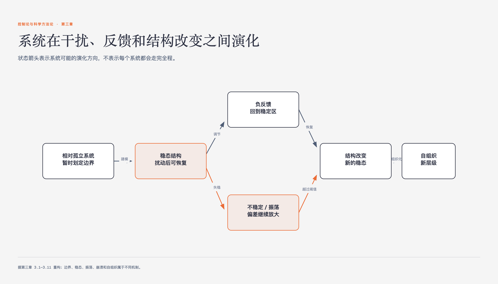

# 《控制论与科学方法论》第三章 系统及其演化 · 原书回顾与主题讲解

本章要回答：系统演化中的稳态与非稳态机制。

图3-1｜系统在恢复、失稳和结构改变之间的可能路径

## 一、原书回顾：作者怎样展开

### 3.1 系统研究方法中的因果联系

本节指出传统单向因果在复杂系统中失效，提出因果长链、概率因果、互为因果及因果网络四种形式。通过庄子游栗园的故事说明因果链的无限性与局部视角的局限，强调需从整体把握相互联系。这为后续引入相对孤立系统概念奠定基础，解决无限追溯的方法论难题。

### 3.2 相对孤立系统

基于前节因果分析，定义系统为相对孤立体系，即忽略微弱概率联系，聚焦主要互为因果变量。以凯巴伯森林鹿群为例，说明忽略土壤气候等外部因素可简化研究，但警告单向干预会破坏内部稳态，导致系统崩溃，引出需从整体角度研究互为因果。

### 3.3 系统的稳态结构

分析互为因果系统通过负反馈维持稳定平衡的机制，如温度调节器。指出稳态结构具有抗干扰能力，如岛屿物种数量均衡。强调稳态并非绝对有利，有时需通过控制破坏自然稳态以建立有利新结构，如农田除草，为讨论稳态预言做铺垫。

### 3.4 稳态结构和预言

阐述利用稳态结构预测系统发展趋势的方法，如地质学家通过储油稳态找石油，或大禹治水选择归海稳态。指出需比较不同稳态的稳定性，并说明当自然稳态不利时，需通过控制手段建立新稳态，如北鳟改变体型以适应江河，体现稳态的可控性。

### 3.5 均匀和稳定

探讨均匀性与稳定性的关系，指出孤立系统趋向均匀（熵增），但生命等开放系统通过汲取负熵维持有序不均匀结构。以金属空穴均匀化增强强度为例，说明利用均匀稳定关系可控制系统，同时指出生命体通过有序结构避免热力学平衡死亡。

### 3.6 不稳定和周期性振荡

讨论系统处于不稳定状态时的周期性振荡现象，如蚜虫与针枞的数量波动。指出振荡由子系统间正反馈耦合引起，可通过加入滤波器或切断反馈回路使系统稳定。强调改变系统结构或初始条件可控制稳定性，为后续超稳定系统讨论提供对比视角。

### 3.7 超稳定系统

介绍依靠不稳定修复机制维持长期稳定的超稳定系统，如内稳定器。以中医藏象学说为例，说明人体通过脏腑反馈调节维持健康，若偏离阈值则启动修复。指出超稳定系统具有周期性稳定-不稳定-稳定特征，能解释传统社会长期停滞现象。

### 3.8 系统的演化

分析系统从旧稳态向新稳态演化的过程，以引入猫破坏老鼠-蛇生态平衡为例，展示结构转化。介绍演化的分叉与汇流模式，指出初始条件微小差异可能导致演化路径巨大不同，如犀牛角的进化，强调演化过程中偶然性与决定论的复杂关系。

### 3.9 系统的崩溃：自繁殖现象

探讨系统崩溃时的自繁殖现象，如核爆炸、癌症，其特征为变量越大增长越快，存在临界值及自动增长链。指出自繁殖常由负反馈控制机制破坏引起，如癌症源于抑制因子反馈中断。通过消灭螺旋锥蝇和激光发明案例，说明利用或抑制自繁殖的应用价值。

### 3.10 自组织系统

阐述系统从无组织状态自动形成秩序的过程，即自组织。以磁针排列和晶体培养为例，说明自组织具备组织核心、不稳定前提、自动选择链、不可逆性及微小差别导致巨大结果等特征。指出可通过控制核心或改变系统状态来引导自组织方向。

### 3.11 智力放大与超级放大器

定义智力放大为选择能力的放大，通过组织核心实现，如刘邦用人。指出自组织系统可作为超级放大器，如威尔逊云室通过粒子轨迹自繁殖放大微观相互作用。总结系统理论在工程与社会科学研究中的广泛应用，强调数学工具在处理复杂系统问题中的重要性。

## 二、主题讲解：系统稳态与非稳态机制解析

### 稳态结构的形成与维持

稳态结构是互为因果系统在相互作用下维持的稳定平衡状态。以负反馈为例，当系统偏离稳态时，相互作用会使其回归。例如，温度调节器通过室内温度影响火炉放热，维持恒温。稳态具有抗干扰能力，如岛屿物种数量在迁入与灭绝平衡下保持稳定。然而，稳态并非绝对有利，有时需通过控制破坏自然稳态以建立有利新结构，如农田除草防止杂草成为主导稳态。理解稳态结构有助于预测系统趋势，如地质学家通过储油稳态寻找石油。

### 不稳定与周期性振荡

当子系统间存在正反馈耦合时，系统可能进入不稳定状态，表现为周期性振荡。例如，蚜虫与针枞的数量波动，因食物减少导致蚜虫死亡，随后树木恢复，形成循环。振荡频率一定时可用于计时。控制振荡可通过改变系统结构，如在反馈回路中加入滤波器减弱作用，或切断影响通道。例如，纠正口吃时通过滤波器减弱声音反馈，使系统稳定。改变初始条件也可影响稳定性，如生态系统初始值低于临界点会导致灭绝。

### 自组织与系统演化

自组织系统在内部相互作用下形成新的秩序。原书用磁针排列、晶体形成和生物演化讨论组织核心、不稳定前提与自动选择链，并把某些演化概括为不可逆。这里应把它当作书中的系统论模型：不同系统能否逆转、初始差异会放大到什么程度，都需要具体机制和证据，不能从“自组织”三个字直接推出。

### 超稳定与自繁殖机制

超稳定系统依靠不稳定修复机制维持长期稳定，如内稳定器通过子系统反馈调节维持健康。中医藏象学说模型展示了人体通过脏腑相互作用维持稳态。自繁殖现象是系统崩溃时的快速变量增长，如核爆炸或癌症，其特征为存在临界值及自动增长链。自繁殖常由负反馈控制机制破坏引起，如癌症源于抑制因子反馈中断。通过理解自繁殖机制，可抑制有害过程或利用有利过程，如通过释放不育雄蝇消灭螺旋锥蝇。

## 检验理解

**情形**：假设一个封闭的生态系统包含植物A和食草动物B。植物A的生长受B的数量抑制（负反馈），而B的数量受A的数量促进（正反馈）。初始状态下，系统处于稳态。现在，由于外部气候变暖，植物A的生长速率提高，但B的繁殖速率未变。

**问题**：请分析该系统在气候变暖后的短期和长期演化趋势，并说明是否可能出现周期性振荡或新的稳态结构。

### 核对思路（先作答再看）

短期看，植物A增多导致B的食物增加，B数量上升。B数量上升反过来抑制A，可能导致A减少。若B的抑制作用强于A的增长，系统可能进入振荡状态，表现为A和B数量的周期性波动。长期看，若系统能调整相互作用强度，可能达到新的稳态，其中A和B的数量均高于初始水平，但比例不同。若B的抑制作用过强，可能导致A灭绝，进而导致B灭绝，系统崩溃。

## 来源、范围与阅读连接

- 原书定位：PDF 95-150。
- 源文件 SHA-256：`d7e36856c845f065d60b2a5eba593b5b2a6b834f329091143bdc8218c52f469f`。
- “原书回顾”只归纳本章作者的展开；“主题讲解”和理解检查属于书镜重构。
- 边界：原书未提供具体数学模型证明稳态存在的充分必要条件，仅通过案例说明。
- 边界：自繁殖现象的临界值计算依赖于具体系统参数，书中未给出通用公式。
- 边界：超稳定系统的修复机制在复杂社会系统中的具体应用案例有限。
- 阅读连接：稳定结构怎样换成另一种稳定结构，是下一章讨论质变模型的起点。
