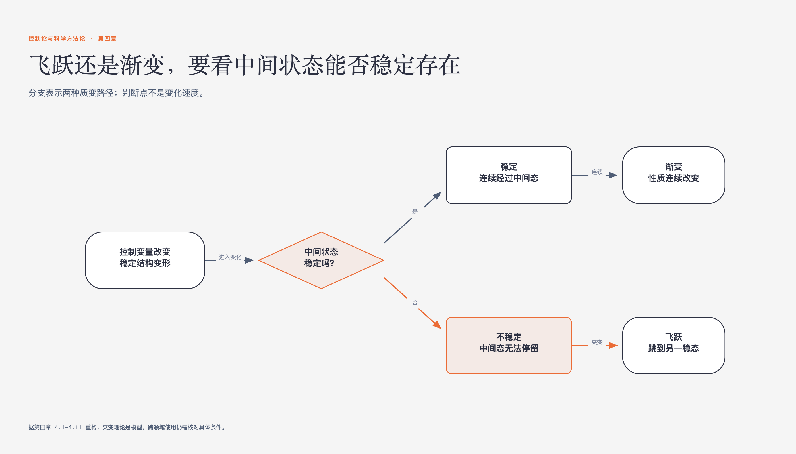

# 《控制论与科学方法论》第四章 质变的数学模型 · 原书回顾与主题讲解

本章要回答：质变（系统结构演化）的数学模型是什么？质变是通过飞跃还是渐变实现？如何判别和解释这些现象？。

图4-1｜用中间状态的稳定性区分渐变与飞跃

## 一、原书回顾：作者怎样展开

### 4.1 哲学家和数学家共同的难题

本节指出质变是系统结构演化的核心环节，并回顾了哲学界关于质变方式的长期争论。作者梳理了“飞跃论”、“渐进论”及苏联学界的“两种飞跃论”，指出后者存在逻辑同语反复的缺陷。随后引出法国数学家托姆的突变理论，该理论通过数学推导证明，当条件变量少于4个时，自然界突变仅有7种基本方式，为研究质变提供了统一的数学模型。

### 4.2 质变可以通过飞跃和渐变两种方式实现

本节通过水的相变案例，论证质变既可通过飞跃也可通过渐变实现。作者利用尖点型突变模型，展示水在常压下加热至沸点发生沸腾（飞跃），而在绕过临界点时则通过连续变化的中间状态实现气液转化（渐变）。这打破了质变必须通过不连续飞跃的传统观念，强调质变方式依赖于具体的条件控制路径。

### 4.3 事物为什么具有确定的性质

本节探讨物质确定性质的来源，将其归结为系统的稳态结构。作者指出，在内外干扰下，只有满足稳定性条件的结构才能存在。质的稳定性包含三种含义：抵抗干扰保持状态不变、偏离后自动回归、以及自动趋向更稳定状态的总趋势。这一概念为后续用数学模型描述质变奠定了物理基础。

### 4.4 稳定机制：稳态结构的数学表达

本节将稳态结构转化为数学表达，引入势函数洼的概念。通过弹簧与电荷小球的对比实验，说明势函数曲线或曲面的洼底对应系统的稳态，洼越深越稳定。动态图箭头指向与势函数洼底一致，表明势函数洼能普遍描述从微观粒子到宏观物体的稳定机制，为解释质变过程中的稳定性变化提供工具。

### 4.5 事物性质的不变、渐变和突变

本节以木块翻倒为例，解释势函数洼的变化如何导致不变、渐变或突变。当条件改变使旧洼变浅时发生渐变；当旧洼消失，状态跃迁至新洼时发生突变。作者据此提出判别飞跃的新原则：若中间过渡态不稳定，则为飞跃；若中间态稳定，则为渐变。这一原则克服了仅凭变化速度判定的缺陷。

### 4.6 怎样判别飞跃

本节深化飞跃的判别标准，强调中间过渡态的稳定性是关键。通过酸碱滴定、燃料氧化及生物进化等案例，说明即使变化迅速，若中间态稳定（如滴定过程），仍属渐变；若中间态不稳定（如多米诺骨牌），则为飞跃。作者指出，社会变革如法国大革命与明治维新的区别，也在于社会结构是否经历不稳定阶段，而非仅看暴力与否。

### 4.7 飞跃和渐变的条件

本节分析质变方式的条件依赖性。指出质变是飞跃还是渐变，取决于维持旧质与新质稳定性的因素对比。若新质增强而旧质未明显减弱，易发生飞跃；若两者均减弱，则易渐变。此外，偶次势函数模型（如尖点型）允许通过控制条件选择飞跃或渐变方式，而奇次模型（如燕尾型）则存在不可逆性，限制了方式的选择。

### 4.8 节点：蝴蝶、燕尾及其他

本节探讨节点的性质，指出节点并非固定点，而是随条件变化的分布区域。以尖点型和蝴蝶型模型为例，说明节点分布区对应两态或三态共存区。蝴蝶型模型能解释水的三相点及氢氧化物酸碱性的分布。此外，还介绍了燕尾型等奇次模型，用于描述死亡等不可逆过程，展示了不同突变模型对节点分布的几何描述。

### 4.9 矫枉必须过正吗

本节研究滞后现象（矫枉过正），指出其仅发生在质变为飞跃时。以水的过热过冷及生态系统为例，说明由于节点分布区的存在，系统恢复原状需跨越滞后差距。但作者强调，矫枉过正并非绝对，当干扰较大时，系统可能无需过正即可恢复。这一现象严格受限于突变模型的节点分布区域。

### 4.10 极端共存

本节解释极端共存现象，即不同质态在同一条件下共存。指出该现象仅发生在节点分布区域内，如水的三相点或昆虫翅膀的极端性状。突变理论通过共存区模型，解释了为何中间状态不稳定而被淘汰，极端状态得以共存。这一理论为理解自然界中复杂共存现象提供了几何依据。

### 4.11 共同的使命

本节总结突变理论对哲学与科学的意义。指出该理论为描述质变、量变规律提供了更精确的数学模型，推动了唯物主义形式的发展。作者强调，尽管突变理论尚处初期，需进一步实践检验，但它启发了对质变规律的深入探讨，体现了科学与哲学在揭示客观世界质态转化规律上的共同使命。

## 二、主题讲解：质变数学模型：稳态、突变与判别

### 稳态结构与势函数洼

质变的基础是系统的稳态结构。在突变理论中，稳态由势函数的洼底表示。势函数洼越深，系统越稳定，抵抗干扰的能力越强。例如，氢分子的稳定结构对应势能曲线的最低点。当外界干扰存在时，系统状态会在洼底附近波动，但不会轻易跳出。势函数洼不仅描述物理位置，也抽象表示化学、生物等系统的稳定性质。理解势函数洼是理解后续质变机制的关键，因为在该模型里，质变表现为势函数洼形态随条件变化的结果。

### 飞跃与渐变的判别原则

质变方式取决于中间过渡态的稳定性。若质变过程中经历的中间状态是不稳定的，则为飞跃；若中间状态是稳定的，则为渐变。例如，水在常压下沸腾时，液态与气态之间的中间密度状态不稳定，故为飞跃；而绕过临界点时，中间状态稳定，故为渐变。判别飞跃不看变化速度，而看中间态是否稳定。这一原则适用于物理、化学及社会系统，如社会变革若经历动荡不稳定期，即为飞跃；若社会结构基本稳定过渡，则为渐变。

### 节点分布与极端共存

节点并非固定点，而是随条件变化的分布区域。在尖点型模型中，节点分布区对应势函数折叠区的投影，表现为尖角形区域。在此区域内，系统可能发生飞跃或极端共存。极端共存指不同质态在同一条件下共存，如水的三相点。该现象仅发生在节点分布区内，因为中间状态不稳定而被淘汰，极端状态得以稳定存在。理解节点分布有助于预测质变发生的条件及可能出现的共存现象。

## 检验理解

**情形**：考虑一个生态系统，其中捕食者A和猎物B的数量相互制约。假设系统存在两个稳态：稳态1为A少B多，稳态2为A多B少。现引入外部干扰，使A的数量逐渐增加。

**问题**：若A数量增加导致B数量急剧减少，系统从稳态1跃迁至稳态2，且中间过程中B的数量处于不稳定状态（如易受其他因素影响而波动），请判断此质变过程是飞跃还是渐变？并说明理由。

### 核对思路（先作答再看）

此过程为飞跃。理由：根据判别原则，质变方式取决于中间过渡态的稳定性。题目指出中间过程中B的数量处于不稳定状态，符合飞跃的定义（中间态不稳定）。若中间态稳定，则为渐变。此处因中间态不稳定，系统无法停留在中间状态，故发生飞跃。

## 来源、范围与阅读连接

- 原书定位：PDF 151-195。
- 源文件 SHA-256：`d7e36856c845f065d60b2a5eba593b5b2a6b834f329091143bdc8218c52f469f`。
- “原书回顾”只归纳本章作者的展开；“主题讲解”和理解检查属于书镜重构。
- 边界：突变理论主要适用于控制变量少于4个的情况，超过此限制模型复杂性剧增。
- 边界：势函数洼的抽象表示需结合具体系统特性，不同领域势函数物理意义不同。
- 边界：节点分布区域的具体形状依赖于突变模型类型，不同模型有不同几何特征。
- 边界：极端共存现象仅发生在节点分布区内，超出此范围可能不存在共存。
- 阅读连接：质变模型说明结构如何变化；第五章进一步追问，我们怎样从有限观察中认识这些结构。
