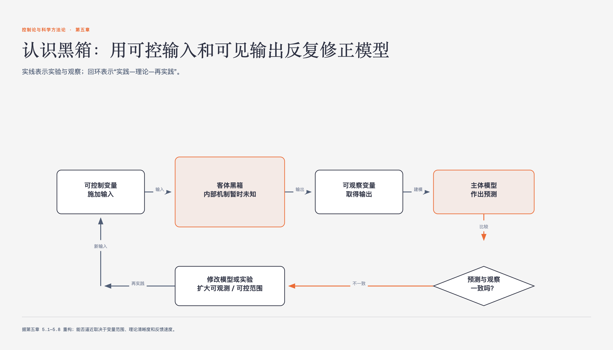

# 《控制论与科学方法论》第五章 黑箱认识论 · 原书回顾与主题讲解

本章要回答：对象内部不能直接打开时，怎样用输入、输出和可检验模型逐步逼近。

图5-1｜黑箱认识论中的实践—理论—再实践

## 一、原书回顾：作者怎样展开

### 5.1 认识对象和黑箱

本节将客体视为黑箱，通过可观察变量（输出）和可控制变量（输入）描述主客体关系。作者以孟德尔豌豆实验为例，说明通过外部输入输出建立内部模型是“不打开黑箱”的方法，而摩尔根发现染色体则是“打开黑箱”。作者指出打开黑箱只是发现新变量，形成新黑箱，因此不打开黑箱的方法在复杂或易损系统中仍具重要价值。

### 5.2 认识论模式

本节提出“实践—理论—实践”循环对应控制论的负反馈调节。通过图5.3展示主体模型与客体黑箱的比较机制，指出只有具备负反馈调节条件，认识才能逼近真理。作者强调该模式成立需满足特定条件，否则会导致认识停滞或振荡，从而引出后续对限制条件的分析。

### 5.3 可观察变量和可控制变量的限制

本节指出认识逼近真理受限于当时的可观察和可控制变量。以海尔蒙特柳树实验和塞贝克温差实验为例，说明若关键变量不可观察，反复实践无法修正错误理论。只有当技术进步（如奥斯特发现电流）扩展变量范围，认识才能突破旧稳态，否则反馈循环将在错误中停滞。

### 5.4 理论的清晰性

本节强调理论必须具备清晰性才能被检验，即提供可计算的信息量。引用波普尔证伪主义，指出模糊理论（如“既变又不变”）无法提供可证伪的观察陈述，导致无法通过实践检验修正。对比中西科学理论风格，指出清晰性是理论通过负反馈逼近真理的前提。

### 5.5 模型逼近客观真理的速度

本节讨论反馈速度必须大于客体变化速度，否则会导致认识振荡。以炼钢炉前分析和经济计划为例，说明反应滞后会导致极端跳跃。摩尔根选用果蝇缩短繁殖周期以加快认识速度，以及计算机提升气象预报速度，均证明提高反馈速度对逼近真理至关重要。

### 5.6 反馈过度

本节分析反馈过度导致振荡的现象，以导弹追踪飞机和人体目的性震颤为例。在认识过程中，过度修改理论会导致从一种极端跳向另一种极端。以光学微粒说与波动说的历史振荡为例，说明反馈过度使认识在错误中徘徊，难以稳定逼近真理。

### 5.7 可判定条件

本节指出实践误差反映理论正确性的“可判定条件”并非永远成立。以薛定谔方程和普朗克量子论为例，说明因实验条件限制，误差大的理论可能正确。此时需依靠“范式”等中间标准指导方向，避免科学家因暂时不符而放弃先进思想，如泡利预言中微子。

### 5.8 科学和人

本节将规律定义为变量间的约束，指出规律普遍性随人类控制能力增强而深化，如能量守恒在相对论中变为特殊规律。科学以人为中心，从最初可控变量出发扩展。认识真理依赖于人在自然界的位置和控制能力，科学光辉源于人的控制需求。

## 二、主题讲解：黑箱认识论的核心机制

### 黑箱模型与变量约束

黑箱认识论将研究对象视为黑箱，通过可观察变量（输出）和可控制变量（输入）建立联系。模型并非内部结构的真实复制，而是基于输入输出关系的假设。例如，孟德尔通过豌豆性状输入输出推断基因存在，而未直接观察基因。模型的作用是解释输入输出间的约束关系，其有效性取决于能否通过实践检验修正。

### 负反馈与认识逼近

认识过程被视为“实践—理论—实践”的负反馈循环。主体模型预测结果，与实践结果比较产生目标差，据此修正模型。若反馈结构存在缺陷，如变量受限、理论模糊或速度不足，系统将无法逼近真理，而是陷入错误稳态或振荡。清晰性确保理论可被证伪，速度确保能跟上客体变化。

### 振荡原因与范式作用

认识振荡源于反馈过度或可判定条件不成立。反馈过度指修正幅度过大，导致在真理两侧摇摆，如光学理论的反复。可判定条件不成立时，实验误差不能直接反映理论真伪，如薛定谔方程初期的失败。此时需依赖“范式”等中间标准，如能量守恒信仰，指导科学家在缺乏直接检验时坚持正确方向，避免盲目放弃。

### 科学的人本中心

科学规律是变量间的约束，其普遍性随人类控制能力扩展而深化。科学以人为中心，从最初可控变量（如位置、力量）出发，逐步扩展至不可控变量。规律的认识依赖于人的控制手段，如气压控制揭示水的沸腾规律。科学的发展是人类控制能力向外延伸的过程，真理具有相对性和历史性。

## 检验理解

**情形**：假设你正在研究一种新型材料的强度变化规律。你发现，当温度升高时，材料强度下降。你建立了一个线性模型来预测强度。然而，在极端高温下，实验数据严重偏离模型预测，且不同实验室的数据差异巨大，无法确定模型是否错误。

**问题**：根据黑箱认识论，面对这种“可判定条件不成立”和“反馈过度”的风险，你应如何调整认识策略？请结合“范式”和“变量限制”进行分析。

### 核对思路（先作答再看）

首先，需承认当前实验条件下“可判定条件”可能不成立，数据差异大意味着误差不能直接反映理论真伪，避免盲目修正模型导致振荡。其次，应检查是否受限于“可观察变量”，如是否遗漏了影响强度的关键变量（如微观结构）。此时应引入“范式”作为中间标准，如基于物理守恒律或已有材料科学理论，判断模型偏离是随机误差还是系统性错误，从而决定是坚持模型还是重构，而非仅凭单次实验结果摇摆。

## 来源、范围与阅读连接

- 原书定位：PDF 196-232。
- 源文件 SHA-256：`d7e36856c845f065d60b2a5eba593b5b2a6b834f329091143bdc8218c52f469f`。
- “原书回顾”只归纳本章作者的展开；“主题讲解”和理解检查属于书镜重构。
- 阅读连接：正文到这里把认识也放进了控制和反馈框架。附录用12个乒乓球问题检验这种方法论能否给出具体策略。
