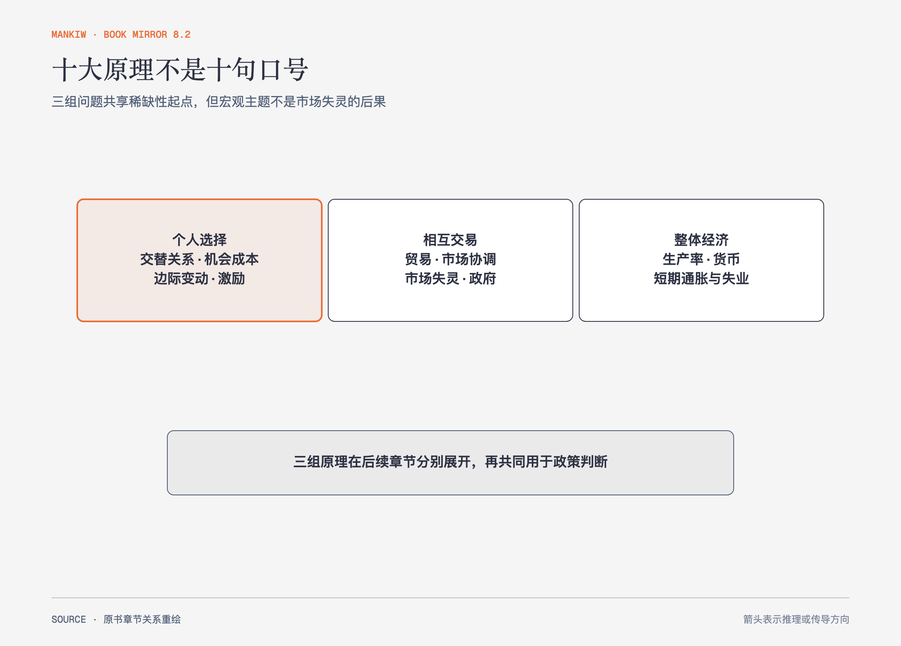

# 《曼昆〈经济学原理〉》第1章｜经济学十大原理 · 原书回顾与主题讲解（书镜 V8.2）

经济学从一个朴素事实开始：资源有限，而人的愿望没有同时被满足。作者没有先铺开术语体系，而是用十条原理搭起全书的判断骨架。

**本章要回答：** 面对选择、交易、市场与整体经济时，经济学家会反复追问哪些问题？

图1-1｜依据本章十条原理重组。三个方框是共享稀缺性起点的并列问题群；宏观主题不是市场失灵的直接后果。

## 一、原书回顾：作者怎样展开

### 人们如何作出决策

作者先从**稀缺性**出发，把个人选择拆成四条原理。第一，人们面临交替关系：时间、收入和公共资源投向一处，就不能同时完整投向另一处。效率与平等也可能发生交替；更平均的分配能改善某些人的处境，却可能改变劳动与生产激励。作者借此提醒，承认取舍不等于已经知道该选哪一边。

第二，某种东西的成本是为了得到它而放弃的东西，即**机会成本**。上大学的成本不只包括学费，也包括因不能全职工作而放弃的收入；原本无论如何都要支出的生活费用不能机械计入。第三，理性人考虑**边际变动**：决策通常是在现有安排上多做一点或少做一点，而不是在两个极端之间重选人生。航班临起飞仍有空位时，平均每位乘客成本不能决定是否卖候补票；只要新增票价高于新增服务成本，出售就可能增加利润。

第四，人们会对**激励**作出反应。作者用安全带法规说明间接效果：安全装置降低每次事故伤害，也可能让谨慎驾驶的边际收益下降，驾驶行为、事故数量和行人风险随之变化。这个案例没有证明安全带无效，而是要求政策评价把直接保护和行为反应一起测量。

### 人们如何相互交易

接着，作者把镜头从个人移到人与人之间。贸易使各方能够专门从事自己相对擅长的活动，并通过交换得到更多种类的物品。这里的收益不要求一方在所有事情上都更强，第3章会用比较优势解释原因。

**市场经济**通常是组织经济活动的一种好方法。价格在分散的买者和卖者之间传递稀缺程度与行动信号，许多独立决定像被“**看不见的手**”协调起来。但“通常”不是“永远”：当产权不清、存在外部性或市场势力时，会出现**市场失灵**，私人决定可能偏离社会希望的结果，所以政府有时可以改善市场结果。作者也保留了另一层边界：政府并不天然拥有完美信息和完美激励。

### 整体经济如何运行

最后三条原理转向宏观经济。一国生活水平长期取决于生产物品与劳务的能力，即生产率；持续提高收入不能只靠多发货币。货币发行过多时，货币价值下降，物价总水平上升。短期中，社会还可能面临通货膨胀与失业之间的交替关系，后文称为**菲利普斯曲线**；作者明确把它限定为短期经验，而不是永久可选的政策菜单。

### 结论

十条原理不是全书结论的缩写，而是后续分析的入口。供求、福利、企业行为、增长、货币和波动各章会把这些直觉变成更具体的模型，并逐步补上适用条件。

## 二、主题讲解：怎样把十条原理用于一次真实选择

### 先把选择写成“多一点什么，就少一点什么”

假设一座城市准备把新增预算用于地铁或公园。经济学分析不会从“哪个更重要”开始，而会先写出约束：同一笔钱不能重复使用，新增地铁意味着放弃多少公园、维护或其他服务。这一步把抽象争论变成机会成本，也暴露了真正需要比较的结果。

### 再看边际变化与激励

选择不是“要不要交通”与“要不要环境”的极端对抗。更实际的问题是：在现有网络上多修一段线路，能减少多少通勤时间；同样的钱多建一块绿地，能服务多少人。收费、补贴和使用规则还会改变居民行为。只比较工程本身，不观察人们如何响应，政策预测就少了一半。

### 最后区分市场能协调什么、还漏掉什么

票价可以协调一部分供求，却未必包含拥堵、污染、土地升值或低收入者可达性等影响。遗漏影响不自动推出“政府直接决定一切”；它要求继续比较产权、收费、补贴、管制或公共提供等方案各自需要的信息和可能造成的新激励。

## 检验理解：别把原理当口号

一家企业给销售人员提高提成后，销售额上升，但退货率也上升。请用机会成本、边际变动和激励解释发生了什么，并说明为什么“销售额上升”还不足以证明新制度更好。

核对思路：提成改变了边际收益，销售人员会调整努力与客户选择；企业需要把新增销售的收益与退货、售后、声誉等机会成本放在一起比较。

## 来源、范围与阅读连接

原书范围：上册 PDF 3–17页，合并 PDF 3–17页；四个原书阶段及十条原理均保留。城市预算与销售提成是讲解用假设案例。源文件 SHA-256：`8cd3def98b1ea31ca9e0c248dd2199004f093fc86a3472b3b33b6e6bc0e66692`。下一章说明经济学家怎样用模型把这些问题变成可检验的分析。
