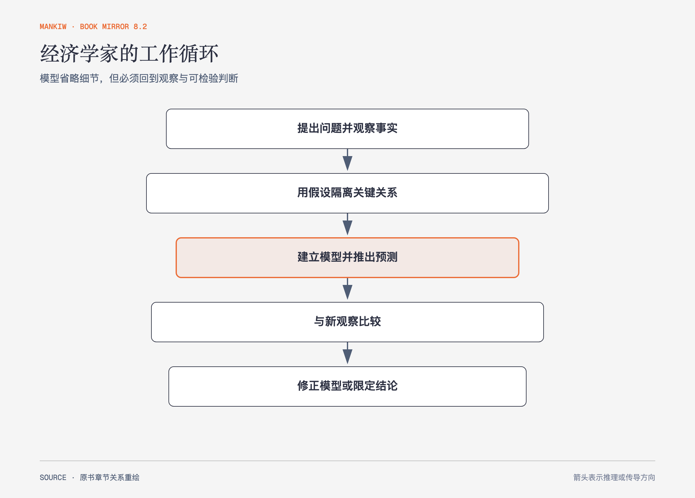

# 《曼昆〈经济学原理〉》第2章｜像经济学家一样思考 · 原书回顾与主题讲解（书镜 V8.2）

经济学家的特殊之处不在于拥有一套固定答案，而在于会把复杂现实压缩成模型，推出预测，再回到事实检查。

**本章要回答：** 模型为什么必须省略细节？实证判断、规范判断和政策建议又该怎样分开？

图2-1｜依据本章科学方法与模型部分重绘。箭头表示分析循环；模型失败后应修正假设或限定结论，而不是把现实归咎于模型之外。

## 一、原书回顾：作者怎样展开

### 作为科学家的经济学家

作者把科学方法概括为观察、理论和进一步观察。经济学难以像实验室科学那样随意操纵整个社会，因此历史事件与现实差异常成为检验材料。观察本身不会自动说出因果；理论需要把关键变量和作用方向说清，新的观察再检验它能解释到哪里。

假设是**经济模型**工作的前提。地图、塑料人体模型和物理学中的无摩擦假设都省略了细节；省略是否合理取决于问题。循环流向图把经济简化为家庭、企业与两个市场，用实物流和货币流说明交易怎样连接。生产可能性边界则展示资源约束、效率、机会成本与增长。作者随后区分微观经济学和宏观经济学：前者研究家庭、企业与具体市场，后者研究通胀、失业和增长等整体变量。

### 作为决策者的经济学家

经济学家描述世界时使用**实证表述**，讨论世界应该怎样时进入**规范表述**。前者原则上能与事实比较，后者还包含价值判断。政策建议通常把两者连接起来：先预测政策会带来什么结果，再判断哪些结果值得追求。只要第二步存在，经济分析就不能替社会偷偷完成价值选择。

### 为什么经济学家意见分歧

分歧有两种主要来源。经济学家可能对某项政策的事实后果有不同判断，例如储蓄会对税率变化作出多大反应；也可能同意后果，却因公平、自由或风险等价值权重不同而支持不同选择。作者用经济学家调查说明，专业共识与公众争论并不完全重合，但没有把共识当作不需检验的权威。

### 出发吧！

作者邀请读者在后续章节中同时掌握术语和思考方式。模型是有目的的简化；使用时要知道它回答的问题、保持不变的条件，以及它没有解释的部分。

### 附录：绘图——简单的复习

附录回顾饼图、柱形图、时间序列图和坐标系，重点解释曲线移动、沿曲线移动、斜率、弹性以及相关与因果的区别。两个变量同时变化可能来自未被画出的**遗漏变量**，也可能存在**反向因果关系**，因此图形关系不能自动改写成因果结论。

## 二、主题讲解：一个模型怎样既简单又不骗人

### 先说清模型要回答的问题

假设我们想解释咖啡价格上涨后购买量为何变化。若问题是消费者对自身价格的反应，可以暂时把收入、口味和替代品价格保持不变；若问题是健康潮流怎样改变咖啡需求，就不能把口味继续锁死。相同变量在一个问题里是背景，在另一个问题里可能正是主角。

### 省略细节必须换来可检验的关系

“价格高了，买得少了”还不是完整模型。需要说明其他条件相同、价格与需求量的方向，并指出什么观察会迫使我们改写结论。若涨价同时伴随收入提高，观察到购买量上升并不直接推翻需求规律；它说明多个因素同时变化，需要换一种识别方式。

### 政策建议要把两层话分开

“限价会造成短缺”属于可检验的实证判断；“即使短缺也应该限价”包含对可负担性、公平和替代方案的价值判断。讨论时把两层混在一起，人们会误以为事实分歧已经解决了价值分歧，或反过来用价值立场否认可观察后果。

## 检验理解：模型的边界在哪里

某地观察到冰淇淋价格和销量在夏天同时上升。这个现象是否推翻“价格上升会减少需求量”？

核对思路：夏季气温可能使需求曲线整体右移；沿固定需求曲线的移动与需求曲线移动不是同一件事。要检验价格本身的作用，需要控制或识别其他变化。

## 来源、范围与阅读连接

原书范围：上册 PDF 18–46页，合并 PDF 18–46页；正文与绘图附录均纳入。咖啡和冰淇淋是讲解用假设案例。源文件 SHA-256：`8cd3def98b1ea31ca9e0c248dd2199004f093fc86a3472b3b33b6e6bc0e66692`。下一章用机会成本和比较优势完整运行一次模型。
