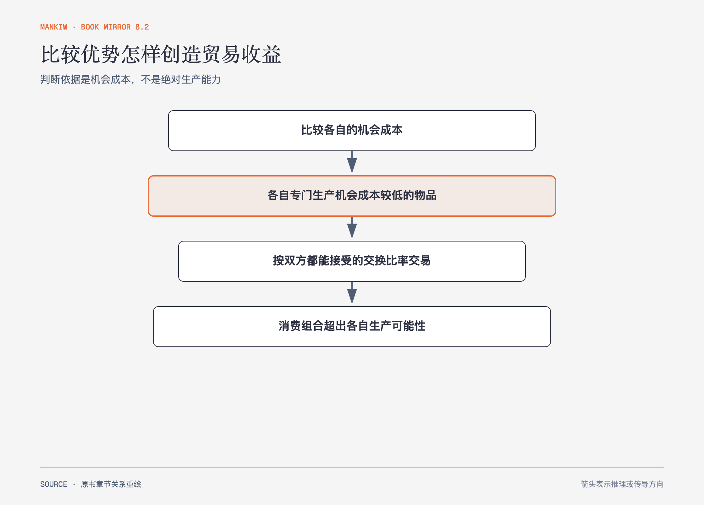

# 《曼昆〈经济学原理〉》第3章｜相互依存性与贸易的好处 · 原书回顾与主题讲解（书镜 V8.2）

贸易收益最容易被误解的地方，是把“谁做得更快”当成唯一判断。作者让农民和牧牛人同时生产牛肉与土豆，证明真正决定分工的是机会成本。

**本章要回答：** 即使一方生产所有物品都更有效率，为什么双方仍可能通过贸易变得更好？

图3-1｜依据农民与牧牛人的寓言重绘。交换比率必须落在双方机会成本之间，消费机会才会同时扩大。

## 一、原书回顾：作者怎样展开

### 一个现代经济寓言

农民和牧牛人都喜欢牛肉与土豆。没有贸易时，每个人必须在两种生产之间分配时间，消费组合受自己的**生产可能性边界**约束。贸易出现后，两人可以调整生产并交换，消费不再等于各自产量。作者用数字表说明，分工并不要求某人只会做一件事，而是要求比较每种选择放弃了什么。

### 比较优势原理

**绝对优势**比较生产同一物品需要的投入量；**比较优势**比较机会成本。一个人可能生产两种物品都使用更少时间，却不可能在两种物品上同时拥有较低机会成本，因为一种物品的机会成本正是另一种物品的倒数。各自专门生产具有比较优势的物品，总产量便可能增加。

贸易价格也有边界。若一份牛肉换取的土豆少于卖方自己生产牛肉所放弃的土豆，卖方不会愿意交换；若买方支付得比自己生产牛肉的机会成本还高，买方也不会愿意。交换比率位于双方机会成本之间时，双方都能用更低代价得到所需物品。

### 比较优势的应用

作者把原理用于个人选择与国际贸易。专业人士是否亲自处理所有事务，取决于他们放弃的其他产出；国家也应比较相对成本，而不是只看谁技术更强。进口可以被理解为用本国具有比较优势的产品换取其他产品，出口则把这部分产品交给国外买者。比较优势为**自由贸易**提供基准解释：贸易收益来自分工，而不是一方必然掠夺另一方。

### 结论

比较优势解释了相互依存为何可能提高生活水平。它不保证贸易后的收益自动均分，也没有否认转型成本；第9章会进一步分析国内赢家、输家和贸易政策。

## 二、主题讲解：用一个小时看懂比较优势

### 先把产量换成机会成本

假设甲一小时能写两份报告或修四个缺陷，乙一小时能写一份报告或修三个缺陷。甲两件事都做得更多，拥有绝对优势。但甲写一份报告要放弃两个缺陷，乙写一份报告要放弃三个缺陷；换个方向看，甲修一个缺陷放弃半份报告，乙修一个缺陷只放弃三分之一份报告。乙在修缺陷上有比较优势，甲在写报告上有比较优势。

### 再检查交换比率

如果甲用一份报告换乙修两个半缺陷，甲得到的缺陷多于自己写报告所放弃的两个；乙为了得到一份报告只修两个半缺陷，少于自己独立写报告时放弃的三个。这个比率同时落在双方机会成本之间，所以两边都受益。

### 最后补上现实边界

真实分工还受沟通、质量、学习、风险和转换时间影响。比较优势提供的是基准：先问相对机会成本，再把交易成本和分配后果加入。若这些成本大于专业化收益，理论并不要求勉强交易。

## 检验理解：谁应该做什么

一位医生打字比助理快，也更擅长诊疗。能否仅凭“医生两项都更强”推出医生应该亲自完成所有录入？

核对思路：要比较医生和助理各自放弃的诊疗或录入产出。绝对优势不能替代机会成本；还要把信息保密、质量和交接成本纳入。

## 来源、范围与阅读连接

原书范围：上册 PDF 47–60页，合并 PDF 47–60页；农民与牧牛人的生产机会、专业化、机会成本与应用均保留。报告与缺陷是讲解用假设案例。源文件 SHA-256：`8cd3def98b1ea31ca9e0c248dd2199004f093fc86a3472b3b33b6e6bc0e66692`。下一章开始分析具体市场怎样用价格协调供求。
