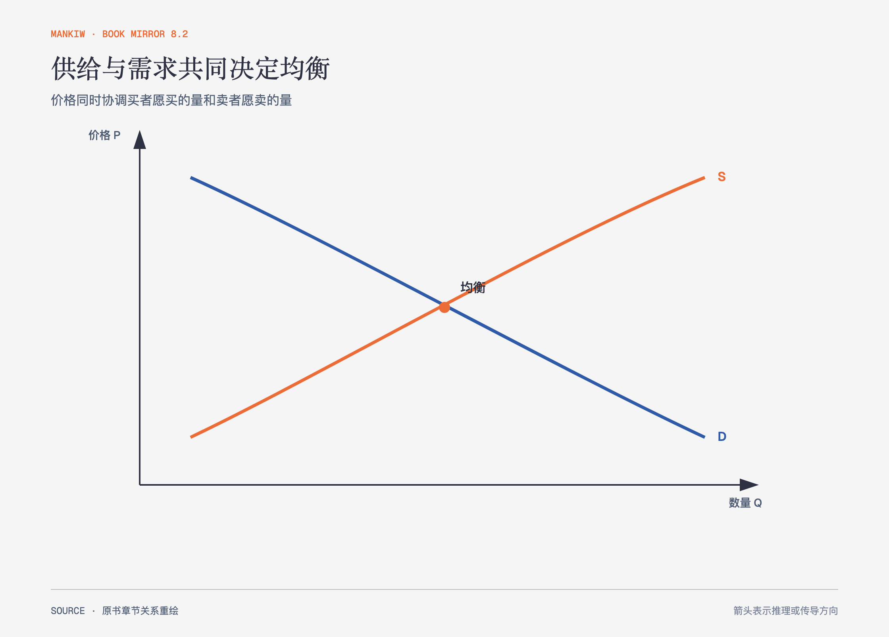

# 《曼昆〈经济学原理〉》第4章｜供给与需求的市场力量 · 原书回顾与主题讲解（书镜 V8.2）

供给与需求模型把许多买者和卖者的分散决定压缩成两条曲线。关键不只是找到交点，还要分清“价格变化造成沿曲线移动”和“其他条件变化造成曲线移动”。

**本章要回答：** 市场价格怎样把买者愿意购买的量与卖者愿意出售的量协调起来？

图4-1｜依据本章供求模型重绘。蓝线表示需求，橙线表示供给；交点是计划购买量等于计划出售量的位置。

## 一、原书回顾：作者怎样展开

### 市场与竞争

市场是一群特定物品或劳务的买者与卖者。作者先聚焦竞争市场：参与者很多，单个买者或卖者相对市场很小，只能接受市场形成的价格。完全竞争还要求交易物品相同且进入退出相对自由。后续章节会放松这些假设，研究市场势力。

### 需求

需求量是在某一价格下买者愿意且能够购买的数量。**需求表**列出价格与需求量，需求曲线把它画出来。其他条件相同时，价格下降通常使需求量增加，这构成需求规律和向右下方倾斜的需求曲线。市场需求由个人需求水平相加得到。

收入、相关物品价格、嗜好、预期和买者数量变化，会使整条需求曲线移动。正常物品与低档物品对收入变化的反应方向不同；替代品与互补品则说明一个市场的变化怎样传到另一个市场。作者用香烟说明：改变偏好会移动需求曲线，直接提高香烟价格则是沿曲线移动。

### 供给

供给量是在某一价格下卖者愿意且能够出售的数量。**供给表**列出价格与供给量；价格提高通常扩大供给量，这就是**供给规律**。投入价格、技术、预期和卖者数量改变时，整条供给曲线移动。个人供给水平相加形成市场供给。

### 供给与需求的结合

均衡价格使供给量等于需求量，对应的成交量是**均衡数量**。价格高于均衡时出现**超额供给**，卖者降价；价格低于均衡时出现**超额需求**，买者竞争推动价格上升。供求规律描述价格怎样把市场推向均衡。分析事件时，作者给出三步：判断事件移动供给还是需求，判断移动方向，再做**比较静态**，比较新旧均衡的价格与数量。

### 结论：价格如何配置资源

价格不是一个孤立数字。它向买者传递稀缺程度，向卖者传递生产回报，并在两边的响应中配置资源。这个机制在竞争条件下有解释力；市场效率和失灵还需要后续章节判断。

## 二、主题讲解：看到涨价时先别急着找一条曲线

### 同样是涨价，原因可以相反

演唱会门票价格和成交量同时上升，可能是歌手走红使需求右移；原材料短缺使供给左移时，价格也会上升，但成交量会下降。只有价格变化，不能单独告诉我们哪条曲线动了。数量方向和事件本身才是识别依据。

### “需求增加”与“需求量增加”要分开

票价下降导致沿既定需求曲线移动，应说需求量增加。歌手走红导致每个价格下愿买的人都更多，才是需求增加、曲线右移。术语差异保存了因果信息；混用之后，分析会把结果误当成原因。

### 均衡是计划相容，不是道德最优

交点只说明买卖计划一致，不说明结果一定公平，也不说明没有外部成本、信息问题或市场势力。供求模型回答“价格与数量怎样调整”，福利分析再回答“这种结果是否有效率、谁得到什么”。

## 检验理解：是哪条曲线动了

芯片制造技术进步，同时智能设备更受欢迎。芯片均衡价格和数量会怎样变化？

核对思路：技术进步使供给右移，偏好变化使需求右移，数量方向都向上；价格受到相反作用，仅凭这两个信息无法确定。

## 来源、范围与阅读连接

原书范围：上册 PDF 63–90页，合并 PDF 63–90页；市场、需求、供给、均衡与价格配置资源均保留。演唱会与芯片是讲解用假设案例。源文件 SHA-256：`8cd3def98b1ea31ca9e0c248dd2199004f093fc86a3472b3b33b6e6bc0e66692`。下一章给“反应有多大”增加弹性尺度。
