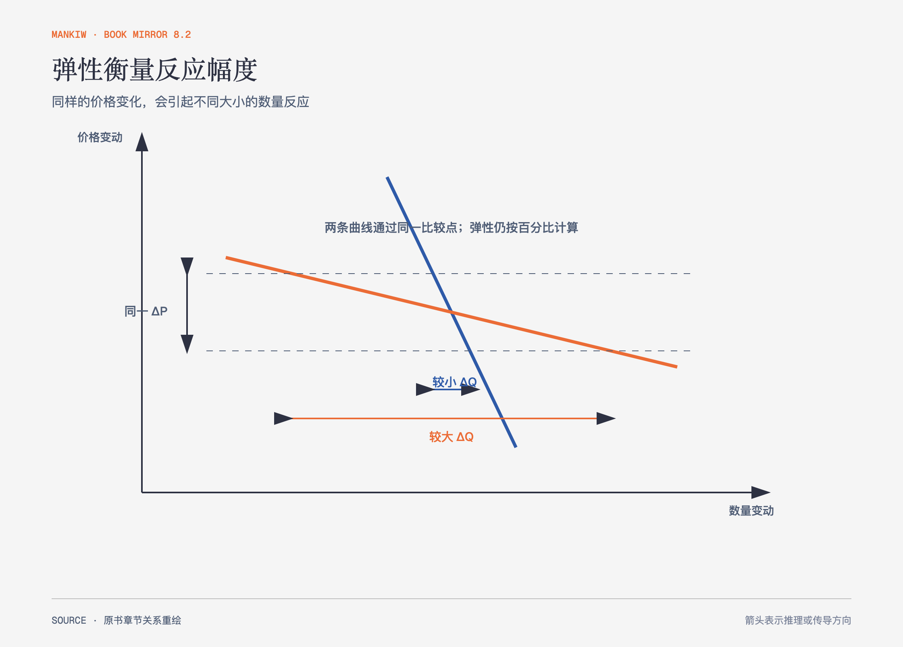

# 《曼昆〈经济学原理〉》第5章｜弹性及其应用 · 原书回顾与主题讲解（书镜 V8.2）

供求曲线告诉我们变化方向，弹性继续追问变化幅度。它用百分比而不是原单位比较，让汽油、门票和小麦等不同市场进入同一尺度。

**本章要回答：** 什么决定买者和卖者对价格或收入变化反应得强还是弱？

图5-1｜依据需求价格弹性重绘。图只表达相同价格变化下数量反应的相对大小；曲线斜率与弹性相关，但不能在单位改变后直接画等号。

## 一、原书回顾：作者怎样展开

### 需求弹性

需求价格弹性等于需求量变动百分比除以价格变动百分比。相近替代品多、属于奢侈品、市场定义窄且调整时间长的物品，需求通常更有弹性。中点法用两个端点的平均值作分母，避免从A到B与从B到A得到不同结果。

需求缺乏弹性时，提高价格增加总收益，因为数量下降比例较小；需求富有弹性时，提高价格减少总收益。单位弹性处两种作用抵消。需求收入弹性则区分正常物品与低档物品，并衡量收入变化怎样影响需求。

### 供给弹性

供给价格弹性衡量供给量对价格的反应。卖者能否改变产量、可用产能与考察期限很重要。海边土地几乎不能增加，供给缺乏弹性；制造品长期中可以扩建或进入，供给通常更有弹性。供给曲线也可能在接近容量上限时由富有弹性变得缺乏弹性。

### 供给、需求和弹性的三种应用

作者把弹性用于农业好消息、石油市场和禁毒政策。技术进步使农产品供给增加，但食品需求缺乏弹性时，价格下降比例可能大于产量增加比例，农民总收入反而下降。石油短缺在短期影响大、长期影响小，因为消费者和生产者需要时间调整。打击毒品供给可能推高价格；若成瘾者需求缺乏弹性，总支出和相关犯罪动机反而可能上升。教育降低需求则沿另一条路径减少交易量和支出。

### 结论

弹性把“会变化”推进到“变化多大”。它依赖市场定义、时间范围和可替代性，同一物品没有脱离情境的永久弹性值。

## 二、主题讲解：先确定时间和替代品，再谈弹性

### 短期离不开，长期可以换

通勤者明天很难因油价上涨立刻搬家或换车，所以短期汽油需求较缺乏弹性。几年内，人们可以换车型、调整住处或使用公共交通，需求反应会扩大。省略时间范围，任何“汽油需求弹性小”的判断都不完整。

### 总收益取决于两股力量谁更大

价格提高让每件商品收入增加，却使销量下降。弹性正是比较这两股力量。若数量下降5%、价格提高10%，总收益大致增加；若数量下降20%，总收益会减少。这个判断不等于利润判断，因为成本还没有进入。

### 政策要看反应，不只看目标

对需求缺乏弹性的物品征税，交易量减少较少，税收收入可能稳定，但负担会更多落到缺少替代选择的一方。后续第6章会说明，法定向谁征税并不能决定谁真正承担税负。

## 检验理解：收入为何下降

农业技术使小麦产量提高，但全行业收入下降。这个结果与“技术进步提高生产能力”矛盾吗？

核对思路：不矛盾。供给右移压低价格；若小麦需求缺乏弹性，价格下降比例大于销量增加比例，总收益会下降。

## 来源、范围与阅读连接

原书范围：上册 PDF 91–113页，合并 PDF 91–113页；需求弹性、供给弹性与三组应用均保留。通勤与比例数字是讲解用假设。源文件 SHA-256：`8cd3def98b1ea31ca9e0c248dd2199004f093fc86a3472b3b33b6e6bc0e66692`。下一章观察政府直接改变价格或在买卖之间加入税收楔子时会发生什么。
