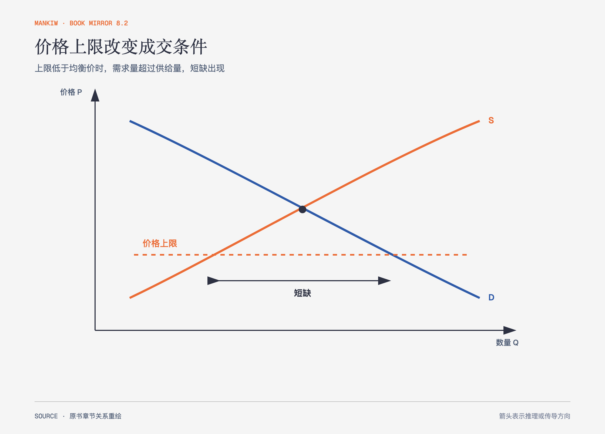

# 《曼昆〈经济学原理〉》第6章｜供给、需求与政府政策 · 原书回顾与主题讲解（书镜 V8.2）

当政府认为市场价格对某些人不利时，常用价格上限、价格下限或税收介入。作者的重点不是先判政策好坏，而是追踪规则怎样改变买卖双方的选择。

**本章要回答：** 价格管制和税收怎样改变成交量、短缺、过剩与真实负担？

图6-1｜依据价格上限模型重绘。橙色虚线低于均衡价格时，供给量小于需求量，两者差额形成短缺。

## 一、原书回顾：作者怎样展开

### 价格控制

价格上限高于均衡价格时没有约束力；低于均衡价格时成为**限制性价格上限**并形成短缺。汽油限价下，排队和非价格配给出现；租金控制短期中供求反应小，长期中房东减少供给、租户增加需求，短缺与质量问题会扩大。价格下限低于均衡价同样无效，高于均衡价则成为**限制性价格下限**并形成过剩。最低工资是劳动力价格下限，影响大小取决于它相对均衡工资的位置和劳动供求弹性。

作者没有把价格管制的全部后果压成一张图。短缺之后还要决定谁得到稀缺物品；排队、关系、质量下降或歧视性选择可能替代价格发挥分配作用。管制改变了显性价格，没有消除稀缺。

### 税收

向卖者征税使供给曲线向上移动，向买者征税使需求曲线向下移动。两种写法最后都在买者支付价格与卖者得到价格之间形成同样的税收楔子，并减少均衡交易量。法律规定谁把钱交给政府，不决定经济上谁承担税负。

### 弹性与税收归宿

更缺乏弹性的一方更难退出市场，因此承担更多税负。若需求很缺乏弹性，买者支付价格上升较多；若供给很缺乏弹性，卖者得到价格下降较多。作者用游艇税说明，向奢侈品征税表面针对富有消费者，但高度可转移的资本与较难转行的工人具有不同弹性，负担可能部分落到工人身上。

### 结论

政府政策会改变市场结果，但效果由供求反应决定。公平目标与实际归宿之间可能存在距离，政策评价必须继续观察数量与替代行为。

## 二、主题讲解：规定价格不等于规定结果

### 短缺不会凭空消失，只会换一种分配方式

假设热门演出门票被限定在远低于均衡的价格。愿意购买的人增加，愿意出售或扩容的供给不足。最终可能由排队时间、抢票工具、关系或二级市场价格来分配。名义票价更低，不代表获得门票的总成本更低。

### 税负要沿退出难度追踪

平台服务费法律上由商家支付，商家可能提高售价、压低员工报酬或接受更低利润。哪条路径更强，要看消费者能否换平台、商家能否退出、员工能否转岗。税收归宿是均衡结果，不是发票上的付款人名称。

### 政策目标还需要福利与分配分析

供求图能说明短缺、过剩和税负，却不能单独决定政策是否值得实施。若政策保护的是基本居住、劳动者最低生活或公共财政，仍需比较受益群体、未成交者、执行成本和替代方案。第7—8章会提供总剩余与无谓损失工具。

## 检验理解：谁承担了税

某城市向房东按套征收固定税。短期内住房供给几乎不能变，租客却能在不同城区间选择。能否因为税单寄给房东，就断定租客承担全部税负？

核对思路：不能。短期供给更缺乏弹性，房东更难退出，通常承担较多；具体幅度仍由两边弹性共同决定。

## 来源、范围与阅读连接

原书范围：上册 PDF 114–135页，合并 PDF 114–135页；价格控制、税收和税负归宿均保留。演出门票、平台服务费与城市住房税是讲解用假设案例。源文件 SHA-256：`8cd3def98b1ea31ca9e0c248dd2199004f093fc86a3472b3b33b6e6bc0e66692`。下一章建立消费者剩余、生产者剩余和市场效率的共同尺度。
