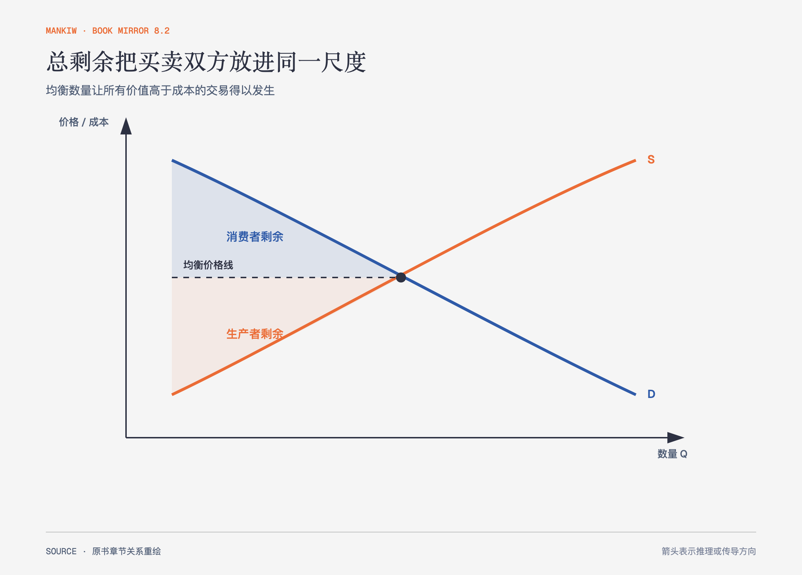

# 《曼昆〈经济学原理〉》第7章｜消费者、生产者与市场效率 · 原书回顾与主题讲解（书镜 V8.2）

供求交点告诉我们市场停在哪里，福利经济学继续问：停在这里时，买者和卖者一共得到多少好处，还有没有本来值得发生却没有发生的交易？

**本章要回答：** 怎样把支付意愿、生产成本和市场价格放进同一套效率判断？

图7-1｜依据本章剩余分析重绘。需求曲线代表边际支付意愿，供给曲线代表边际成本；两块面积相加构成总剩余。

## 一、原书回顾：作者怎样展开

### 消费者剩余

支付意愿是买者愿为一种物品支付的最高金额。作者用埃尔维斯唱片拍卖让出价最高者依次进入，展示价格怎样筛选买者。成交价低于支付意愿时，差额就是消费者剩余。需求曲线的高度可以解释为边际买者的支付意愿，因此价格线以下、需求曲线以上的面积衡量市场消费者剩余。价格下降既增加原买者的剩余，也让新的买者进入。

把消费者剩余当作福利尺度还有一个前提：社会愿意尊重形成支付意愿的偏好。作者用海洛因作反例。成瘾者的高支付意愿并不足以证明增加消费会改善社会福利，因为这种偏好本身可能不值得由社会认可。支付意愿是分析起点，不是无需判断的道德结论。

### 生产者剩余

卖者的成本是为了生产而必须放弃的价值，也是愿意出售的最低价格。油漆工竞标案例按成本从低到高排列卖者，说明价格提高为何让更多卖者愿意接单。成交价高于成本时，差额构成生产者剩余。供给曲线的高度代表边际卖者的成本，价格线以上、供给曲线以下的面积衡量生产者剩余。

### 市场效率

仁慈的社会计划者若只关心总剩余，就要把物品交给支付意愿最高的买者，让成本最低的卖者生产，并使所有支付意愿高于成本的交易发生。竞争均衡恰好满足这三点：均衡数量左侧的交易增加总剩余，右侧的交易成本高于价值，继续生产会减少总剩余。

### 结论：市场效率与市场失灵

作者把结论限定在完全竞争、没有外部性等条件下。市场势力会影响价格与数量，外部性会让曲线漏掉第三方成本或收益。总剩余还聚合了所有人的收益，没有回答分配是否公平。

## 二、主题讲解：效率是在问“是否漏掉了互利交易”

### 价格只是转移，总剩余看价值与成本

一张票从100元涨到120元，买者少得20元，卖者多得20元；只看这笔已成交交易，总剩余没有因价格转移而改变。真正影响效率的是交易是否发生，以及买者价值是否高于卖者成本。

### 均衡左右两边是两类错误

均衡数量左边若有交易未发生，意味着支付意愿高于成本的互利机会被放弃；右边若继续生产，则新增成本高于买者价值。效率产量位于两类错误的分界处。

### 效率判断不能吞掉公平问题

总剩余相同的两个方案，收益可能落在完全不同的人身上。经济学工具先把“效率”与“平等”分开，便于看清蛋糕大小和分法的取舍；它没有规定社会只能追求总量，也没有证明每一元收益对不同人的意义相同。

## 检验理解：便宜是否一定更有效率

政府要求所有二手票按原价出售，结果部分持票者不愿卖、部分高支付意愿观众买不到。票价更低能否单独证明总剩余更高？

核对思路：不能。要看交易是否从低价值使用者转向高价值使用者，以及排队、搜索和灰色交易成本。低价可能改变分配，却也可能阻止互利交换。

## 来源、范围与阅读连接

原书范围：上册 PDF 139–160页，合并 PDF 139–160页；消费者剩余、生产者剩余、市场效率与市场失灵均保留。二手票是讲解用假设案例。源文件 SHA-256：`8cd3def98b1ea31ca9e0c248dd2199004f093fc86a3472b3b33b6e6bc0e66692`。下一章把税收加入图中，观察哪些互利交易因此消失。
