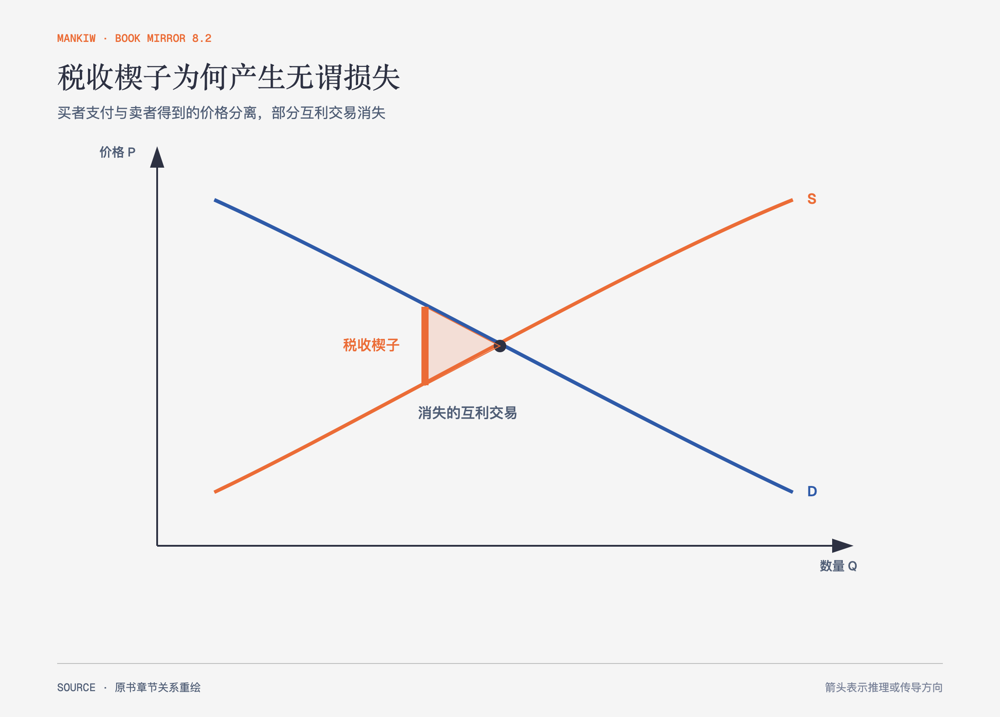

# 《曼昆〈经济学原理〉》第8章｜应用：税收的代价 · 原书回顾与主题讲解（书镜 V8.2）

税收把一部分消费者与生产者剩余转成政府收入，也可能让原本互利的交易不再发生。后者就是无谓损失。

**本章要回答：** 为什么税率提高不只转移收入，还会缩小市场并损失总剩余？

图8-1｜依据本章税收福利图重绘。楔子表示买者支付与卖者所得之差，三角形表示税后消失的互利交易。

## 一、原书回顾：作者怎样展开

### 税收的无谓损失

征税后，买者支付价格上升、卖者得到价格下降，成交量减少。消费者剩余和生产者剩余的减少，一部分成为政府税收收入，另一部分没有转给任何人，构成**无谓损失**。政府收入计入社会收益，并不等于税收没有成本；未发生交易中原本存在的支付意愿与成本差额已经消失。

作者把无谓损失连接到贸易收益。税收提高买者成本、压低卖者收益，使两者无法实现部分互利交易。税收扭曲激励，市场规模因此缩小。

### 无谓损失的决定因素

**需求弹性**或供给弹性越大，数量对税收反应越大，消失的交易越多，无谓损失通常越大。劳动税的争论集中在劳动供给弹性：如果人们会大幅调整工作时间、职业、地点或是否进入劳动市场，税收扭曲更大；若劳动供给反应小，损失也小。作者没有把这一经验问题写成已经确定的常数。

### 无谓损失和税收收入随税收变动而变动

税率提高时，无谓损失增长得比税率本身更快，因为税收楔子和受影响的交易量同时变化。税收收入则等于税额乘成交量：低税率阶段可能随税率上升而增加，税率过高导致市场严重收缩时，收入反而可能下降。拉弗曲线被**供给学派经济学**用来论证减税可能扩大税基；曲线只表达这种可能性，不能证明现实税率已经位于下降一侧。

### 结论

税收为公共支出筹资，也改变私人行为。评价税制要同时看收入用途、分配、执行和无谓损失，不能只凭税率高低下结论。

## 二、主题讲解：把“政府收到了钱”和“社会损失了什么”分开

### 转移不是损失，消失的交易才是

一笔10元税从买卖双方转到政府，如果政府收入仍用于社会目的，这10元本身是转移。若税使一个买者放弃价值80元、成本70元的交易，原本10元的互利空间没人得到，这才是无谓损失。

### 弹性决定市场会躲开多少

可替代性强的交易更容易因税退出、换品或换地点。税基因此收缩，行政规则也可能诱发重新包装。无谓损失不仅来自图中的数量减少，也提醒我们追踪现实中的替代行为。

### 拉弗曲线是边界提醒，不是万能减税论证

税率为零时收入为零，税率极端高且所有交易消失时收入也可能接近零，中间存在峰值并不告诉我们当前在哪里。要主张减税会增加收入，还需要估计行为反应和税基变化。

## 检验理解：两种税为何损失不同

对几乎没有替代品的必需药和对可随时取消的娱乐服务征收同额税，哪一个更可能产生较大无谓损失？

核对思路：娱乐服务的供求若更有弹性，交易量减少更多，无谓损失更大；但税负公平与收入用途仍需另外评价。

## 来源、范围与阅读连接

原书范围：上册 PDF 161–179页，合并 PDF 161–179页；税收楔子、弹性、税率规模与拉弗曲线均保留。药品和娱乐服务是讲解用假设案例。源文件 SHA-256：`8cd3def98b1ea31ca9e0c248dd2199004f093fc86a3472b3b33b6e6bc0e66692`。下一章把同一福利工具用于国际贸易。
