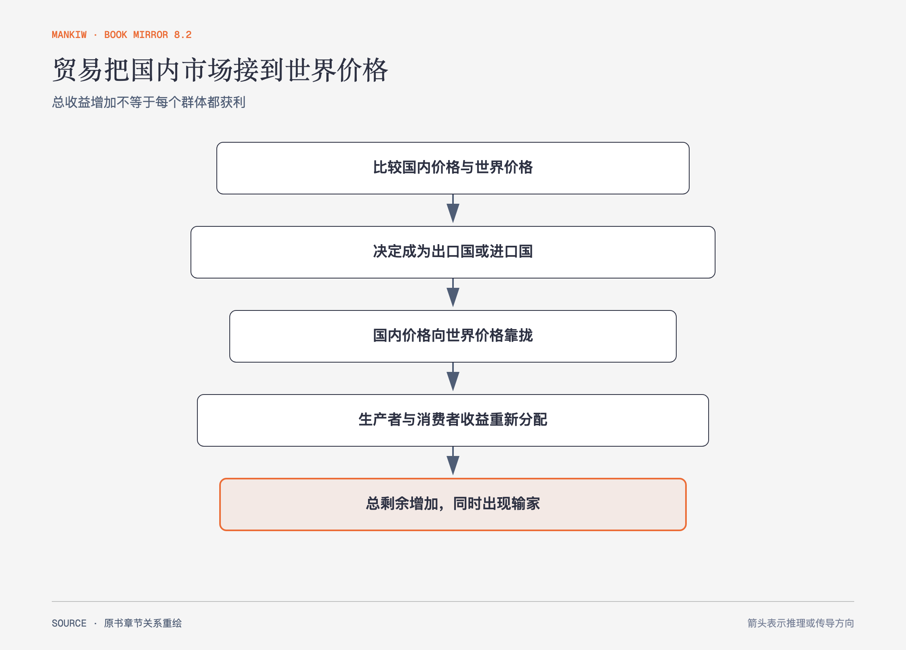

# 《曼昆〈经济学原理〉》第9章｜应用：国际贸易 · 原书回顾与主题讲解（书镜 V8.2）

比较优势说明贸易能扩大总机会，本章把分析放进供求图，追踪开放后价格、产量、消费和剩余怎样变化。

**本章要回答：** 一国开放贸易后为什么总收益增加，同时仍会出现明确的赢家与输家？

图9-1｜依据本章出口国与进口国分析重绘。箭头表示世界价格进入国内市场后的价格、数量和剩余变化；总剩余增加不代表每个群体都获利。

## 一、原书回顾：作者怎样展开

### 贸易的决定因素

没有贸易时，国内供求决定价格。开放贸易后，作为**小型经济**的一国无法影响世界价格，是世界市场的**价格接受者**：若世界价格高于国内价，本国具有相对优势并出口；若世界价格低于国内价，本国进口。国内价格向世界价格调整，生产与消费不再相等，差额由贸易填补。

### 贸易的赢家和输家

出口国价格上升，生产者剩余增加，消费者剩余减少，但生产者所得超过消费者所失，总剩余增加。进口国价格下降，消费者获益、生产者受损，消费者所得超过生产者所失。贸易收益是总量判断，不是否认受损群体。

关税提高进口品国内价格，保护国内生产者并给政府带来收入，却减少消费、扩大低成本国外生产被高成本国内生产替代的部分，形成无谓损失。进口限额通过**进口许可证**控制数量，效果相似，但形成的**许可证剩余**归谁取决于发放安排，不能自动当作政府收入。

### 各种限制贸易的观点

作者依次讨论就业、国家安全、**幼稚产业论**、不公平竞争和谈判筹码。就业论忽略劳动力会在行业间移动和贸易对其他行业的影响；国家安全可能成立，但行业有夸大自身战略性的激励；幼稚产业需要说明学习收益为何不能由私人投资承担；外国补贴可能伤害国内生产者，却也降低消费者成本；以关税威胁谈判可能成功，也可能引发报复。

### 结论

自由贸易提高总剩余的基准结论建立在小国、竞争市场和未计入其他外部影响等条件上。政策争论需要把总收益、国内分配、转型成本和非经济目标分开。

## 二、主题讲解：总量变好以后，分配问题才刚开始

### 先看国内价格朝哪边走

若开放后进口更便宜，消费者购买价格下降，国内高成本生产者缩减。若本国能以更高世界价格出口，生产者扩张，国内消费者支付更多。判断赢家与输家，从价格方向开始最清楚。

### 补偿可能存在，不等于已经发生

总剩余增加意味着赢家理论上有能力补偿输家后仍有净收益，但现实政策未必完成补偿。工人转岗、地区衰退和技能不匹配可能持续多年。把“可以补偿”写成“已经没人受损”，就越过了原书结论。

### 贸易限制也有二阶分配

关税保护一个行业，会提高使用该投入的下游成本；配额创造的租金可能落到许可证持有人；报复关税会伤害出口行业。政策名称不能替代完整传导链。

## 检验理解：进口限制保护了谁

一国限制低价钢材进口。国内钢厂利润上升，能否推出本国整体福利上升？

核对思路：还要计入钢材消费者和下游制造业成本、政府或配额持有者收益、交易量变化与报复风险。受保护行业获益只是分配的一部分。

## 来源、范围与阅读连接

原书范围：上册 PDF 180–203页，合并 PDF 180–203页；出口、进口、关税、进口限额和限制贸易观点均保留。钢材例子是讲解用假设。源文件 SHA-256：`8cd3def98b1ea31ca9e0c248dd2199004f093fc86a3472b3b33b6e6bc0e66692`。下一篇开始研究市场价格没有计入的第三方影响。
