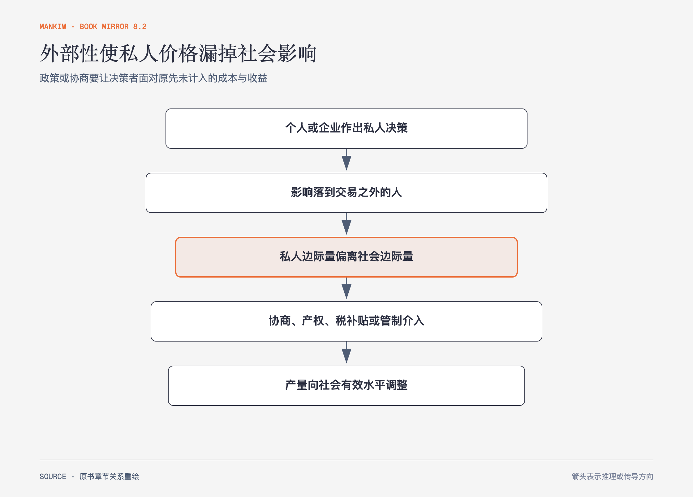

# 《曼昆〈经济学原理〉》第10章｜外部性 · 原书回顾与主题讲解（书镜 V8.2）

当交易影响旁观者，而这部分影响没有进入买卖双方的价格时，私人均衡可能不再使社会总剩余最大。

**本章要回答：** 怎样识别外部性，并在私人协商、税补贴、许可证与管制之间判断？

图10-1｜依据本章外部性分析重绘。箭头表示把交易之外的影响纳入决策；政策工具是否合适还取决于信息、交易成本和执行条件。

## 一、原书回顾：作者怎样展开

### 外部性和市场无效率

生产铝造成污染时，社会成本高于企业私人成本，市场供给曲线漏掉外部成本，均衡产量高于**社会最适量**。若技术溢出使其他企业受益，社会价值高于买者私人价值，市场产量可能过低。把外部成本或收益加入边际决策，原书称为**外部性的内在化**。

作者用负外部性、正外部性和技术政策说明，政策需要知道影响方向与大小。专利通过暂时产权让创新者获得更多收益，试图内部化知识溢出；但挑选特定产业需要政府识别真实溢出，信息要求很高。

### 外部性的私人解决方法

道德规范、慈善、企业合并和合同都可能内部化外部性。**科斯定理**指出，若各方能无成本谈判且产权明确，私人协商可以达到有效率结果，最初权利分配影响财富分配，却不必影响效率结果。

私人方法并非总有效。参与者多、谈判成本高、信息不对称或各方互相等待时，协议可能无法达成。科斯定理提供判断基准，不是“任何污染都不用政府”的结论。

### 针对外部性的公共政策

政府可以用**命令与控制政策**直接管制行为，也可以用庇古税、补贴或可交易污染许可证改变激励。税把每单位外部成本加入私人决策；许可证限定总量并允许减排成本较低的企业出售权利。税确定价格、让数量调整，许可证确定数量、让价格调整；信息与不确定性决定哪一种更合适。

### 结论

外部性要求把旁观者纳入福利分析。解决办法的共同目标是让决策者面对完整社会成本或收益，不是单纯惩罚某个主体。

## 二、主题讲解：从“有人受影响”推进到可操作判断

### 先确认影响是否在交易之外

餐厅味道不好只影响付费顾客，通常已进入交易；油烟影响邻居且没有补偿，才是候选外部性。价格高、企业赚钱或有人不喜欢某项活动，都不能单独证明外部性存在。

### 再比较协商与公共工具需要的信息

一户噪声影响一户邻居，产权清楚且沟通容易，调整时段或补偿可能足够。数千辆车共同造成拥堵和污染时，逐户谈判几乎不可行，收费、标准或许可证更可操作。

### 工具要对准边际影响

固定罚款若与排放量无关，企业减少最后一单位排放的激励可能不足。按单位收费能让企业比较减排成本与外部成本；但若损害高度依赖地点和时段，统一费率仍可能过粗。

## 检验理解：邻居的抱怨一定是外部性吗

一家咖啡馆开业后，隔壁商店人流增加但租金也上涨。哪些影响可能是外部性，哪些可能已经通过市场价格传递？

核对思路：要追踪影响是否通过交易和产权价格被双方承担；仅有影响不够。若租金变化已经反映商业价值，它与未补偿的噪声、垃圾等影响性质不同。

## 来源、范围与阅读连接

原书范围：上册 PDF 207–227页，合并 PDF 207–227页；社会成本、私人解决、科斯定理、管制、庇古税与许可证均保留。餐厅、咖啡馆是讲解用假设案例。源文件 SHA-256：`8cd3def98b1ea31ca9e0c248dd2199004f093fc86a3472b3b33b6e6bc0e66692`。下一章处理难以排除使用者的物品。
