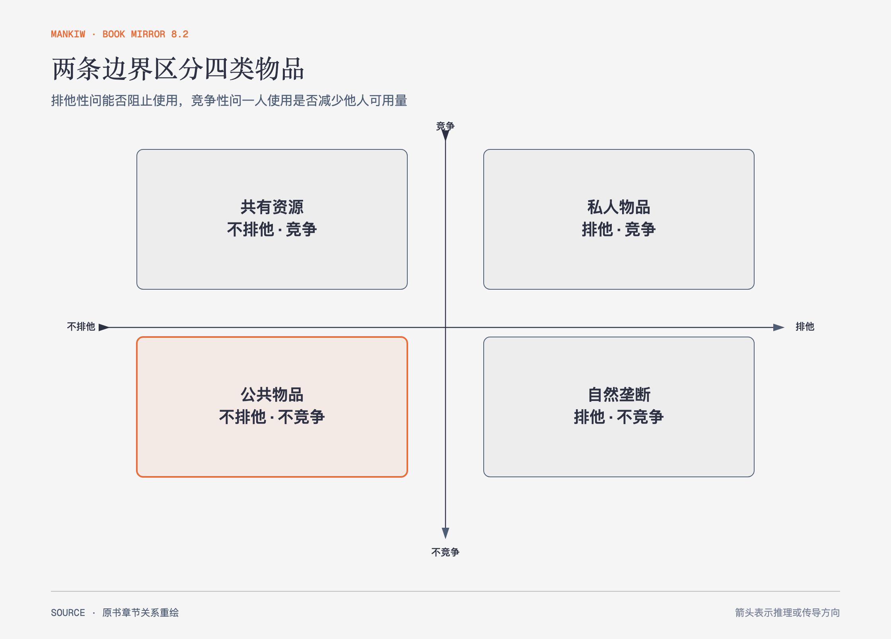

# 《曼昆〈经济学原理〉》第11章｜公共物品和共有资源 · 原书回顾与主题讲解（书镜 V8.2）

有些物品难以向使用者收费，有些物品一人使用会减少别人可用量。把这两条边界分开，才能理解搭便车与公地悲剧为什么是两种不同问题。

**本章要回答：** 排他性和竞争性怎样决定市场能否提供、使用者会不会过度使用？

图11-1｜依据原书四类物品矩阵重绘。横轴表示排他性，纵轴表示竞争性；四类问题需要不同制度安排。

## 一、原书回顾：作者怎样展开

### 各种类型的物品

**排他性**问能否阻止未付费者使用，**竞争性**问一人使用是否减少别人可用量。两条轴组成四类：私人物品既排他又竞争；公共物品既不排他也不竞争；共有资源不排他但竞争；自然垄断所供物品排他但不竞争或边际成本很低。

分类取决于情境。道路不拥挤时可能不竞争，拥挤后变成竞争性资源；收费技术也会改变排他性。物品名称不能永久决定它属于哪一格。

### 公共物品

公共物品的难题是**搭便车者**：无法排除未付费者时，个人会等待别人付款，私人市场可能提供不足。国防、基础研究和某些公共活动是作者的例子。政府可以通过税收提供，但仍要做成本—收益分析；公共收益难以观察，人的生命或环境价值也不能靠简单市场价格完全衡量。

### 共有资源

共有资源的难题是过度使用。每个使用者得到自己的收益，却只承担资源耗损的一小部分，于是总使用量过高，形成**共有地悲剧**。清洁空气、水、拥挤道路、鱼类和野生动物都可能出现这一结构。管制、税费、配额或产权安排可以改变使用者面对的成本。

### 结论

市场是否有效取决于物品特征与制度环境。政府介入也需要信息与执行；分类提供问题诊断，不自动给出唯一政策。

## 二、主题讲解：先辨认问题结构，再选工具

### 不排他导致“没人愿意先付”

社区防洪一旦建成，很难只保护付费住户。即使每个人都需要，个体仍有动机等待别人出资。这里的问题是提供不足，收费困难是关键。

### 竞争性导致“每个人都多用一点”

公共草场上的牧民多放一头牛，得到完整收益，却只承担草场退化的一部分。所有人采用同一逻辑后，资源被过度消耗。这里的问题是使用过量，而不是没人愿意生产。

### 技术会移动边界

电子收费让道路更容易排他，拥堵监测让按时段定价成为可能；但技术成本、隐私与公平仍要评价。分类不是静态标签，而是制度设计前的一次现场测量。

## 检验理解：一条道路属于哪一类

一条空闲的收费高速公路和一条拥堵的免费道路分别更接近哪一类？

核对思路：空闲收费路排他但暂不竞争，接近自然垄断型物品；拥堵免费路不排他但竞争，接近共有资源。时间与收费制度变化会移动分类。

## 来源、范围与阅读连接

原书范围：上册 PDF 228–246页，合并 PDF 228–246页；四类物品、搭便车、成本—收益与公地悲剧均保留。防洪和草场沿用本章结构作讲解。源文件 SHA-256：`8cd3def98b1ea31ca9e0c248dd2199004f093fc86a3472b3b33b6e6bc0e66692`。下一章讨论政府为公共职能筹资时怎样设计税制。
