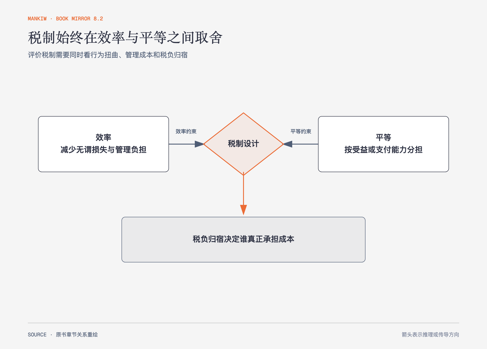

# 《曼昆〈经济学原理〉》第12章｜税制的设计 · 原书回顾与主题讲解（书镜 V8.2）

税制设计不只是在不同税种中挑一个名字。作者把政府筹资、效率成本、管理负担和公平原则放在一起，说明税负归宿为何比法定纳税人更重要。

**本章要回答：** 怎样判断一个税制既筹到所需收入，又没有制造过大的扭曲和不公平？

图12-1｜依据本章效率与平等框架重绘。两侧箭头表示共同约束税制，向下箭头表示最后还要回到实际税负归宿。

## 一、原书回顾：作者怎样展开

### 美国政府的财政概况

作者先盘点联邦、州和地方政府的主要收入与支出，说明税制服务于现实公共预算。所得税、工资税、公司所得税、销售税和财产税覆盖不同税基，各级政府承担的项目也不同。税收超过支出形成预算盈余，支出超过税收形成预算赤字。书中数字属于当时美国财政快照，不能直接当作当前数据。

### 税收和效率

税收的效率成本包括无谓损失和管理负担。税收改变劳动、储蓄、消费与投资激励，行为反应越大，扭曲通常越大。纳税人记录、申报和寻求专业帮助也占用真实资源。边际税率决定多赚一元的激励，平均税率衡量总税负占收入比重，两者回答不同问题。定额税扭曲较少，却可能在公平上难以接受。

### 税收与平等

受益原则主张按从公共服务获得的利益纳税，支付能力原则主张按承担能力分担。后者还要判断横向平等与纵向平等，以及采用**比例税、累进税或累退税**。作者用**粘蝇纸理论**提醒，**税收归宿**不会因为法律标签就固定在被征税对象上：公司税可能通过工资、价格或资本收益传给不同群体；只看税单抬头无法判断公平。消费税和单一税率税则作为扩大税基、改变储蓄激励的方案进入比较。

### 结论

效率与平等之间没有由经济学自动解出的唯一答案。经济分析可以估计行为反应、管理成本和归宿，价值判断决定社会愿意接受哪种分配。

## 二、主题讲解：评价税制时按三个问题走

### 税基是什么，边际上改变了什么

对劳动收入征税会改变多工作一小时的回报，对消费征税改变现在消费相对未来消费的价格。先明确税基和边际激励，才能判断人们会换工作、换品类、推迟交易还是改变组织形式。

### 谁能退出，谁就更可能转移负担

资本可以迁移、消费者可以换品、劳动者可能不易转岗。税负会沿价格、工资和收益率重新分配。名义纳税方只是征管入口，弹性决定真实归宿。

### 公平原则要把价值选择说出来

按受益付费适合某些可识别服务，却难覆盖扶贫或国防；按支付能力分担需要决定“能力”用收入、消费还是财富衡量。不同原则不是统计误差，而是不同公共价值。

## 检验理解：低税率一定更公平吗

两种税都收取相同总额：一种税率低但主要落在低收入者必需消费上，另一种税率高但集中在高收入者可调整消费上。能否只比较税率判断公平？

核对思路：不能。要比较税基、支付能力、行为反应、税负归宿和公共收入用途。

## 来源、范围与阅读连接

原书范围：上册 PDF 247–270页，合并 PDF 247–270页；财政概况、效率、管理负担、边际税率、受益原则、支付能力和税负归宿均保留。书中财政数字只按历史语境回顾。源文件 SHA-256：`8cd3def98b1ea31ca9e0c248dd2199004f093fc86a3472b3b33b6e6bc0e66692`。下一篇转向企业成本与市场结构。
