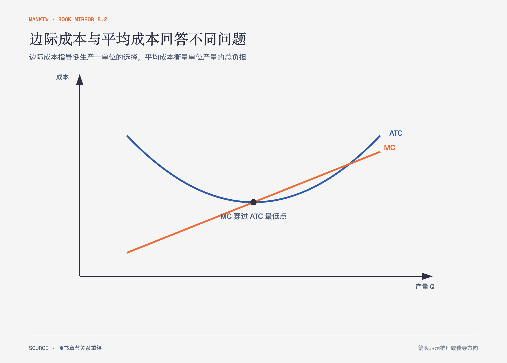

# 《曼昆〈经济学原理〉》第13章｜生产成本 · 原书回顾与主题讲解（书镜 V8.2）

企业会计记录花出去的钱，经济学还要追问自有资源放在这里而放弃了什么。随后，作者把生产函数、边际产量和一组成本曲线连起来。

**本章要回答：** 机会成本怎样进入企业决策，边际成本、平均成本与短长期选择分别说明什么？

图13-1｜依据本章典型成本曲线重绘。边际成本穿过平均总成本最低点；这是典型形状，不是每家企业都必须精确符合的测量模板。

## 一、原书回顾：作者怎样展开

### 什么是成本

利润等于总收益减总成本。经济学成本包含显性成本和隐性成本：前者需要货币支出，后者是使用自有时间、资金或场所放弃的机会。会计利润通常只扣显性成本，经济利润还扣隐性成本。自有资本本可取得的利息也属于机会成本。

### 生产与成本

海伦的糕点厂贯穿本章：在厨房和设备暂时固定时，新增工人先带来分工收益，人员继续增加后开始互相拥挤，出现**边际产量递减**。为了增加同样一单位产量，企业需要投入更多劳动，边际成本因此上升。生产函数变平与总成本曲线变陡是同一机制的两种表示。

### 成本的各种衡量

总成本分为固定成本与可变成本。平均固定成本随产量增加下降，平均可变成本反映每单位可变投入，平均总成本是两者之和。边际成本衡量多生产一单位带来的总成本变化。当边际成本低于平均总成本时，平均值被拉低；高于平均值时，平均值被拉高，所以边际成本曲线穿过平均总成本最低点。

### 短期与长期成本

短期中部分投入固定，长期中企业可以改变工厂规模。长期平均总成本曲线由不同短期规模下可达到的最低平均成本组成。平均总成本最低的产量是**有效规模**。产量扩大使平均成本下降时存在规模经济，保持不变是规模收益不变，上升则是规模不经济；管理协调复杂性可能成为规模不经济来源。

### 结论

不同成本概念服务不同决策。是否继续多生产看边际成本，单位盈利能力看平均成本，是否退出还要纳入长期可避免的全部成本。

## 二、主题讲解：先问“这项成本能否因当前决定而改变”

### 沉没成本不应控制下一步

一家餐馆已支付一年租金。今晚是否营业，要比较营业新增收入与食材、临时人工等可变成本；已经无法收回的租金不会因今晚关门消失。长期是否续租则不同，租金会重新变成可避免成本。

### 平均成本不能替代边际选择

平均每份餐成本40元，不代表多做一份也要40元。厨房有空余时，新增一份可能只增加食材与少量人工；接近容量上限时，加单可能需要加班或新设备，边际成本会陡增。

### 规模经济有边界

集中采购、专业分工能降低平均成本，但沟通和协调也会增长。观察到前一阶段平均成本下降，不能无限外推到所有产量。

## 检验理解：什么时候该停产

某工厂市场价格低于平均总成本，却高于平均可变成本。短期应立即停产吗？

核对思路：短期继续生产仍能覆盖可变成本并分担部分固定成本，未必应停产；长期若价格不能覆盖平均总成本，企业会退出或调整规模。

## 来源、范围与阅读连接

原书范围：上册 PDF 273–292页，合并 PDF 273–292页；机会成本、生产函数、成本曲线与短长期成本均保留。餐馆和工厂是讲解用假设案例。源文件 SHA-256：`8cd3def98b1ea31ca9e0c248dd2199004f093fc86a3472b3b33b6e6bc0e66692`。下一章把这些成本放进竞争企业的产量选择。
