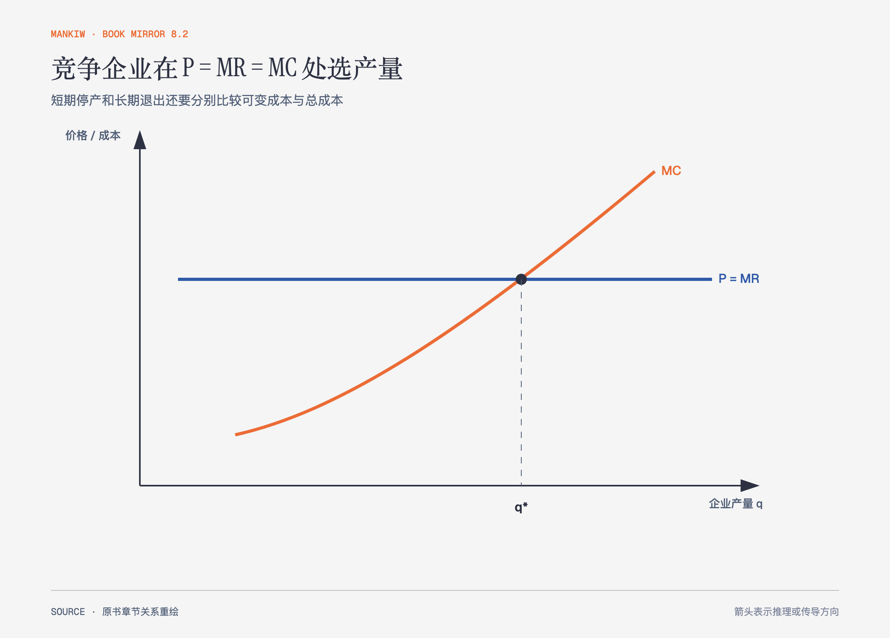

# 《曼昆〈经济学原理〉》第14章｜竞争市场上的企业 · 原书回顾与主题讲解（书镜 V8.2）

竞争企业不能控制市场价格，它能决定的是生产多少、何时暂时停产，以及长期是否进入或退出。

**本章要回答：** 为什么利润最大化产量满足价格等于边际成本，短期停产与长期退出又为何不是同一决定？

图14-1｜依据竞争企业模型重绘。水平线表示价格等于边际收益；与边际成本曲线交点给出利润最大化产量。

## 一、原书回顾：作者怎样展开

### 什么是竞争市场？

完全竞争市场有许多买者和卖者，物品相同，企业可自由进入退出。单个企业相对市场很小，是价格接受者。其总收益等于价格乘数量，平均收益和边际收益都等于市场价格。

### 利润最大化与竞争企业的供给曲线

若边际收益大于边际成本，多生产一单位增加利润；若边际成本更大，应减产。最优产量满足边际收益等于边际成本。对价格接受者，边际收益就是价格，因此边际成本曲线向上部分给出不同价格下愿意供给的量。

短期**停止营业**要比较总收益与可变成本。价格低于平均可变成本时，生产连可变成本都不能覆盖，停产损失更小。边际成本曲线高于平均可变成本的部分构成企业短期供给曲线。固定成本已经发生，是短期沉没成本。长期退出则比较收益与总成本；价格低于平均总成本时，企业最终退出。

### 竞争市场的供给曲线

短期市场供给是各企业供给水平相加，企业数量固定。长期中利润吸引进入、亏损推动退出；自由进入退出把经济利润推向零，价格趋向平均总成本最低的有效规模。若关键资源稀缺或新增企业成本上升，长期供给曲线也可能向上倾斜，处在成本边界的**边际企业**决定长期价格下限。

### 结论：在供给曲线背后

企业与市场供给来自边际决策。零经济利润包含所有机会成本得到补偿，不等于企业主没有收入或会无理由停业。

## 二、主题讲解：三个阈值回答三个问题

### P 与 MC 决定“多做一单位值不值”

市场价格是新增一单位带来的收入，边际成本是新增代价。两者比较决定产量方向，而平均利润不能告诉企业最后一单位是否值得生产。

### P 与 AVC 决定短期是否营业

价格低于平均总成本但高于平均可变成本时，继续生产能支付全部可变成本并覆盖一部分固定成本，比完全停产更少亏损。短期停产不等于退出，设备和合同仍在。

### P 与 ATC 决定长期是否留下

长期中固定投入可以调整，若价格持续不能覆盖总机会成本，资源会转向其他用途。进入退出过程也会改变市场供给和价格，所以单个企业的决定会反馈到行业均衡。

## 检验理解：亏损为什么还生产

一家酒店淡季房价低于每间房分摊的全年总成本，但高于清洁、洗涤和额外服务成本。继续接客是否一定不理性？

核对思路：不一定。短期只要新增收入覆盖新增可变成本，营业能减少亏损；长期是否保留酒店仍看总成本与机会成本。

## 来源、范围与阅读连接

原书范围：上册 PDF 293–313页，合并 PDF 293–313页；利润最大化、停产、退出、市场供给与零利润均保留。酒店是讲解用假设案例。源文件 SHA-256：`8cd3def98b1ea31ca9e0c248dd2199004f093fc86a3472b3b33b6e6bc0e66692`。下一章取消价格接受假设，研究垄断。
