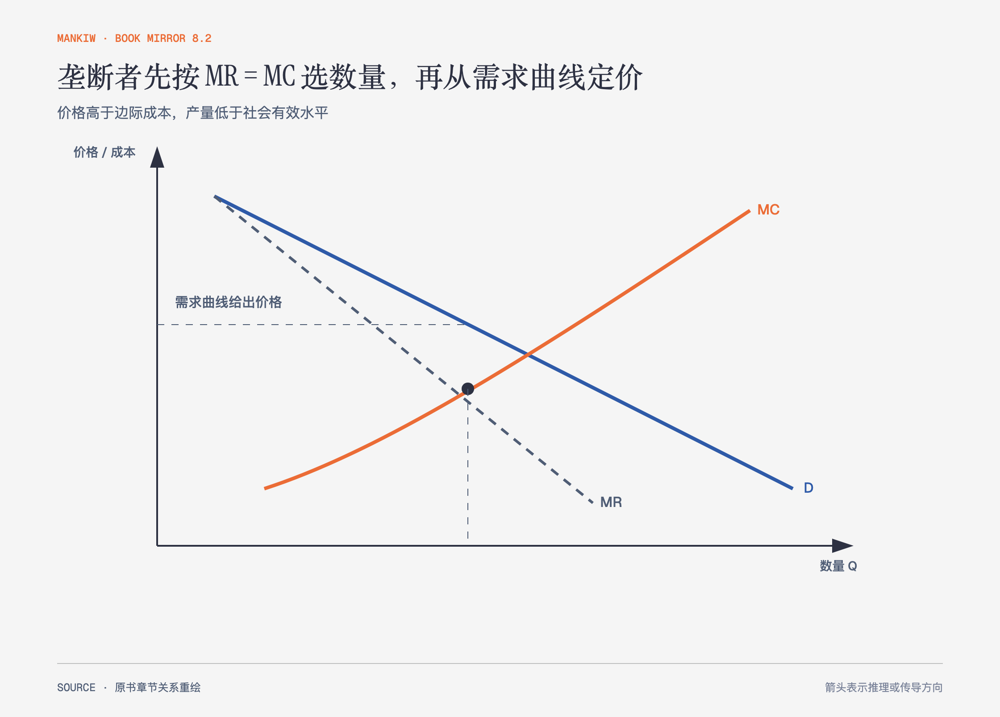

# 《曼昆〈经济学原理〉》第15章｜垄断 · 原书回顾与主题讲解（书镜 V8.2）

垄断者是市场唯一卖者，但仍受需求约束。它不能随意同时选择高价和高销量，而要在边际收益与边际成本之间取舍。

**本章要回答：** 垄断者怎样定量与定价，为什么结果低于效率产量，公共政策又有哪些代价？

图15-1｜依据本章垄断模型重绘。MR 比需求曲线下降更快；垄断数量由 MR=MC 决定，价格再由需求曲线给出。

## 一、原书回顾：作者怎样展开

### 为什么会产生垄断

**进入障碍**（也常说进入壁垒）来自关键资源由一家企业控制、政府授予排他权利，或一个生产者以更低成本服务整个市场。自然垄断通常有很大固定成本和较低边际成本，平均总成本随产量增加而下降。障碍维持市场势力，没有障碍的高利润会吸引进入。

### 垄断者如何作出生产与定价决策

垄断者面对整个市场需求曲线。为了多卖一单位，它通常必须降低所有单位的价格，所以边际收益低于价格。利润最大化仍在 MR=MC 处，但价格从需求曲线读取，高于边际成本。垄断者没有独立于需求的供给曲线，因为同一成本条件下的数量还取决于需求形状。

### 垄断的福利代价

价格加成是买卖双方之间的转移，本身不等于社会损失；真正的无谓损失来自**垄断产量**低于支付意愿等于边际成本的效率水平。部分价值高于成本的交易没有发生。若垄断利润来自寻租或维持障碍的额外支出，社会成本还会增加。

### 对垄断的公共政策

政策可以用反托拉斯法促进竞争、管制定价、**公有制**，或在干预成本过高时暂不处理。自然垄断若按边际成本定价可能无法覆盖固定成本，监管需要在效率、财政补贴和企业激励间取舍。政府经营也不自动消除成本与信息问题。

### 价格歧视

能分辨支付意愿并阻止转售时，垄断者会向不同顾客收取不同价格。若能套利，低价买者转售给高价买者，歧视会失效。完全价格歧视可能消除无谓损失并把全部剩余转给卖者；现实中的电影票、机票、折扣券和奖学金只是不同程度的分组定价，既有分配效果，也可能扩大交易量。

### 结论

垄断的核心是进入壁垒与市场需求约束。市场势力提供加价能力，却不保证无限利润，也不自动决定哪种公共政策最好。

## 二、主题讲解：别把“唯一卖者”理解成“想卖多少就卖多少”

### 需求曲线把价格和数量绑在一起

软件服务若提高价格，可能失去部分用户；降低价格能扩大销量，却也降低原有用户贡献的收入。边际收益把这两部分同时计入，所以通常低于当前价格。

### 效率缺口来自被阻止的交易

当某用户愿付100元、服务边际成本20元，却因统一定价150元而不购买时，80元潜在剩余消失。垄断利润和无谓损失要分开：利润是分配，无谓损失是互利机会没有实现。

### 管制需要解决成本覆盖问题

若服务有巨额固定成本而新增用户成本很低，按边际成本定价可能无法维持系统。监管可以允许平均成本定价、补贴固定成本或引入可竞争环节，但每种做法都带来新的信息与激励问题。

## 检验理解：降价一定减少垄断利润吗

一家垄断影院对学生降价，同时继续向其他顾客收原价。利润和总剩余可能怎样变化？

核对思路：若能识别学生且阻止转售，新增学生交易可能增加利润和总剩余；剩余如何分配取决于价格。价格歧视不必然扩大或缩小无谓损失，要看产量变化。

## 来源、范围与阅读连接

原书范围：上册 PDF 314–348页，合并 PDF 314–348页；垄断来源、定价、福利、政策与价格歧视均保留。软件服务与影院是讲解用假设案例。源文件 SHA-256：`8cd3def98b1ea31ca9e0c248dd2199004f093fc86a3472b3b33b6e6bc0e66692`。下一章研究少数卖者之间的策略相互依赖。
