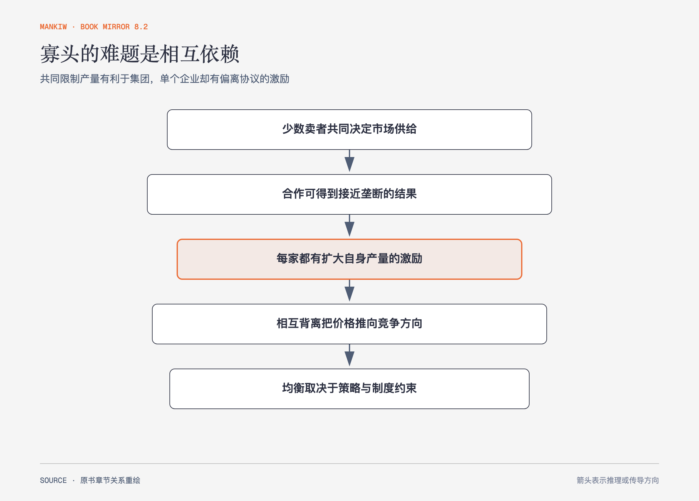

# 《曼昆〈经济学原理〉》第16章｜寡头 · 原书回顾与主题讲解（书镜 V8.2）

寡头既不同于完全竞争，也不同于单一垄断。少数企业的每个决定都会改变其他企业面对的价格和利润，策略相互依赖成为核心。

**本章要回答：** 为什么企业共同合作能得到更高利润，个别理性却常把它们推离合作结果？

图16-1｜依据双头与囚犯两难处境重绘。箭头表示从合作收益到个别偏离、再到非合作均衡的推理，不表示所有寡头都经历明确合谋。

## 一、原书回顾：作者怎样展开

### 在垄断和完全竞争之间

现实市场常由少数企业或许多差别产品企业组成，属于不完全竞争。寡头的关键是卖者数量少，垄断竞争的关键是产品有差别且企业较多。企业数量与产品差异决定每家对市场价格的影响。

### 只有少数几个卖者的市场

杰克和吉尔若**勾结**并组成卡特尔，可以像垄断者一样限制总产量、提高价格并分配利润；但每人都有扩大自身产量的动机。扩产带来多卖一单位的**产量效应**，也会降低所有单位价格，形成**价格效应**。非合作时，产量高于垄断、低于完全竞争，价格低于垄断价、高于边际成本。企业数量增加后，单个企业对价格的影响变小，结果趋向竞争。

### 博弈论与合作经济学

**博弈论**研究相互影响的策略选择。**囚犯的两难处境**说明，合作结果对双方更好，个别的**优势战略**却使双方选择不合作。**纳什均衡**是每个参与者在给定他人策略时都不愿单独改变的状态。欧佩克、军备竞赛、广告和共有资源展示了同一结构的不同形式；重复互动中“一报还一报”等策略、惩罚和声誉可能维持合作，但并非自动成功。

### 针对寡头的公共政策

反托拉斯法阻止明确合谋，也要判断转售价格控制、掠夺性定价和搭售等复杂做法。看似限制竞争的行为有时可能解决搭便车或提供服务激励；看似低价的行为也可能排挤竞争。作者强调政策需要识别实际经营目的与效果。

### 结论

寡头结果没有单一曲线可直接读出。预期、承诺、重复次数和制度规则共同决定均衡，公共政策也要避免把所有合作或绑定都当成同一种问题。

## 二、主题讲解：用一次促销战看懂相互依赖

### 每家都在回答“对方不变时，我怎么办”

两家平台都不补贴时利润较高；任一家单独补贴能抢走用户；两家都补贴后用户价格下降，但双方利润都低。若“无论对方怎样，补贴都更有利”，两家会进入低利润均衡。

### 合作承诺必须可执行

口头约定不补贴仍有偷偷偏离的诱因。重复博弈中，未来惩罚可能提高守约价值；但市场增长、退出预期和难以观察的折扣会削弱约束。合作结果需要机制，不只需要共同愿望。

### 反托拉斯判断看消费者与竞争过程

联合制定安全标准可能减少兼容成本，联合定价则直接限制竞争。政策要区分合作解决了什么问题、是否排除替代者，以及长期价格、质量和创新怎样变化。

## 检验理解：为什么共同最优没有实现

两个团队都希望减少夜间告警，但任何一个团队单独放宽阈值都会把问题转给另一方。最终双方都维持高敏感度并频繁互相打扰。这个结构与囚犯两难处境有什么相似与不同？

核对思路：共同减少噪声更好，单方偏离却可能获益，存在相互依赖；但真实告警还涉及安全边界和不对称损失，不能只按收益矩阵简化。

## 来源、范围与阅读连接

原书范围：上册 PDF 349–376页，合并 PDF 349–376页；双头、纳什均衡、囚犯两难、重复博弈和反托拉斯争论均保留。平台和告警是讲解用假设案例。源文件 SHA-256：`8cd3def98b1ea31ca9e0c248dd2199004f093fc86a3472b3b33b6e6bc0e66692`。下一章研究差别产品下的竞争。
