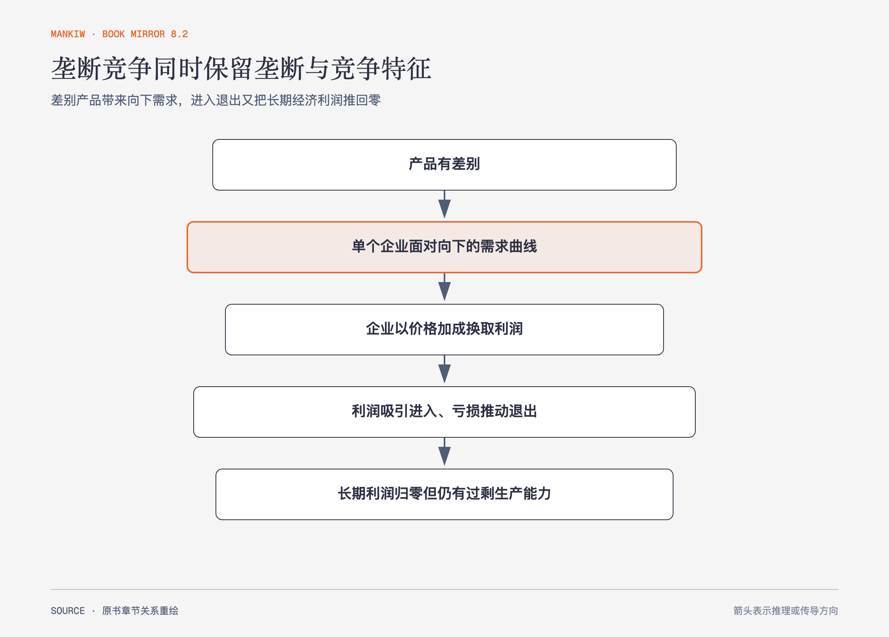

# 《曼昆〈经济学原理〉》第17章｜垄断竞争 · 原书回顾与主题讲解（书镜 V8.2）

垄断竞争把两个看似冲突的特征放在一起：每家产品有差别，因此拥有一些市场势力；企业又能进入退出，因此长期经济利润被竞争压回零。

**本章要回答：** 差别产品、价格加成、进入退出、广告和品牌怎样共同塑造市场结果？

图17-1｜依据本章短期利润与长期进入退出重绘。箭头表示利润吸引进入、亏损推动退出；长期零经济利润仍可与价格高于边际成本并存。

## 一、原书回顾：作者怎样展开

### 有差别产品的竞争

市场上有许多卖者、产品有差别、企业可**自由进入**。单个企业面对向右下方倾斜的需求曲线，短期像垄断者一样在 MR=MC 处选产量并按需求定价。盈利吸引新企业与替代品进入，使原企业需求下降；亏损促使退出。长期中需求曲线与平均总成本相切，经济利润为零。

长期均衡与完全竞争有两点差异：价格高于边际成本，新增顾客仍有价值；企业产量低于平均总成本最低的**有效规模**，存在过剩生产能力。零利润没有消除市场势力，只说明进入已经耗尽超额收益。

### 垄断竞争与社会福利

价格加成造成部分无谓损失，产品种类也可能过多或过少。新企业进入会抢走已有企业顾客，产生**抢走业务的外部性**；同时给消费者增加品种，产生**产品多样化外部性**。两股力量方向相反，公共政策很难算出正确企业数量。

### 广告

批评者认为广告操纵偏好、制造虚假差别并抬高进入壁垒；支持者认为广告提供价格、质量和地点信息，促进竞争。原书引用眼镜广告限制的研究，说明限制广告可能与更高价格相关，但个案证据不能证明所有广告都有同样效果。

### 品牌

批评者把品牌看成广告制造的非理性偏好，支持者把品牌看成质量信息和企业维护声誉的承诺。昂贵广告本身也可能发出质量信号，因为低质量产品难以从重复购买中收回投入。前苏联生产标记与电视网品牌用于说明可识别生产者怎样承担声誉后果。

### 结论

垄断竞争广泛存在，却难以用单一效率标准下政策结论。产品差别带来选择，也带来加价和过剩生产能力；广告与品牌既可能误导，也可能提供信息。

## 二、主题讲解：长期零利润为何不等于“没有差别”

### 进入削弱每家的需求，不消除产品身份

一家咖啡店盈利会吸引新店，原店顾客减少，利润被压低。但位置、口味和氛围仍有差别，原店面对的需求曲线不会自动变成水平线。

### 过剩生产能力是差别与选择的代价之一

若每家都扩大到最低平均成本规模，市场可能容不下这么多品种。较小规模提高单位成本，却给消费者更多选择。福利判断需要比较多样性价值与加价、闲置能力的成本。

### 广告要看它改变了什么信息

列明价格、成分和门店位置的广告直接降低搜索成本；只塑造身份联想的广告可能主要改变偏好。二者都叫广告，经济机制并不相同。

## 检验理解：品牌溢价都不理性吗

消费者愿为连锁餐厅多付钱，因为跨城市也能预期相近卫生与口味。这个溢价能否被简单归为广告操纵？

核对思路：不能。品牌可能承载可验证的质量与声誉信息；也可能夸大差别。要看重复交易、质量控制和替代信息是否存在。

## 来源、范围与阅读连接

原书范围：上册 PDF 377–393页，合并 PDF 377–393页；短长期均衡、社会福利、广告与品牌均保留。咖啡店和连锁餐厅是讲解用假设案例。源文件 SHA-256：`8cd3def98b1ea31ca9e0c248dd2199004f093fc86a3472b3b33b6e6bc0e66692`。下册从企业投入转向劳动、土地和资本市场。
