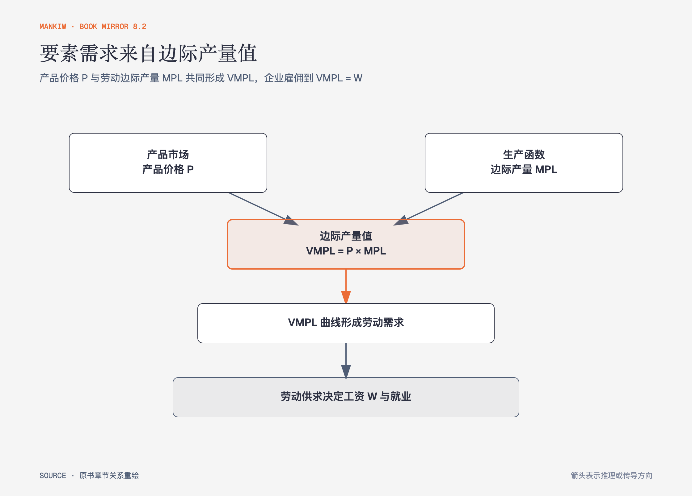

# 《曼昆〈经济学原理〉》第18章｜生产要素市场 · 原书回顾与主题讲解（书镜 V8.2）

劳动、土地和资本的需求并非独立产生。企业购买这些要素，是因为它们能帮助生产消费者愿意购买的产品。

**本章要回答：** 产品需求、边际产量与要素价格怎样连接，为什么竞争均衡中工资等于劳动的边际产量值？

图18-1｜依据本章派生需求重绘。箭头表示产品价值经边际产量传到劳动需求，再由要素供求形成工资与其他要素收入。

## 一、原书回顾：作者怎样展开

### 企业的劳动需求

劳动需求是**派生需求**。竞争企业既是产品市场的价格接受者，也是劳动市场的工资接受者。生产函数给出工人数量与产量的关系，**边际产量递减**使后加入工人的新增产出下降。劳动的边际产量值等于边际产量乘产品价格，表示多雇一名工人增加的收入。

利润最大化企业比较边际产量值与工资：前者高于工资就继续雇佣，低于工资就减少用工，直到两者相等。劳动边际产量值曲线因此也是企业劳动需求曲线。产品价格、技术和其他要素供给变化会移动劳动需求。

### 劳动市场的均衡

市场劳动供给与劳动需求决定均衡工资和就业。劳动供给增加会降低工资并使企业扩大用工，直至新增工人的边际产量值降到新工资；劳动需求增加则同时提高工资与就业。原书用巴勒斯坦工人进入以色列受限说明劳动供给收缩怎样减少就业、提高留任者工资。竞争均衡中，每种要素得到其边际贡献的价值，作者把这套解释称为**新古典分配理论**。

作者用跨国生产率与工资说明二者长期相关，但把完整增长解释留到后文。观察相关关系不意味着工资只由个人努力决定；资本、技术、制度和产品价格都会影响边际产量值。

### 其他生产要素：土地和资本

土地和资本也按供求形成价格。要素的**租赁价格**是某一时期使用它的价格，**购买价格**则是永久拥有它的价格。购买者关心当前和预期未来的租赁收入，而这些收入又取决于要素未来的边际产量值；两块当前租金相同的土地，若未来生产率预期不同，购买价格可以不同。资本既包括机器和建筑，也能通过利息、租金、股利等形式产生收入。要素互相影响：劳动减少可能提高剩余劳动的边际产量，却降低土地的边际产量。黑死病案例用这种变化解释工资上升与地租下降。

### 结论

要素收入来自边际生产率与产品价值。这个竞争基准还没有解释教育、工作条件、能力、歧视和制度造成的工资差异，下一章继续展开。

## 二、主题讲解：企业买的不是“人”，而是新增产出价值

### 边际产量与产品价格缺一不可

一名工人每小时多做10件产品，并不自动说明他值多少工资。若每件产品只能卖1元，边际产量值是10元；若产品价格升到2元，同样生产率对应20元。劳动需求会随产品市场变化。

### 其他要素会改变劳动价值

给工人配更好的设备，可能提高每小时产量，从而把劳动需求曲线右移。反过来，缺少原料或场地会压低边际产量。把工资完全归因于个人能力，会漏掉互补要素。

### 均衡关系不是道德评价

竞争模型解释支付怎样与边际贡献相连，不证明所有实际收入都公平，也不证明市场已满足完全竞争。市场势力、歧视、谈判和信息问题会改变结果。

## 检验理解：产品价格为何影响工资

一家果园工人的采摘速度没有变化，但苹果售价持续下降。企业的劳动需求会怎样变化？

核对思路：边际产量不变，边际产量值因产品价格下降而降低，劳动需求左移；均衡工资或就业可能下降。

## 来源、范围与阅读连接

原书范围：下册 PDF 3–21页，合并 PDF 396–414页；劳动需求、劳动市场、土地与资本均保留。数量示例是讲解用假设。源文件 SHA-256：`8cd3def98b1ea31ca9e0c248dd2199004f093fc86a3472b3b33b6e6bc0e66692`。下一章分析均衡工资为何仍有巨大差异。
