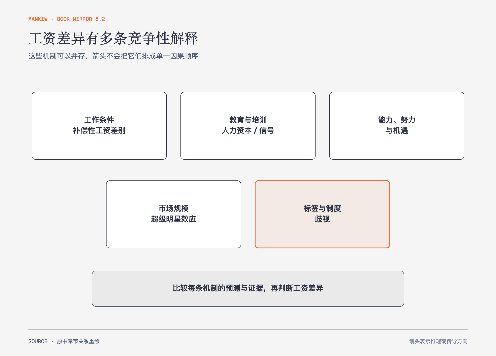

# 《曼昆〈经济学原理〉》第19章｜收入与歧视 · 原书回顾与主题讲解（书镜 V8.2）

工资差异可能来自工作条件、生产率、人力资本、能力、努力、机遇和歧视。作者反复强调：看到群体平均差异，不能直接知道每条机制贡献了多少。

**本章要回答：** 怎样解释工资差异，同时避免把无法观察的生产率差异或歧视轻率地写成已证明事实？

图19-1｜依据本章工资决定因素重绘。五个方框是可以并存的竞争性解释；歧视需要在检查其他机制后用更直接的证据识别。

## 一、原书回顾：作者怎样展开

### 决定均衡工资的若干因素

工作有危险、辛苦或不便时，工资可能包含**补偿性工资差别**。教育和培训形成**人力资本**，提高生产率与工资；技术变化会提高某些技能的需求。能力、努力和机遇也影响结果，但往往难以精确衡量。

教育还有信号理论：学历可能向雇主表明能力，而不完全是教育本身提高生产率。义务教育等自然差异有助于识别教育回报，却仍不能自动分清全部机制。**超级明星现象**需要服务能以低成本触达大量消费者，且顾客偏好最优秀者，收入因此高度集中。

### 歧视经济学

群体平均工资差异不能直接等同歧视，因为教育、经验、职业和工作时长等可观察与不可观察因素也不同；但这些差异本身也可能是更早歧视造成的。原书用实行种族隔离的电车说明利润动机的边界：企业若因偏见放弃低成本工人会处于劣势，但顾客或政府强制的歧视不会被雇主竞争自动消除。测量问题不能用来否认歧视，也不能让差额自动成为因果证明。

雇主偏见在竞争市场中会增加成本：不歧视的企业可雇到被低估的工人而获利，竞争可能削弱工资差别。但**顾客歧视**、政府规定或缺少竞争会让歧视持续。电车隔离、体育和男女工资案例分别说明利润动机能起作用，也有边界。

本章还讨论同工同酬与**可比价值**。支持者希望按教育、经验、责任和工作条件给不同职业确定可比较的工资，减少女性集中职业被低估的影响；反对者指出，衡量两种不同工作的“可比”价值很困难，强制工资高于市场均衡还可能减少这些岗位的需求并增加失业。双方争的是价值如何衡量，以及法律规定怎样改变劳动市场数量。

### 结论

工资是劳动供求、生产率和制度共同作用的结果。收入差异的解释需要分解机制、比较可观察证据，并保留无法识别的部分。

## 二、主题讲解：差异解释要按“机制—预测—证据”走

### 先列竞争性解释

夜班工资高，可能是夜班更辛苦的补偿，也可能需要更稀缺技能，或夜间需求更强。不同机制对换班、培训和需求变化有不同预测，不能凭一个差额选答案。

### 再问能观察到什么变化

若提高培训后同一工人的产出与工资同时上升，人力资本解释得到支持；若文凭变化而能力训练很少、雇主仍提高工资，信号作用更值得检查。单个相关关系仍可能受选择偏差影响。

### 歧视判断既不能跳步，也不能被无限推迟

控制变量后仍有差异，不等于剩余全部是歧视；但如果招聘回访只因姓名或性别标记改变，其他条件相同，证据更直接。判断强度应跟识别设计相称。

## 检验理解：同工同酬要先定义什么

两名员工职位相同但项目难度、工作时段和客户风险不同，收入不同。能否仅凭职位名断定违反同工同酬？

核对思路：需先定义“同工”的任务、责任、产出与条件；补偿性差别与生产率差异要被检验，歧视也不能因存在其他变量而被预先排除。

## 来源、范围与阅读连接

原书范围：下册 PDF 22–41页，合并 PDF 415–434页；工资因素、教育信号、超级明星和歧视均保留。夜班、培训与招聘回访为讲解情形。源文件 SHA-256：`8cd3def98b1ea31ca9e0c248dd2199004f093fc86a3472b3b33b6e6bc0e66692`。下一章从个人工资转到整体收入分配与贫困政策。
