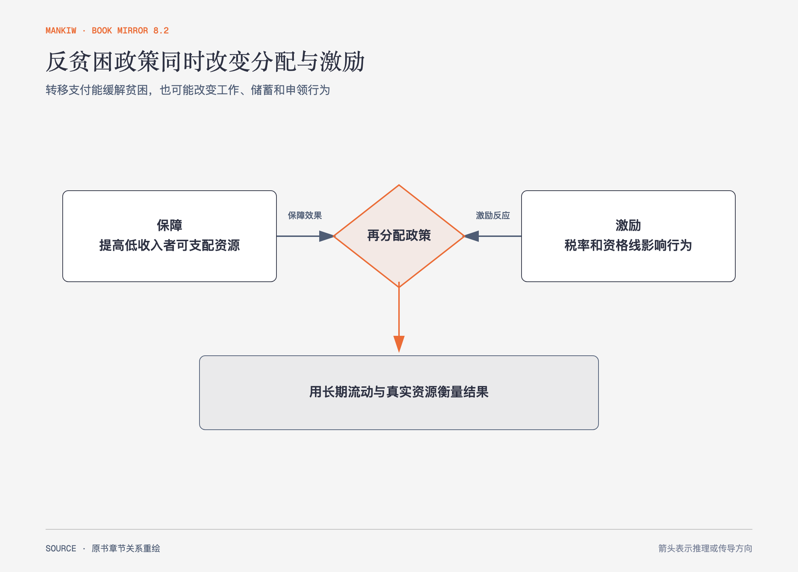

# 《曼昆〈经济学原理〉》第20章｜收入分配 · 原书回顾与主题讲解（书镜 V8.2）

收入分配讨论既有测量问题，也有价值判断。作者先问不平等有多大、数据漏掉了什么，再比较功利主义、自由主义与自由意志主义，最后分析反贫困政策的激励。

**本章要回答：** 怎样区分短期贫困、长期机会、再分配价值判断和政策激励？

图20-1｜依据本章反贫困政策分析重绘。两侧表示提高资源保障与改变工作储蓄激励的同时作用，结果还要用长期流动和实物资源检查。

## 一、原书回顾：作者怎样展开

### 不平等的衡量

收入分组和贫困率展示分配，但存在三类局限：实物转移支付未必计入现金收入，收入会随生命周期变化，年度收入也会受暂时波动影响。**持久收入**比单年收入更接近长期生活能力；**经济流动性**意味着某些家庭短期处于低收入，另一些则长期贫困。妇女劳动参与变化、国际比较与贫困线案例说明，数字背后的家庭结构和测量口径很重要。

### 收入再分配的政治哲学

功利主义主张最大化总效用；由于边际效用递减，收入从富者转给穷者可能提高总效用，但转移会通过税收和福利改变激励，像“漏水的桶”。自由主义从**无知面纱**后选择制度，并用保护最不利者的**最大化标准**评价分配；自由意志主义强调过程、公正取得与自愿交换，不把结果平等当作独立目标。三种立场的分歧包含价值判断，不能只靠统计数据消除。

### 减少贫困的政策

最低工资、福利、负所得税和实物转移支付各有不同目标与副作用。福利资格随收入上升而取消时，等于对额外劳动设置很高的隐含税率；负所得税可用统一公式转移收入，但同样面临激励问题；实物援助能确保资源用于食物或医疗，却限制受助者选择。储蓄资产限制还可能惩罚为未来积累缓冲的人。

### 结论

社会在效率与平等之间取舍，没有脱离价值立场的唯一分配方案。政策评价应同时看短期救助、长期激励、行政识别与尊严等影响。

## 二、主题讲解：别让“脱贫线”变成悬崖

### 资格线会制造离散跳变

家庭收入增加一元却失去大额补贴，实际可支配资源反而下降，**有效边际税率**可能很高，人们会避免多工作或正式申报。政策本意是帮助低收入者，设计却可能形成贫困陷阱。

### 平滑退坡仍有成本

让补贴随收入逐步减少能消除悬崖，但退坡率仍像额外边际税率。退坡越慢，激励改善，覆盖范围和财政成本却越大。设计需要把目标和约束写明。

### 年度收入不是全部生活条件

学生、暂时失业者和长期无劳动能力者可能有相同年度收入，却需要不同帮助。资产、家庭支持、住房和医疗等实物条件也影响福利判断。

## 检验理解：涨工资为何没有变富

某家庭月薪增加500元，却失去700元补贴。政策对其劳动激励会有什么影响？

核对思路：可支配资源下降，形成超过100%的局部隐含边际税率；应检查资格线或退坡设计，而不是把反应简单归为“不愿工作”。

## 来源、范围与阅读连接

原书范围：下册 PDF 42–67页，合并 PDF 435–460页；不平等测量、三种哲学与反贫困政策均保留。补贴数字为讲解用假设。源文件 SHA-256：`8cd3def98b1ea31ca9e0c248dd2199004f093fc86a3472b3b33b6e6bc0e66692`。下一章用预算约束和偏好模型研究消费者选择。
