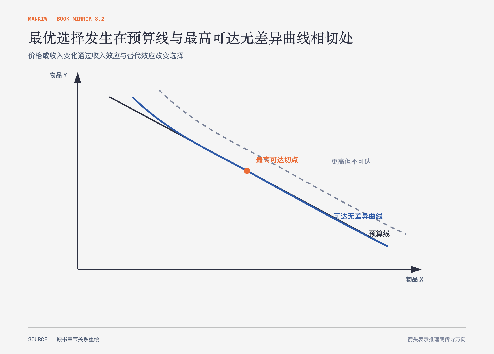

# 《曼昆〈经济学原理〉》第21章｜消费者选择理论 · 原书回顾与主题讲解（书镜 V8.2）

需求曲线把许多选择压成价格与数量关系。本章向内展开，说明预算约束、偏好和最优选择怎样生成需求反应。

**本章要回答：** 收入与价格变化为什么同时产生替代效应和收入效应，甚至可能让劳动供给或储蓄方向不确定？

图21-1｜依据本章消费者最优选择重绘。切点表示在预算约束内达到最高可达偏好；图不假定所有偏好都能用同一曲线形状表示。

## 一、原书回顾：作者怎样展开

### 预算约束：消费者买得起什么

**预算约束线**给出收入和价格允许的消费组合。斜率等于两种物品价格之比，表示市场提供的交换率。收入变化平行移动预算线，一种物品价格变化则使预算线绕截距转动。

### 偏好：消费者想要什么

无差异曲线连接给消费者相同满足程度的组合。作者假设偏好可比较、可传递、偏好更多，并通常呈凸性。无差异曲线向右下方倾斜且不相交，其斜率的绝对值是**边际替代率**。完全替代品和完全互补品展示极端形状；效用只是给偏好排序的另一种语言。

### 最优化：消费者选择什么

最优点位于预算线与最高可达无差异曲线相切处，边际替代率等于相对价格。收入增加通常使正常物品消费增加，低档物品可能减少。价格下降既让该物品相对更便宜，产生替代效应；也提高实际购买力，产生收入效应。吉芬物品要求负收入效应大到超过替代效应，是特殊可能性。

### 四种应用

作者把模型用于需求曲线、工资与劳动供给、利率与储蓄、现金和实物转移。工资提高使闲暇更昂贵，替代效应增加劳动；也使人更富，若闲暇是正常物品，收入效应减少劳动。利率对储蓄同样有方向相反的效应。实物转移若超过家庭自愿消费量，会限制选择；否则可能与等额现金结果相同。

### 结论

消费者选择理论提供一致框架，却依赖稳定偏好和可描述约束。它解释选择怎样响应相对价格，不证明观察到的每个行为都来自完全计算。

## 二、主题讲解：一项价格变化其实同时改变两件事

### 替代效应改变相对价格

公交降价后，相对打车更便宜，即使保持原购买力，消费者也会倾向多坐公交。这是沿原无差异曲线寻找新切点。

### 收入效应改变实际购买力

同样收入现在能买到更多出行服务，相当于实际收入提高。若打车是正常物品，消费者可能把部分省下的钱用于打车，抵消一部分替代效应。

### 总效应方向取决于两者强弱

对普通物品，替代效应让价格下降的物品消费增加；收入效应可能同向或反向。劳动与储蓄问题尤其容易出现方向不确定，不能只凭“回报更高”预测行为。

## 检验理解：加薪后为什么有人少工作

时薪提高后，一名员工减少工时。这个行为是否违反理性选择？

核对思路：不一定。更高工资使闲暇机会成本上升，替代效应增加工作；也提高实际收入，收入效应可能让人购买更多闲暇。后者更强时，工时下降。

## 来源、范围与阅读连接

原书范围：下册 PDF 71–98页，合并 PDF 464–491页；预算约束、偏好、最优化、收入与替代效应及四类应用均保留。公交与打车是讲解用假设。源文件 SHA-256：`8cd3def98b1ea31ca9e0c248dd2199004f093fc86a3472b3b33b6e6bc0e66692`。下一篇转向宏观经济统计。
