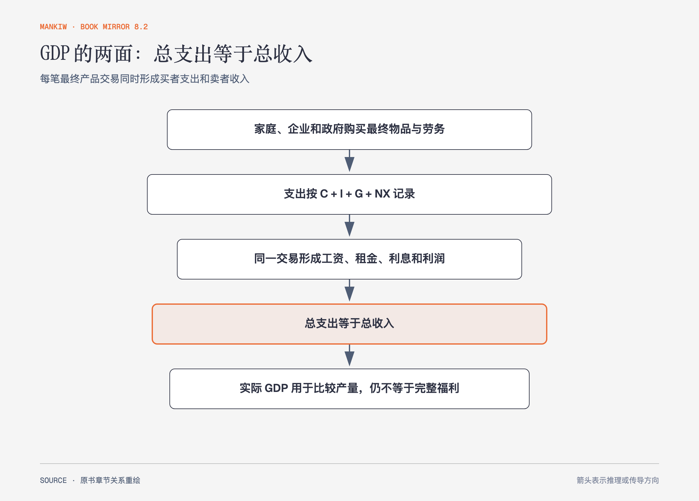

# 《曼昆〈经济学原理〉》第22章｜国民收入的衡量 · 原书回顾与主题讲解（书镜 V8.2）

国内生产总值把整个经济的最终产品交易汇总为一个数字。它既可从支出一侧计算，也可从收入一侧计算，因为同一笔交易同时是买者支出和卖者收入。

**本章要回答：** GDP 计算了什么、排除了什么，为什么实际 GDP 与经济福利不能画等号？

图22-1｜依据循环流向与 GDP 恒等关系重绘。箭头表示同一最终产品交易被同时记录为支出与收入；最后一节点明确 GDP 只是福利的一项指标。

## 一、原书回顾：作者怎样展开

### 经济的收入与支出

对整体经济，每笔支出都会成为某人的收入，所以总收入等于总支出。循环流向图用家庭和企业说明这一点；现实还包括政府、金融与国外部门，但会计恒等关系仍成立。

### 国内生产总值的衡量

GDP 是一个国家在一定时期内生产的所有最终物品与劳务的市场价值。市场价值用价格把不同物品相加；“最终”避免**中间物品**重复计算；“生产”排除单纯二手转售；地域按国内而非国民身份；时期意味着流量。作者还区分国民生产总值、国民生产净值、国民收入、个人收入和个人可支配收入。家庭自产、地下经济和没有市场价格的活动可能漏计。

### GDP 的组成部分

支出分为消费 C、投资 I、政府购买 G 和净出口 NX，所以 Y=C+I+G+NX。投资包括设备、建筑和存货，不等同于日常金融投资；政府转移支付不是购买当期产品，因此不计入 G；进口已进入消费、投资或政府购买，需在净出口中扣除。

### 实际 GDP 与名义 GDP

**名义GDP**用当期价格衡量，价格和数量都会影响；**实际GDP**用基年价格衡量，尽量只反映产量。**GDP平减指数**用名义与实际 GDP 之比描述总体价格变化。比较不同时期生产能力，应优先看实际量。

### GDP 与经济福利

GDP 高通常伴随更多物质资源，但不计闲暇、家庭活动、环境质量、分配与许多非市场价值。它也可能把修复灾害的支出计为产出。作者把 GDP 称为有用但不完善的福利指标，而非无意义或完整的幸福指数。

### 结论

GDP 提供一致的宏观计量语言。使用时必须对齐名义与实际、总量与人均、产出与福利的边界。

## 二、主题讲解：先问这笔活动有没有新生产

### 二手交易与新服务要分开

二手房本身早已计入建造年份 GDP，今天转售不再增加当期产出；中介提供的新服务则计入。股票买卖是资产转移，券商服务费是当期服务。

### 灾害重建说明“产出增加”不等于“更幸福”

重建房屋会增加 GDP，却只是恢复被毁财富。GDP 衡量当期生产流量，没有从中扣除资产损失。政策讨论若把重建增长称为净福利改善，会混淆存量与流量。

### 人均与分配仍需另外看

总 GDP 增长可能来自人口增加，人均产出未变；人均增长也不说明收益怎样分布。指标必须与问题匹配。

## 检验理解：哪些计入今年GDP

今年购买一套去年建成的二手房，同时支付中介费并重新装修。哪些部分计入今年 GDP？

核对思路：房屋本身不重复计入；今年提供的中介与装修服务计入。若装修材料是最终购买，也计入相应支出。

## 来源、范围与阅读连接

原书范围：下册 PDF 101–118页，合并 PDF 494–511页；收入支出相等、GDP定义、组成、实际与名义及福利边界均保留。二手房例子是讲解用假设。源文件 SHA-256：`8cd3def98b1ea31ca9e0c248dd2199004f093fc86a3472b3b33b6e6bc0e66692`。下一章处理价格指数与生活费用。
